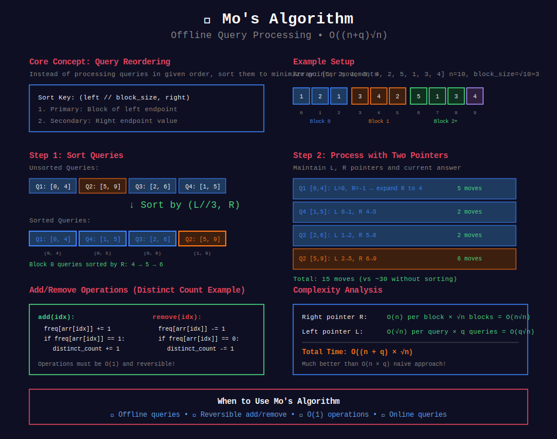
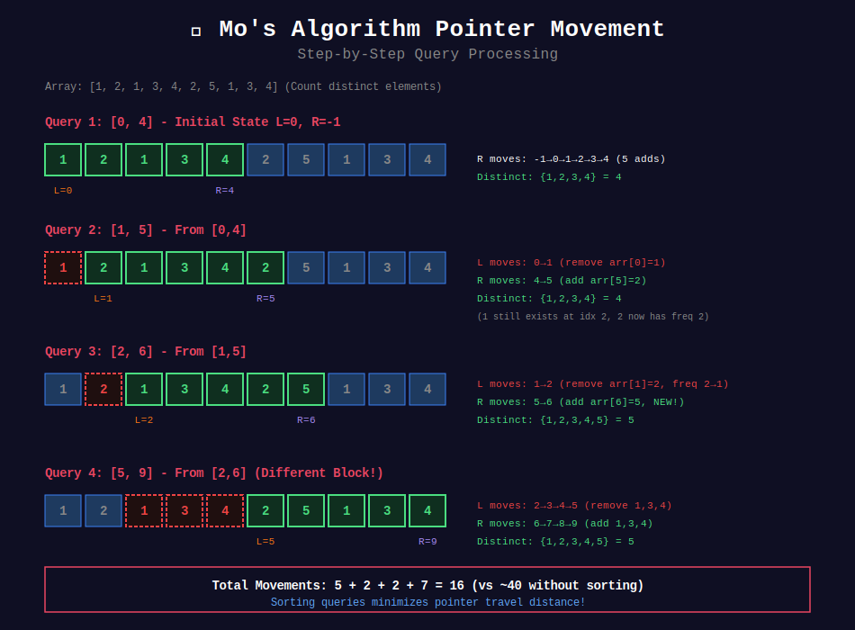
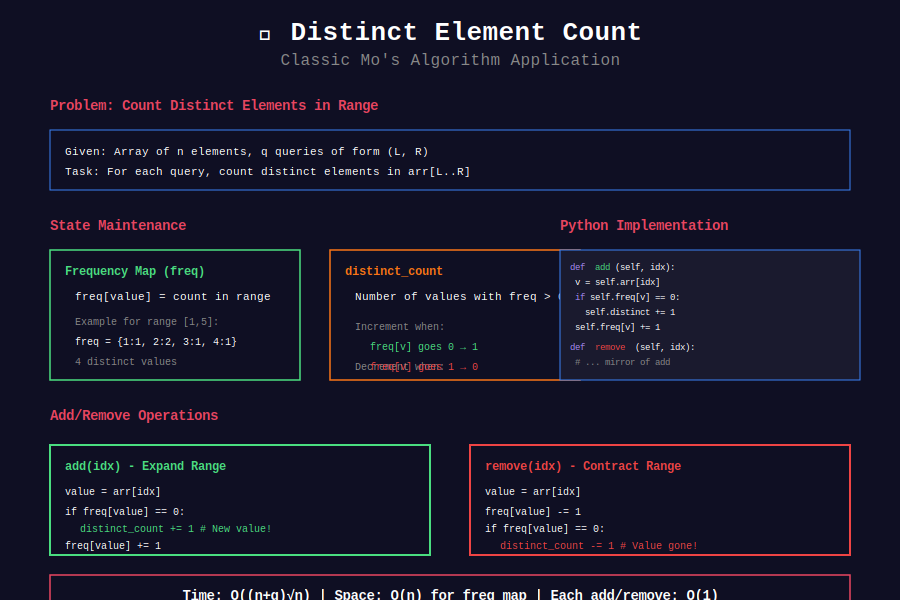

<div align="center">

# 🔄 Mo's Algorithm

<p>
  
  
</p>

**Offline Query Processing with Block Sorting**

*Reorder queries to minimize pointer movements*

</div>

---

## 🧭 Navigation

| ⬅️ Previous | 📂 Current | ➡️ Next |
|:------------|:----------:|--------:|
| [← 01. Range Queries](../01_range_queries/README.md) | **02. Mo's Algorithm** | [🏠 Sqrt Decomp Home](../README.md) |

---

## 📐 Mo's Algorithm Principle

### Core Idea
1. **Offline processing:** Know all queries beforehand
2. **Sort queries** by block of left endpoint, then by right endpoint
3. **Maintain answer** for current range [L, R]
4. **Expand/contract** range incrementally

### Why It Works
- Queries in same block move R by O(n) total
- Between blocks, L moves by O(√n)
- **Total movements:** O(n√n)

### Time Complexity

```math
T = O(n\sqrt{n} + q\sqrt{n}) = O((n+q)\sqrt{n})

```

---

## 🎨 Visual Diagrams

### Mo's Algorithm Overview

<div align="center">

</div>

### Pointer Movement Visualization

<div align="center">

</div>

### Distinct Count Application

<div align="center">

</div>

---

## 💻 Complete Implementation

```python
import math
from collections import defaultdict

class MoAlgorithm:
    """
    Mo's Algorithm for offline range queries.
    
    Time: O((n+q)√n)
    Space: O(n)
    
    Example use case: Count distinct elements in range
    """
    def __init__(self, arr: list[int]):
        self.arr = arr
        self.n = len(arr)
        self.block_size = int(math.ceil(math.sqrt(self.n)))
        
        # Current range state
        self.left = 0
        self.right = -1
        self.current_answer = 0
        
        # For distinct count example
        self.freq = defaultdict(int)
        self.distinct_count = 0
    
    def add(self, idx: int) -> None:
        """Add arr[idx] to current range."""
        value = self.arr[idx]
        if self.freq[value] == 0:
            self.distinct_count += 1
        self.freq[value] += 1
    
    def remove(self, idx: int) -> None:
        """Remove arr[idx] from current range."""
        value = self.arr[idx]
        self.freq[value] -= 1
        if self.freq[value] == 0:
            self.distinct_count -= 1
    
    def get_answer(self) -> int:
        """Get current answer (e.g., distinct count)."""
        return self.distinct_count
    
    def process_queries(self, queries: list[tuple[int, int]]) \
                       -> list[int]:
        """
        Process all queries and return answers.
        
        Args:
            queries: List of (left, right) query ranges
        
        Returns:
            List of answers in original query order
        """
        # Add query index
        indexed_queries = [
            (left, right, idx) 
            for idx, (left, right) in enumerate(queries)
        ]
        
        # Sort queries by Mo's order
        indexed_queries.sort(
            key=lambda q: (
                q[0] // self.block_size,  # Block of left
                q[1]                       # Then by right
            )
        )
        
        # Process queries in sorted order
        answers = [0] * len(queries)
        
        for left, right, query_idx in indexed_queries:
            # Expand/contract range to [left, right]
            
            # Move right pointer
            while self.right < right:
                self.right += 1
                self.add(self.right)
            while self.right > right:
                self.remove(self.right)
                self.right -= 1
            
            # Move left pointer
            while self.left < left:
                self.remove(self.left)
                self.left += 1
            while self.left > left:
                self.left -= 1
                self.add(self.left)
            
            # Store answer for this query
            answers[query_idx] = self.get_answer()
        
        return answers

# Example usage
def count_distinct_in_ranges(arr: list[int], 
                            queries: list[tuple[int, int]]) \
                            -> list[int]:
    """
    Count distinct elements in each query range.
    
    Time: O((n+q)√n)
    """
    mo = MoAlgorithm(arr)
    return mo.process_queries(queries)

```

---

## 🎨 Visual Example

```
+-----------------------------------------------------------------+

| EXAMPLE: Mo's Algorithm Query Processing                        |
+-----------------------------------------------------------------+
| Array: [1, 2, 1, 3, 4, 2, 5, 1, 3, 4]  (n=10, block_size=3)   |
|                                                                  |
| Queries (unsorted):                                              |
|   Q1: [0, 4]   Block 0                                          |
|   Q2: [5, 9]   Block 1                                          |
|   Q3: [2, 6]   Block 0                                          |
|   Q4: [1, 5]   Block 0                                          |
+-----------------------------------------------------------------+

| STEP 1: Sort queries by (block of L, R)                        |
|                                                                  |
|   Block 0: [0,4], [2,6], [1,5]  → sort by R → [0,4], [1,5], [2,6]|
|   Block 1: [5,9]                                                 |
|                                                                  |
|   Sorted order: [0,4], [1,5], [2,6], [5,9]                     |
+-----------------------------------------------------------------+

| STEP 2: Process queries with pointer movements                  |
|                                                                  |
|   Initial: L=0, R=-1                                            |
|                                                                  |
|   Query [0,4]:                                                   |
|     Move R: 0→1→2→3→4  (5 adds)                                |
|     Answer: 4 distinct [1,2,3,4]                                |
|                                                                  |
|   Query [1,5]:                                                   |
|     Move L: 0→1  (1 remove)                                     |
|     Move R: 4→5  (1 add)                                        |
|     Answer: 4 distinct [1,2,3,4]                                |
|                                                                  |
|   Query [2,6]:                                                   |
|     Move L: 1→2  (1 remove)                                     |
|     Move R: 5→6  (1 add)                                        |
|     Answer: 5 distinct [1,2,3,4,5]                              |
|                                                                  |
|   Query [5,9]:                                                   |
|     Move L: 2→3→4→5  (3 removes)                                |
|     Move R: 6→7→8→9  (4 adds)                                   |
|     Answer: 5 distinct [1,2,3,4,5]                              |
|                                                                  |
| Total movements: 16 (instead of 40 without sorting!)            |
+-----------------------------------------------------------------+

```

---

## 🏆 Problem Templates

### Template: Distinct Elements in Range

```python
def distinct_elements(arr: list[int], 
                     queries: list[tuple[int, int]]) -> list[int]:
    """
    Count distinct elements in each query range.
    
    Time: O((n+q)√n)
    """
    mo = MoAlgorithm(arr)
    return mo.process_queries(queries)

```

### Template: Sum in Range

```python
class MoSum(MoAlgorithm):
    """Mo's for range sum."""
    def __init__(self, arr: list[int]):
        super().__init__(arr)
        self.current_sum = 0
    
    def add(self, idx: int) -> None:
        self.current_sum += self.arr[idx]
    
    def remove(self, idx: int) -> None:
        self.current_sum -= self.arr[idx]
    
    def get_answer(self) -> int:
        return self.current_sum

```

---

## 💡 Key Insights

> **Why Offline?**  
> Need to know all queries beforehand to sort them optimally

> **Block Size √n:**  
> Balances L movements between blocks (√n) and R movements within blocks (n)

> **Add/Remove Operations:**  
> Must be **reversible** and **O(1)** or **O(log n)**

> **Total Complexity:**  
> O((n+q)√n) - much better than O(nq) naive approach

> **When to Use:**  
> - Offline queries
> - Operations are reversible
> - Better than O(nq) but worse than O((n+q)log n) segment tree

---

## 📚 References

| Resource | Link |
|----------|------|
| **Mo's Algorithm** | [CP-Algorithms](https://cp-algorithms.com/data_structures/sqrt_decomposition.html#mos-algorithm) |
| **Tutorial** | [Codeforces](https://codeforces.com/blog/entry/20032) |

---

<div align="center">

**Made with ❤️ by [Gaurav Goswami](https://github.com/Gaurav14cs17)**

</div>

---

## 🧭 Navigation

| ⬅️ Previous | 📂 Current | ➡️ Next |
|:------------|:----------:|--------:|
| [← 01. Range Queries](../01_range_queries/README.md) | **02. Mo's Algorithm** | [🏠 Sqrt Decomp Home](../README.md) |

