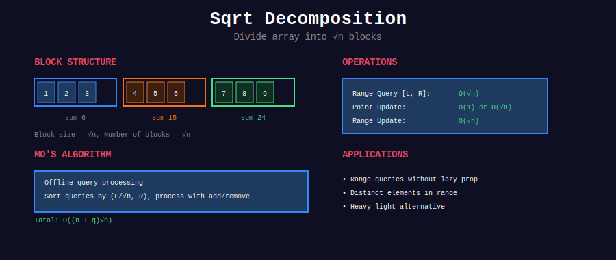

<div align="center">

# √ Square Root Decomposition



<p>
  
  
  
</p>

**Divide and Conquer Arrays into √n Blocks**

*O(√n) queries and updates - The perfect middle ground*

</div>

---

## 🧭 Navigation

| ⬅️ Previous | 📂 Current | ➡️ Next |
|:------------|:----------:|--------:|
| [← Matrix Exponentiation](../33_matrix_exponentiation/README.md) | **Sqrt Decomposition** | [Persistent DS →](../35_persistent_ds/README.md) |

---

## 📐 Mathematical Foundations

### 1️⃣ The Square Root Decomposition Principle

**Core Idea:** Divide array of size $n$ into $\sqrt{n}$ blocks, each of size $\sqrt{n}$.

**Block Size:**

```math
\text{block\_size} = \lceil \sqrt{n} \rceil

```

**Number of Blocks:**

```math
\text{num\_blocks} = \lceil \frac{n}{\text{block\_size}} \rceil \approx \sqrt{n}

```

**Why √n?**
- Too small blocks: Many blocks → slow queries

- Too large blocks: Big blocks → slow updates

- **√n is optimal**: Balances query and update complexity

---

### 2️⃣ Time Complexity Analysis

**Preprocessing:** Build block summaries

```math
T_{\text{build}} = O(n)

```

**Query (Range):** 

- Partial blocks at ends: $O(\sqrt{n})$

- Complete blocks in middle: $O(\sqrt{n})$ blocks × $O(1)$ lookup

- **Total:** $O(\sqrt{n})$

**Update (Single Element):**
- Find block: $O(1)$

- Update element: $O(1)$

- Update block summary: $O(1)$

- **Total:** $O(1)$

**Update (Range):**
- Partial blocks: $O(\sqrt{n})$

- Complete blocks: $O(\sqrt{n})$

- **Total:** $O(\sqrt{n})$

---

### 3️⃣ Space Complexity

```math
S = O(n + \sqrt{n}) = O(n)

```

- Original array: $O(n)$

- Block data: $O(\sqrt{n})$ blocks

---

### 4️⃣ Comparison with Other Structures

| Structure | Build | Query | Update | Space | Complexity |
|-----------|-------|-------|--------|-------|------------|
| **Naive** | O(1) | O(n) | O(1) | O(n) | Simple |
| **Prefix Sum** | O(n) | O(1) | O(n) | O(n) | Static only |
| **Sqrt Decomp** | O(n) | O(√n) | O(√n) | O(n) | Balanced |
| **Segment Tree** | O(n) | O(log n) | O(log n) | O(n) | Faster |
| **Fenwick Tree** | O(n) | O(log n) | O(log n) | O(n) | Point updates |

**When to Use Sqrt Decomposition:**
- ✅ Simpler to implement than Segment Tree

- ✅ Works for problems where Segment Tree doesn't apply easily

- ✅ Good for competitions when time is limited

- ✅ Flexible - easy to modify for different operations

---

### 5️⃣ Mathematical Proof of Optimality

**Theorem:** For an array of size $n$, block size $b = \sqrt{n}$ minimizes query time.

**Proof:**
- Query touches at most $\frac{n}{b}$ complete blocks: $O(\frac{n}{b})$

- Query touches at most 2 partial blocks: $O(b)$

- Total: $T(b) = O(\frac{n}{b} + b)$

To minimize, take derivative:

```math
\frac{dT}{db} = -\frac{n}{b^2} + 1 = 0
b^2 = n
b = \sqrt{n}

```

At $b = \sqrt{n}$: $T = O(\frac{n}{\sqrt{n}} + \sqrt{n}) = O(\sqrt{n} + \sqrt{n}) = O(\sqrt{n})$ $\blacksquare$

---

## 🎨 Visual Walkthrough

<div align="center">

</div>

### Step-by-Step Breakdown

```
+-----------------------------------------------------------------+

| EXAMPLE: Range Sum Query with Sqrt Decomposition               |
+-----------------------------------------------------------------+
| Array: [2, 1, 4, 3, 5, 7, 6, 8, 9]  (n = 9, block_size = 3)   |
|                                                                  |
| STEP 1: Divide into blocks                                      |
|                                                                  |
|   Index:  0  1  2 | 3  4  5 | 6  7  8                          |
|   Array: [2, 1, 4]|[3, 5, 7]|[6, 8, 9]                         |
|           Block 0  | Block 1 | Block 2                          |
|                                                                  |
|   Block Sums: [7, 15, 23]                                       |
+-----------------------------------------------------------------+

| STEP 2: Query sum(1, 7)  (indices 1 to 7 inclusive)           |
|                                                                  |
|   Visualization:                                                 |
|   Index:  0  1  2 | 3  4  5 | 6  7  8                          |
|   Array: [2, 1, 4]|[3, 5, 7]|[6, 8, 9]                         |
|           -  ✓  ✓  ✓  ✓  ✓   ✓  ✓  -                          |
|                                                                  |
|   Analysis:                                                      |
|   - Block 0: Partial (indices 1-2)  → sum individually          |
|   - Block 1: Complete (indices 3-5) → use block sum             |
|   - Block 2: Partial (indices 6-7)  → sum individually          |
|                                                                  |
|   Calculation:                                                   |
|   Partial left  (1-2): 1 + 4 = 5                               |
|   Complete (block 1): 15                                        |
|   Partial right (6-7): 6 + 8 = 14                              |
|   ----------------------------                                  |
|   Total: 5 + 15 + 14 = 34 ✓                                    |
|                                                                  |
|   Operations: O(√n) = O(3) = 3 block checks                    |
+-----------------------------------------------------------------+

| STEP 3: Update array[4] = 10  (was 5)                          |
|                                                                  |
|   Old: [2, 1, 4]|[3, 5, 7]|[6, 8, 9]                          |
|   New: [2, 1, 4]|[3,10, 7]|[6, 8, 9]                          |
|                       ↑                                          |
|                    changed                                       |
|                                                                  |
|   Update block 1 sum: 15 + (10-5) = 20                         |
|   Block Sums: [7, 20, 23]                                       |
|                                                                  |
|   Operations: O(1) - constant time update!                      |
+-----------------------------------------------------------------+

```

---

## 💻 Core Implementation Templates

### Template 1: Basic Sqrt Decomposition (Range Sum)

```python
import math

class SqrtDecomposition:
    """
    Square root decomposition for range sum queries.
    
    Time: Build O(n), Query O(√n), Update O(1)
    Space: O(n)
    """
    def __init__(self, arr: list[int]):
        self.n = len(arr)
        self.block_size = int(math.ceil(math.sqrt(self.n)))
        self.num_blocks = (self.n + self.block_size - 1) // self.block_size
        
        self.arr = arr[:]
        self.blocks = [0] * self.num_blocks
        
        # Precompute block sums
        for i in range(self.n):
            block_id = i // self.block_size
            self.blocks[block_id] += arr[i]
    
    def update(self, index: int, value: int) -> None:
        """
        Update single element.
        
        Time: O(1)
        """
        block_id = index // self.block_size
        
        # Update block sum
        self.blocks[block_id] += value - self.arr[index]
        
        # Update array
        self.arr[index] = value
    
    def query(self, left: int, right: int) -> int:
        """
        Query sum in range [left, right].
        
        Time: O(√n)
        """
        result = 0
        
        left_block = left // self.block_size
        right_block = right // self.block_size
        
        if left_block == right_block:
            # Same block - sum elements directly
            for i in range(left, right + 1):
                result += self.arr[i]
        else:
            # Left partial block
            left_end = (left_block + 1) * self.block_size - 1
            for i in range(left, min(left_end + 1, self.n)):
                result += self.arr[i]
            
            # Complete blocks in middle
            for block_id in range(left_block + 1, right_block):
                result += self.blocks[block_id]
            
            # Right partial block
            right_start = right_block * self.block_size
            for i in range(right_start, right + 1):
                result += self.arr[i]
        
        return result

```

---

### Template 2: Range Update + Range Query

```python
class SqrtDecompRangeUpdate:
    """
    Sqrt decomposition with range updates.
    
    Time: Build O(n), Query O(√n), Update O(√n)
    Space: O(n)
    """
    def __init__(self, arr: list[int]):
        self.n = len(arr)
        self.block_size = int(math.ceil(math.sqrt(self.n)))
        self.num_blocks = (self.n + self.block_size - 1) // self.block_size
        
        self.arr = arr[:]
        self.blocks = [0] * self.num_blocks
        self.lazy = [0] * self.num_blocks  # Lazy propagation
        
        # Precompute block sums
        for i in range(self.n):
            block_id = i // self.block_size
            self.blocks[block_id] += arr[i]
    
    def range_update(self, left: int, right: int, value: int) -> None:
        """
        Add value to range [left, right].
        
        Time: O(√n)
        """
        left_block = left // self.block_size
        right_block = right // self.block_size
        
        if left_block == right_block:
            # Same block - update elements directly
            for i in range(left, right + 1):
                self.arr[i] += value
                self.blocks[left_block] += value
        else:
            # Left partial block
            left_end = (left_block + 1) * self.block_size - 1
            for i in range(left, min(left_end + 1, self.n)):
                self.arr[i] += value
                self.blocks[left_block] += value
            
            # Complete blocks - use lazy propagation
            for block_id in range(left_block + 1, right_block):
                self.lazy[block_id] += value
                block_size_actual = min(
                    self.block_size,
                    self.n - block_id * self.block_size
                )
                self.blocks[block_id] += value * block_size_actual
            
            # Right partial block
            right_start = right_block * self.block_size
            for i in range(right_start, right + 1):
                self.arr[i] += value
                self.blocks[right_block] += value
    
    def query(self, left: int, right: int) -> int:
        """
        Query sum in range [left, right].
        
        Time: O(√n)
        """
        result = 0
        
        for i in range(left, right + 1):
            block_id = i // self.block_size
            result += self.arr[i] + self.lazy[block_id]
        
        return result

```

---

### Template 3: LeetCode 307 - Range Sum Query Mutable

```python
class NumArray:
    """
    LeetCode 307: Range Sum Query - Mutable
    
    Use sqrt decomposition.
    """
    def __init__(self, nums: list[int]):
        self.sqrt_decomp = SqrtDecomposition(nums)
    
    def update(self, index: int, val: int) -> None:
        """Update nums[index] = val"""
        self.sqrt_decomp.update(index, val)
    
    def sumRange(self, left: int, right: int) -> int:
        """Return sum of elements in range [left, right]"""
        return self.sqrt_decomp.query(left, right)

```

---

### Template 4: Sqrt Decomposition for Min/Max

```python
class SqrtDecompMinMax:
    """
    Sqrt decomposition for range min/max queries.
    
    Time: Build O(n), Query O(√n), Update O(1)
    """
    def __init__(self, arr: list[int]):
        self.n = len(arr)
        self.block_size = int(math.ceil(math.sqrt(self.n)))
        self.num_blocks = (self.n + self.block_size - 1) // self.block_size
        
        self.arr = arr[:]
        self.block_min = [float('inf')] * self.num_blocks
        self.block_max = [float('-inf')] * self.num_blocks
        
        # Precompute block min/max
        for i in range(self.n):
            block_id = i // self.block_size
            self.block_min[block_id] = min(self.block_min[block_id], arr[i])
            self.block_max[block_id] = max(self.block_max[block_id], arr[i])
    
    def update(self, index: int, value: int) -> None:
        """Update single element."""
        block_id = index // self.block_size
        self.arr[index] = value
        
        # Recompute block min/max
        start = block_id * self.block_size
        end = min(start + self.block_size, self.n)
        
        self.block_min[block_id] = min(self.arr[start:end])
        self.block_max[block_id] = max(self.arr[start:end])
    
    def query_min(self, left: int, right: int) -> int:
        """Query minimum in range [left, right]."""
        result = float('inf')
        
        left_block = left // self.block_size
        right_block = right // self.block_size
        
        if left_block == right_block:
            for i in range(left, right + 1):
                result = min(result, self.arr[i])
        else:
            # Left partial
            left_end = (left_block + 1) * self.block_size - 1
            for i in range(left, min(left_end + 1, self.n)):
                result = min(result, self.arr[i])
            
            # Complete blocks
            for block_id in range(left_block + 1, right_block):
                result = min(result, self.block_min[block_id])
            
            # Right partial
            right_start = right_block * self.block_size
            for i in range(right_start, right + 1):
                result = min(result, self.arr[i])
        
        return result

```

---

## 🏆 LeetCode Problems by Category

### 🟡 Medium (Core Skills)

| # | Problem | Technique | Difficulty |
|:-:|---------|-----------|-----------|
| 307 | [Range Sum Query - Mutable](https://leetcode.com/problems/range-sum-query-mutable/) | Basic sqrt decomp | ⭐⭐⭐ |
| 327 | [Count of Range Sum](https://leetcode.com/problems/count-of-range-sum/) | Modified sqrt decomp | ⭐⭐⭐⭐ |

### 🔴 Hard (Advanced)

| # | Problem | Technique | Difficulty |
|:-:|---------|-----------|-----------|
| 315 | [Count of Smaller Numbers After Self](https://leetcode.com/problems/count-of-smaller-numbers-after-self/) | Sqrt decomp / Merge sort | ⭐⭐⭐⭐ |
| 715 | [Range Module](https://leetcode.com/problems/range-module/) | Interval management | ⭐⭐⭐⭐ |
| 2407 | [Longest Increasing Subsequence II](https://leetcode.com/problems/longest-increasing-subsequence-ii/) | DP + Sqrt decomp | ⭐⭐⭐⭐⭐ |

---

## 📂 Subtopics

<table>
<tr>
<td width="50%" valign="top">

### [01. Range Queries](./01_range_queries/)

**Core Concepts:**
- Range sum

- Range min/max

- Range GCD

- Point update

- Range update

**Key Operations:**
- Build: O(n)

- Query: O(√n)

- Update: O(1) or O(√n)

**Problems:** 15+

</td>
<td width="50%" valign="top">

### [02. Mo's Algorithm](./02_mos_algorithm/)

**Core Concepts:**
- Query reordering

- Offline processing

- Add/remove elements

- Block sorting

- Hilbert curve optimization

**Key Ideas:**
- Sort queries by blocks

- Move pointers efficiently

- O(n√n) total

**Problems:** 10+

</td>
</tr>
</table>

---

## 💡 Key Insights

> **Perfect Balance:**  
> √n blocks of size √n gives O(√n) for both queries and updates - the optimal trade-off!

> **When to Use:**  
> - Problem is too complex for Segment Tree
> - Need quick implementation
> - Flexibility more important than log n complexity

> **Advantages:**  
> - Simpler than Segment Tree
> - Easy to modify for custom operations
> - Good for competition programming

> **Disadvantages:**  
> - O(√n) slower than O(log n)
> - Less cache-friendly than Fenwick Tree
> - More memory than prefix sum

> **Mo's Algorithm Magic:**  
> Reorder queries to minimize pointer movements. Total: O((n+q)√n)

---

## 📚 References

| Topic | Resource | Link |
|-------|----------|------|
| **Sqrt Decomposition** | CP-Algorithms | [Link](https://cp-algorithms.com/data_structures/sqrt_decomposition.html) |
| **Mo's Algorithm** | CP-Algorithms | [Link](https://cp-algorithms.com/data_structures/sqrt_decomposition.html#mos-algorithm) |
| **Block Decomposition** | Codeforces | [Tutorial](https://codeforces.com/blog/entry/20489) |

---

## 💭 Common Interview Questions

**Q: Why √n blocks? Why not log n blocks?**  
A: √n balances query (O(n/b)) and per-block cost (O(b)). Derivative shows minimum at b = √n.

**Q: Sqrt Decomp vs Segment Tree?**  
A: Segment Tree is faster (O(log n)), but Sqrt Decomp is simpler and more flexible for complex operations.

**Q: Can I use different block sizes?**  
A: Yes! For some problems, different sizes work better. But √n is optimal for standard queries.

**Q: What's Mo's Algorithm?**  
A: Offline query processing technique that reorders queries to process them efficiently in O((n+q)√n).

**Q: When NOT to use Sqrt Decomposition?**  
A: When Segment/Fenwick Tree works and you need O(log n). Or when n is small (< 1000).

---

<div align="center">

### 🎯 Master Sqrt Decomposition

*"√n - The perfect balance between simplicity and efficiency"*

**Simpler than trees, faster than brute force**

**Made with ❤️ by [Gaurav Goswami](https://github.com/Gaurav14cs17)**

</div>

---

## 🧭 Navigation

| ⬅️ Previous | 📂 Current | ➡️ Next |
|:------------|:----------:|--------:|
| [← Matrix Exponentiation](../33_matrix_exponentiation/README.md) | **Sqrt Decomposition** | [Persistent DS →](../35_persistent_ds/README.md) |
