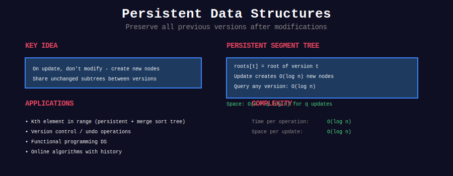

<div align="center">

# 💾 Persistent Data Structures



<p>
  
  
  
</p>

**Time Travel in Data Structures - Access Any Version**

*Immutability meets efficiency*

</div>

---

## 🧭 Navigation

| ⬅️ Previous | 📂 Current | ➡️ Next |
|:------------|:----------:|--------:|
| [← Sqrt Decomposition](../34_sqrt_decomposition/README.md) | **Persistent DS** | [Randomized Algorithms →](../36_randomized_algorithms/README.md) |

---

## 🎨 Visual Overview

<div align="center">


</div>

---

## 📐 Core Concept

**Persistent Data Structure:** Preserves **all previous versions** when modified.

**Key Properties:**
- ✅ Access any historical version
- ✅ Modifications create new version without affecting old
- ✅ Space-efficient through **path copying**
- ✅ Time complexity same or slightly worse than mutable version

**Types:**
- **Partially Persistent:** Access all versions, modify only latest
- **Fully Persistent:** Access and modify any version
- **Confluently Persistent:** Merge different versions

---

## 💻 Implementation

### Persistent Segment Tree

```python
class PersistentSegmentTree:
    class Node:
        def __init__(self, val=0, left=None, right=None):
            self.val = val
            self.left = left
            self.right = right
    
    def __init__(self, arr):
        self.n = len(arr)
        self.versions = [self._build(arr, 0, self.n - 1)]
    
    def _build(self, arr, l, r):
        if l == r:
            return self.Node(arr[l])
        mid = (l + r) // 2
        node = self.Node()
        node.left = self._build(arr, l, mid)
        node.right = self._build(arr, mid + 1, r)
        node.val = node.left.val + node.right.val
        return node
    
    def update(self, version, idx, val):
        """Create new version with updated value."""
        new_root = self._update(self.versions[version], 0, self.n - 1, idx, val)
        self.versions.append(new_root)
        return len(self.versions) - 1
    
    def _update(self, node, l, r, idx, val):
        if l == r:
            return self.Node(val)
        
        mid = (l + r) // 2
        new_node = self.Node()
        
        if idx <= mid:
            new_node.left = self._update(node.left, l, mid, idx, val)
            new_node.right = node.right  # Reuse old subtree
        else:
            new_node.left = node.left    # Reuse old subtree
            new_node.right = self._update(node.right, mid + 1, r, idx, val)
        
        new_node.val = new_node.left.val + new_node.right.val
        return new_node
    
    def query(self, version, l, r):
        """Query range sum in specific version."""
        return self._query(self.versions[version], 0, self.n - 1, l, r)
    
    def _query(self, node, tl, tr, l, r):
        if l > r:
            return 0
        if tl == l and tr == r:
            return node.val
        mid = (tl + tr) // 2
        return (self._query(node.left, tl, mid, l, min(r, mid)) +
                self._query(node.right, mid + 1, tr, max(l, mid + 1), r))

```

---

## 🏆 LeetCode Problems

### 🟡 Medium

| # | Problem | Technique | Difficulty |
|:-:|---------|-----------|-----------|
| 981 | [Time Based Key-Value Store](https://leetcode.com/problems/time-based-key-value-store/) | Versioning | ⭐⭐ |
| 1146 | [Snapshot Array](https://leetcode.com/problems/snapshot-array/) | Persistent array | ⭐⭐⭐ |

### 🔴 Hard

| # | Problem | Technique | Difficulty |
|:-:|---------|-----------|-----------|
| 2080 | [Range Frequency Queries](https://leetcode.com/problems/range-frequency-queries/) | Persistent segment tree | ⭐⭐⭐⭐ |
| 2276 | [Count Integers in Intervals](https://leetcode.com/problems/count-integers-in-intervals/) | Persistent data | ⭐⭐⭐⭐ |

---

## 💡 Key Insights

> **Path Copying:** Only copy nodes on path from root to modified leaf. O(log n) space per update!

> **Time Complexity:** Same as non-persistent + O(log n) for copying

> **Use Cases:** Version control, time travel queries, undo/redo, functional programming

---

<div align="center">

**Made with ❤️ by [Gaurav Goswami](https://github.com/Gaurav14cs17)**

</div>

---

## 🧭 Navigation

| ⬅️ Previous | 📂 Current | ➡️ Next |
|:------------|:----------:|--------:|
| [← Sqrt Decomposition](../34_sqrt_decomposition/README.md) | **Persistent DS** | [Randomized Algorithms →](../36_randomized_algorithms/README.md) |
