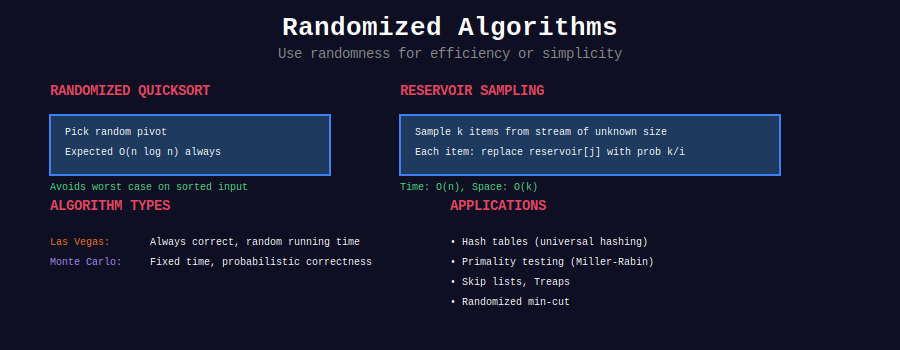
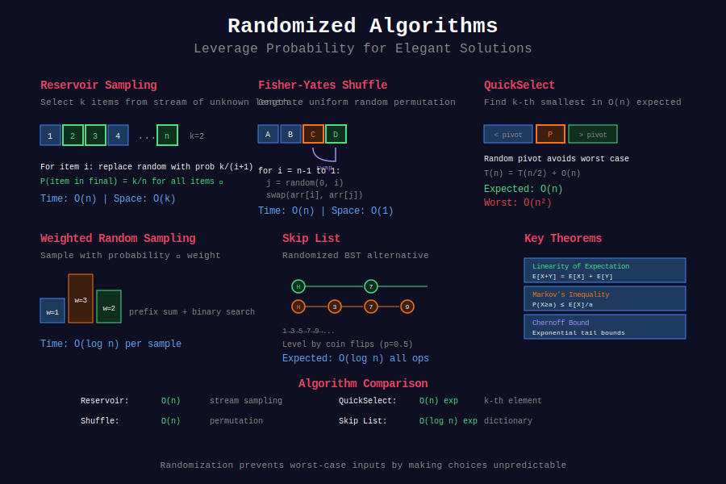

<div align="center">

# 🎲 Randomized Algorithms



<p>
  
  
  
</p>

**Leverage Randomness for Elegant Solutions**

*When probability theory meets algorithm design*

</div>

---

## 🧭 Navigation

| ⬅️ Previous | 📂 Current | ➡️ Next |
|:------------|:----------:|--------:|
| [← Persistent DS](../35_persistent_ds/README.md) | **Randomized Algorithms** | [Interval Trees →](../37_interval_trees/README.md) |

---

## 🎨 Visual Overview

<div align="center">



</div>

---

## 📐 Mathematical Foundation

### Expected Value

For random variable X:

**E[X] = Σ x · P(X = x)**

**Linearity of Expectation:**
E[X + Y] = E[X] + E[Y]  (even if X, Y not independent!)

### Key Theorems

**1. Markov's Inequality:**

```
P(X ≥ a) ≤ E[X] / a

```

**2. Chebyshev's Inequality:**

```
P(|X - E[X]| ≥ k·σ) ≤ 1/k²

```

**3. Chernoff Bound:**
For sum of independent Bernoulli trials:

```
P(X ≥ (1+δ)μ) ≤ e^(-δ²μ/3)

```

---

## 💻 Core Implementations

### 1. Reservoir Sampling (k items from stream)

```python
def reservoir_sample(stream, k):
    """
    Select k items uniformly at random from stream of unknown length.
    
    Time: O(n), Space: O(k)
    Each item has probability k/n of being selected.
    """
    reservoir = []
    
    for i, item in enumerate(stream):
        if i < k:
            reservoir.append(item)
        else:
            # With probability k/(i+1), replace random item
            j = random.randint(0, i)
            if j < k:
                reservoir[j] = item
    
    return reservoir

# Proof of correctness:
# P(item_i in final sample) = k/n for all i
# For item at index i:
# P(selected) = k/(i+1) * product of not being replaced
#             = k/(i+1) * (i+1)/(i+2) * ... * (n-1)/n
#             = k/n ✓

```

### 2. Fisher-Yates Shuffle

```python
def shuffle(arr):
    """
    Generate uniform random permutation.
    
    Time: O(n), Space: O(1)
    Each of n! permutations has equal probability.
    """
    n = len(arr)
    for i in range(n - 1, 0, -1):
        j = random.randint(0, i)
        arr[i], arr[j] = arr[j], arr[i]
    return arr

# Why it works:
# After k iterations, last k elements are a random k-permutation
# Probability of any permutation = 1/n!

```

### 3. QuickSelect (Randomized)

```python
def quickselect(arr, k):
    """
    Find k-th smallest element.
    
    Expected Time: O(n)
    Worst Case: O(n²) but probability exponentially small
    """
    if len(arr) == 1:
        return arr[0]
    
    # Random pivot
    pivot = random.choice(arr)
    
    left = [x for x in arr if x < pivot]
    mid = [x for x in arr if x == pivot]
    right = [x for x in arr if x > pivot]
    
    if k < len(left):
        return quickselect(left, k)
    elif k < len(left) + len(mid):
        return pivot
    else:
        return quickselect(right, k - len(left) - len(mid))

# Expected recurrence:
# T(n) = T(n/2) + O(n) = O(n)
# With high probability, pivot near median

```

### 4. Weighted Random Sampling

```python
class WeightedRandom:
    def __init__(self, weights):
        """
        Precompute prefix sums for O(log n) sampling.
        """
        self.prefix = []
        total = 0
        for w in weights:
            total += w
            self.prefix.append(total)
        self.total = total
    
    def pick(self):
        """
        Sample with probability proportional to weight.
        
        Time: O(log n)
        """
        target = random.random() * self.total
        # Binary search for target
        left, right = 0, len(self.prefix) - 1
        while left < right:
            mid = (left + right) // 2
            if self.prefix[mid] < target:
                left = mid + 1
            else:
                right = mid
        return left

```

### 5. Skip List (Randomized BST)

```python
class SkipList:
    class Node:
        def __init__(self, val, level):
            self.val = val
            self.forward = [None] * (level + 1)
    
    def __init__(self, max_level=16, p=0.5):
        self.max_level = max_level
        self.p = p
        self.head = self.Node(float('-inf'), max_level)
        self.level = 0
    
    def random_level(self):
        """Generate random level with probability p^k."""
        lvl = 0
        while random.random() < self.p and lvl < self.max_level:
            lvl += 1
        return lvl
    
    def insert(self, val):
        """Expected Time: O(log n)"""
        update = [None] * (self.max_level + 1)
        curr = self.head
        
        for i in range(self.level, -1, -1):
            while curr.forward[i] and curr.forward[i].val < val:
                curr = curr.forward[i]
            update[i] = curr
        
        lvl = self.random_level()
        if lvl > self.level:
            for i in range(self.level + 1, lvl + 1):
                update[i] = self.head
            self.level = lvl
        
        new_node = self.Node(val, lvl)
        for i in range(lvl + 1):
            new_node.forward[i] = update[i].forward[i]
            update[i].forward[i] = new_node

```

---

## 🏆 LeetCode Problems by Pattern

### 🎯 Reservoir Sampling (5 problems)

| # | Problem | Difficulty | Key Insight |
|:-:|---------|-----------|-------------|
| 382 | [Linked List Random Node](https://leetcode.com/problems/linked-list-random-node/) | ⭐⭐ | Stream of unknown length |
| 398 | [Random Pick Index](https://leetcode.com/problems/random-pick-index/) | ⭐⭐ | Multiple occurrences |
| 497 | [Random Point in Rectangles](https://leetcode.com/problems/random-point-in-non-overlapping-rectangles/) | ⭐⭐ | Weighted by area |

### 🔀 Shuffling (4 problems)

| # | Problem | Difficulty | Key Insight |
|:-:|---------|-----------|-------------|
| 384 | [Shuffle an Array](https://leetcode.com/problems/shuffle-an-array/) | ⭐⭐ | Fisher-Yates |
| 519 | [Random Flip Matrix](https://leetcode.com/problems/random-flip-matrix/) | ⭐⭐ | Virtual shuffle |

### ⚖️ Weighted Sampling (6 problems)

| # | Problem | Difficulty | Key Insight |
|:-:|---------|-----------|-------------|
| 528 | [Random Pick with Weight](https://leetcode.com/problems/random-pick-with-weight/) | ⭐⭐ | Prefix sum + binary search |
| 710 | [Random Pick with Blacklist](https://leetcode.com/problems/random-pick-with-blacklist/) | ⭐⭐⭐⭐ | Virtual swapping |

### 🎲 Rejection Sampling (3 problems)

| # | Problem | Difficulty | Key Insight |
|:-:|---------|-----------|-------------|
| 470 | [Implement Rand10() Using Rand7()](https://leetcode.com/problems/implement-rand10-using-rand7/) | ⭐⭐⭐ | Rejection + digit generation |
| 478 | [Generate Random Point in Circle](https://leetcode.com/problems/generate-random-point-in-a-circle/) | ⭐⭐ | Polar coordinates |

### 🚀 QuickSelect (4 problems)

| # | Problem | Difficulty | Key Insight |
|:-:|---------|-----------|-------------|
| 215 | [Kth Largest Element](https://leetcode.com/problems/kth-largest-element-in-an-array/) | ⭐⭐ | Classic quickselect |
| 347 | [Top K Frequent Elements](https://leetcode.com/problems/top-k-frequent-elements/) | ⭐⭐ | Frequency + quickselect |
| 973 | [K Closest Points](https://leetcode.com/problems/k-closest-points-to-origin/) | ⭐⭐ | Distance + quickselect |

---

## 🎯 Common Patterns

### Pattern 1: Stream Processing → Reservoir Sampling
**Recognition:** Unknown length stream, need k random items  
**Solution:** Keep reservoir of k items, probabilistically replace

### Pattern 2: Uniform Distribution → Shuffle/Rejection
**Recognition:** Generate random with constraints  
**Solution:** Fisher-Yates or rejection sampling

### Pattern 3: Non-uniform Distribution → Weighted Sampling
**Recognition:** Different probabilities for choices  
**Solution:** Prefix sums + binary search

### Pattern 4: Selection Problem → QuickSelect
**Recognition:** Find k-th element without full sort  
**Solution:** Randomized partitioning

---

## 📊 Practice Roadmap

### Week 1: Foundation (5 problems)

- [ ] 384. Shuffle an Array

- [ ] 398. Random Pick Index

- [ ] 382. Linked List Random Node

- [ ] 528. Random Pick with Weight

- [ ] 215. Kth Largest Element

### Week 2: Advanced (5 problems)

- [ ] 470. Implement Rand10()

- [ ] 478. Generate Random Point in Circle

- [ ] 710. Random Pick with Blacklist

- [ ] 497. Random Point in Rectangles

- [ ] 519. Random Flip Matrix

---

## 🔍 Interview Focus

**Top 5 Must-Know:**
1. **Reservoir Sampling** - Stream processing classic
2. **Fisher-Yates Shuffle** - Uniform permutation generation
3. **Weighted Sampling** - Prefix sum technique
4. **QuickSelect** - Expected O(n) selection
5. **Rejection Sampling** - Generate constrained distributions

**Common Mistakes:**
- ❌ Using `random.choice()` repeatedly (biased!)

- ❌ Forgetting to maintain uniform probability

- ❌ Not handling edge cases in reservoir sampling

- ❌ Using modulo for random range (biased for non-powers of 2)

---

## 📚 References

| Resource | Link |
|----------|------|
| **Randomized Algorithms** | [MIT OCW](https://ocw.mit.edu/courses/electrical-engineering-and-computer-science/6-046j-design-and-analysis-of-algorithms-spring-2015/) |
| **Reservoir Sampling** | [Paper](https://en.wikipedia.org/wiki/Reservoir_sampling) |
| **Skip Lists** | [William Pugh's Paper](https://15721.courses.cs.cmu.edu/spring2018/papers/08-oltpindexes1/pugh-skiplists-cacm1990.pdf) |

---

## 💡 Key Insights

> **Linearity of Expectation:** Works even without independence! Powerful for analysis.

> **Randomization as Adversary Removal:** Prevents worst-case inputs by making choices random.

> **High Probability Bounds:** "With high probability" often means probability ≥ 1 - 1/n^c for some constant c.

---

<div align="center">

**Made with ❤️ by [Gaurav Goswami](https://github.com/Gaurav14cs17)**

</div>

---

## 🧭 Navigation

| ⬅️ Previous | 📂 Current | ➡️ Next |
|:------------|:----------:|--------:|
| [← Persistent DS](../35_persistent_ds/README.md) | **Randomized Algorithms** | [Interval Trees →](../37_interval_trees/README.md) |
