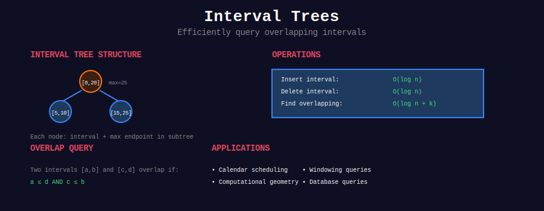

<div align="center">

# 📊 Interval Trees



<p>
  
  
  
</p>

**Efficient Interval Operations in O(log n)**

*When ranges matter more than points*

</div>

---

## 🧭 Navigation

| ⬅️ Previous | 📂 Current | ➡️ Next |
|:------------|:----------:|--------:|
| [← Randomized Algorithms](../36_randomized_algorithms/README.md) | **Interval Trees** | [Online Algorithms →](../38_online_algorithms/README.md) |

---

## 🎨 Visual Overview

<div align="center">


</div>

---

## 📐 Mathematical Foundation

### Problem Definition

**Given:** Set of intervals I = {[l₁, r₁], [l₂, r₂], ..., [lₙ, rₙ]}

**Operations:**
- **Insert(interval):** Add interval to set

- **Delete(interval):** Remove interval from set

- **Query(point):** Find all intervals containing point

- **Overlap(interval):** Find all intervals overlapping with given interval

### Key Property

**Augmented BST:** Store max endpoint in subtree

```
Node:
  - interval: [low, high]
  - max: max(high, left.max, right.max)
  - left, right: child pointers

```

**Query Optimization:**

```
If node.left.max < query_low:
    ⟹ No overlap in left subtree (prune!)

```

---

## 💻 Core Implementations

### 1. Interval Tree (Overlap Queries)

```python
class IntervalTree:
    class Node:
        def __init__(self, interval):
            self.interval = interval  # [low, high]
            self.max = interval[1]
            self.left = None
            self.right = None
    
    def __init__(self):
        self.root = None
    
    def insert(self, interval):
        """Insert interval. Time: O(log n)"""
        self.root = self._insert(self.root, interval)
    
    def _insert(self, node, interval):
        if not node:
            return self.Node(interval)
        
        # BST on low endpoint
        if interval[0] < node.interval[0]:
            node.left = self._insert(node.left, interval)
        else:
            node.right = self._insert(node.right, interval)
        
        # Update max
        node.max = max(node.interval[1], 
                      node.left.max if node.left else float('-inf'),
                      node.right.max if node.right else float('-inf'))
        return node
    
    def overlap_search(self, interval):
        """Find ONE overlapping interval. Time: O(log n)"""
        return self._overlap(self.root, interval)
    
    def _overlap(self, node, interval):
        if not node:
            return None
        
        # Check current node
        if self._overlaps(node.interval, interval):
            return node.interval
        
        # If left subtree might contain overlap
        if node.left and node.left.max >= interval[0]:
            return self._overlap(node.left, interval)
        
        # Otherwise check right
        return self._overlap(node.right, interval)
    
    def _overlaps(self, a, b):
        """Check if two intervals overlap."""
        return a[0] <= b[1] and b[0] <= a[1]
    
    def all_overlaps(self, interval):
        """Find ALL overlapping intervals. Time: O(k + log n)"""
        result = []
        self._all_overlaps(self.root, interval, result)
        return result
    
    def _all_overlaps(self, node, interval, result):
        if not node:
            return
        
        # Check left subtree
        if node.left and node.left.max >= interval[0]:
            self._all_overlaps(node.left, interval, result)
        
        # Check current node
        if self._overlaps(node.interval, interval):
            result.append(node.interval)
        
        # Check right subtree
        if node.interval[0] <= interval[1]:
            self._all_overlaps(node.right, interval, result)

```

### 2. Segment Tree with Lazy Propagation

```python
class SegmentTreeLazy:
    def __init__(self, n):
        self.n = n
        self.tree = [0] * (4 * n)
        self.lazy = [0] * (4 * n)
    
    def push(self, v, tl, tr):
        """Propagate lazy update."""
        if self.lazy[v]:
            self.tree[v] += self.lazy[v] * (tr - tl + 1)
            if tl != tr:
                self.lazy[2*v] += self.lazy[v]
                self.lazy[2*v+1] += self.lazy[v]
            self.lazy[v] = 0
    
    def update_range(self, l, r, val):
        """Add val to range [l, r]. Time: O(log n)"""
        self._update(1, 0, self.n - 1, l, r, val)
    
    def _update(self, v, tl, tr, l, r, val):
        self.push(v, tl, tr)
        
        if l > r:
            return
        
        if l == tl and r == tr:
            self.lazy[v] += val
            self.push(v, tl, tr)
            return
        
        tm = (tl + tr) // 2
        self._update(2*v, tl, tm, l, min(r, tm), val)
        self._update(2*v+1, tm+1, tr, max(l, tm+1), r, val)
        
        self.push(2*v, tl, tm)
        self.push(2*v+1, tm+1, tr)
        self.tree[v] = self.tree[2*v] + self.tree[2*v+1]
    
    def query(self, l, r):
        """Query sum on [l, r]. Time: O(log n)"""
        return self._query(1, 0, self.n - 1, l, r)
    
    def _query(self, v, tl, tr, l, r):
        if l > r:
            return 0
        
        self.push(v, tl, tr)
        
        if l == tl and r == tr:
            return self.tree[v]
        
        tm = (tl + tr) // 2
        return (self._query(2*v, tl, tm, l, min(r, tm)) +
                self._query(2*v+1, tm+1, tr, max(l, tm+1), r))

```

### 3. Coordinate Compression (For Large Ranges)

```python
class CompressedIntervalTree:
    def __init__(self):
        self.coords = set()
        self.intervals = []
    
    def add_interval(self, l, r):
        """Collect coordinates."""
        self.coords.add(l)
        self.coords.add(r)
        self.intervals.append((l, r))
    
    def build(self):
        """Compress coordinates."""
        self.sorted_coords = sorted(self.coords)
        self.coord_map = {c: i for i, c in enumerate(self.sorted_coords)}
        self.n = len(self.sorted_coords)
        self.tree = SegmentTreeLazy(self.n)
    
    def update(self, l, r, val):
        """Update compressed range."""
        l_idx = self.coord_map[l]
        r_idx = self.coord_map[r]
        self.tree.update_range(l_idx, r_idx, val)

```

---

## 🏆 LeetCode Problems by Pattern

### 🎯 Basic Interval Operations (8 problems)

| # | Problem | Difficulty | Key Insight |
|:-:|---------|-----------|-------------|
| 56 | [Merge Intervals](https://leetcode.com/problems/merge-intervals/) | ⭐⭐ | Sort + greedy merge |
| 57 | [Insert Interval](https://leetcode.com/problems/insert-interval/) | ⭐⭐ | Three-phase merge |
| 435 | [Non-overlapping Intervals](https://leetcode.com/problems/non-overlapping-intervals/) | ⭐⭐ | Greedy by end time |
| 452 | [Minimum Arrows](https://leetcode.com/problems/minimum-number-of-arrows-to-burst-balloons/) | ⭐⭐ | Same as 435 |
| 986 | [Interval List Intersections](https://leetcode.com/problems/interval-list-intersections/) | ⭐⭐ | Two pointers |
| 1288 | [Remove Covered Intervals](https://leetcode.com/problems/remove-covered-intervals/) | ⭐⭐ | Sort by start, desc by end |

### 📅 Calendar Problems (5 problems)

| # | Problem | Difficulty | Key Insight |
|:-:|---------|-----------|-------------|
| 729 | [My Calendar I](https://leetcode.com/problems/my-calendar-i/) | ⭐⭐ | Binary search tree |
| 731 | [My Calendar II](https://leetcode.com/problems/my-calendar-ii/) | ⭐⭐ | Track double bookings |
| 732 | [My Calendar III](https://leetcode.com/problems/my-calendar-iii/) | ⭐⭐⭐⭐ | Sweep line + TreeMap |
| 2276 | [Count Integers in Intervals](https://leetcode.com/problems/count-integers-in-intervals/) | ⭐⭐⭐⭐ | Merge on insert |

### 🎨 Range Module / Painting (6 problems)

| # | Problem | Difficulty | Key Insight |
|:-:|---------|-----------|-------------|
| 715 | [Range Module](https://leetcode.com/problems/range-module/) | ⭐⭐⭐⭐ | Segment tree or sorted intervals |
| 2158 | [Amount of New Area Painted](https://leetcode.com/problems/amount-of-new-area-painted-each-day/) | ⭐⭐⭐⭐ | Coordinate compression |
| 699 | [Falling Squares](https://leetcode.com/problems/falling-squares/) | ⭐⭐⭐⭐ | Lazy segment tree |
| 218 | [The Skyline Problem](https://leetcode.com/problems/the-skyline-problem/) | ⭐⭐⭐⭐ | Sweep line + multiset |

### 🔍 Query Problems (6 problems)

| # | Problem | Difficulty | Key Insight |
|:-:|---------|-----------|-------------|
| 352 | [Data Stream as Disjoint Intervals](https://leetcode.com/problems/data-stream-as-disjoint-intervals/) | ⭐⭐⭐ | TreeMap merge |
| 436 | [Find Right Interval](https://leetcode.com/problems/find-right-interval/) | ⭐⭐ | Binary search on starts |
| 495 | [Teemo Attacking](https://leetcode.com/problems/teemo-attacking/) | ⭐⭐ | Merge consecutive |
| 616 | [Add Bold Tag in String](https://leetcode.com/problems/add-bold-tag-in-string/) | ⭐⭐ | Interval merging |

---

## 🎯 Common Patterns

### Pattern 1: Merge Overlapping Intervals

```python
def merge(intervals):
    intervals.sort()
    result = [intervals[0]]
    
    for curr in intervals[1:]:
        last = result[-1]
        if curr[0] <= last[1]:  # Overlap
            result[-1] = [last[0], max(last[1], curr[1])]
        else:
            result.append(curr)
    
    return result

```

### Pattern 2: Interval Intersection

```python
def intersection(a, b):
    """Return intersection of two intervals."""
    start = max(a[0], b[0])
    end = min(a[1], b[1])
    return [start, end] if start <= end else None

```

### Pattern 3: Sweep Line for Max Overlap

```python
def max_overlap(intervals):
    events = []
    for l, r in intervals:
        events.append((l, 1))   # Start
        events.append((r, -1))  # End
    
    events.sort()
    curr = max_count = 0
    
    for _, delta in events:
        curr += delta
        max_count = max(max_count, curr)
    
    return max_count

```

---

## 📊 Comparison of Data Structures

| Data Structure | Insert | Query | Range Update | Use Case |
|----------------|--------|-------|--------------|----------|
| **Interval Tree** | O(log n) | O(k + log n) | ❌ | Overlap queries |
| **Segment Tree** | O(log n) | O(log n) | ✅ O(log n) | Range queries |
| **Sorted List** | O(n) | O(log n) | ❌ | Static queries |
| **TreeMap** | O(log n) | O(log n) | ❌ | Dynamic intervals |

---

## 📊 Practice Roadmap

### Week 1: Foundation (6 problems)

- [ ] 56. Merge Intervals

- [ ] 57. Insert Interval

- [ ] 435. Non-overlapping Intervals

- [ ] 986. Interval List Intersections

- [ ] 729. My Calendar I

- [ ] 731. My Calendar II

### Week 2: Advanced (6 problems)

- [ ] 732. My Calendar III

- [ ] 715. Range Module

- [ ] 2276. Count Integers in Intervals

- [ ] 2158. Amount of New Area Painted

- [ ] 352. Data Stream as Disjoint Intervals

- [ ] 218. The Skyline Problem

---

## 🔍 Interview Focus

**Top 5 Must-Know:**
1. **Merge Intervals** - Sort + greedy pattern
2. **Insert Interval** - Three-phase approach
3. **My Calendar Series** - Building up complexity
4. **Range Module** - Full interval management
5. **Sweep Line** - Event-based processing

**Common Mistakes:**
- ❌ Not sorting intervals first

- ❌ Wrong overlap condition (use `a[0] <= b[1] and b[0] <= a[1]`)

- ❌ Not handling edge cases (empty, single interval)

- ❌ Inefficient coordinate compression

---

## 📚 References

| Resource | Link |
|----------|------|
| **Interval Trees** | [MIT OCW](https://courses.csail.mit.edu/6.851/spring21/) |
| **CLRS Chapter 14** | [Augmenting Data Structures](https://mitpress.mit.edu/books/introduction-algorithms-third-edition) |
| **Segment Trees** | [CP-Algorithms](https://cp-algorithms.com/data_structures/segment_tree.html) |

---

## 💡 Key Insights

> **Augmentation Principle:** Store additional information (max endpoint) to enable efficient pruning.

> **Coordinate Compression:** When ranges are large (10⁹) but count is small (10⁵), compress!

> **Lazy Propagation:** Defer updates until query time for O(log n) range updates.

> **Greedy Interval Scheduling:** Sort by end time, pick earliest ending non-overlapping interval.

---

<div align="center">

**Made with ❤️ by [Gaurav Goswami](https://github.com/Gaurav14cs17)**

</div>

---

## 🧭 Navigation

| ⬅️ Previous | 📂 Current | ➡️ Next |
|:------------|:----------:|--------:|
| [← Randomized Algorithms](../36_randomized_algorithms/README.md) | **Interval Trees** | [Online Algorithms →](../38_online_algorithms/README.md) |
