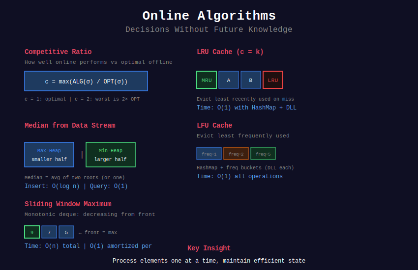
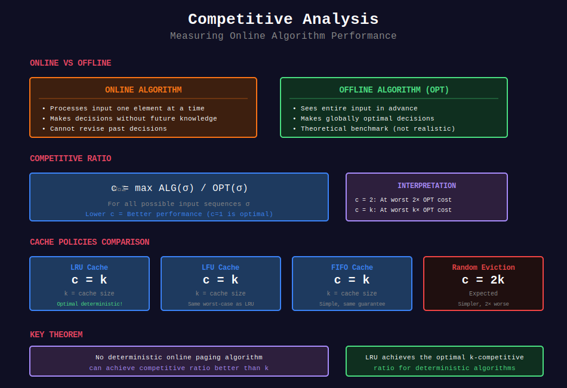
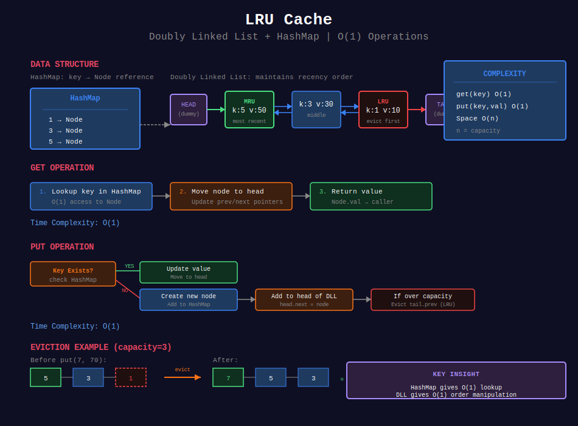
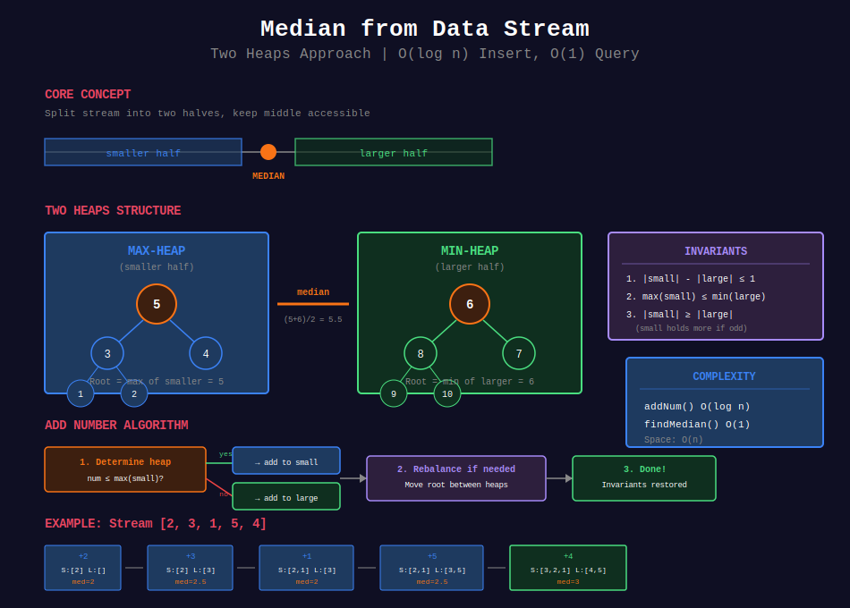
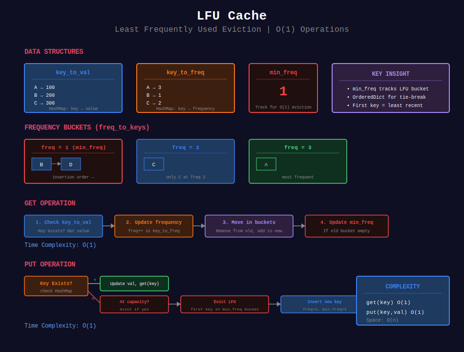
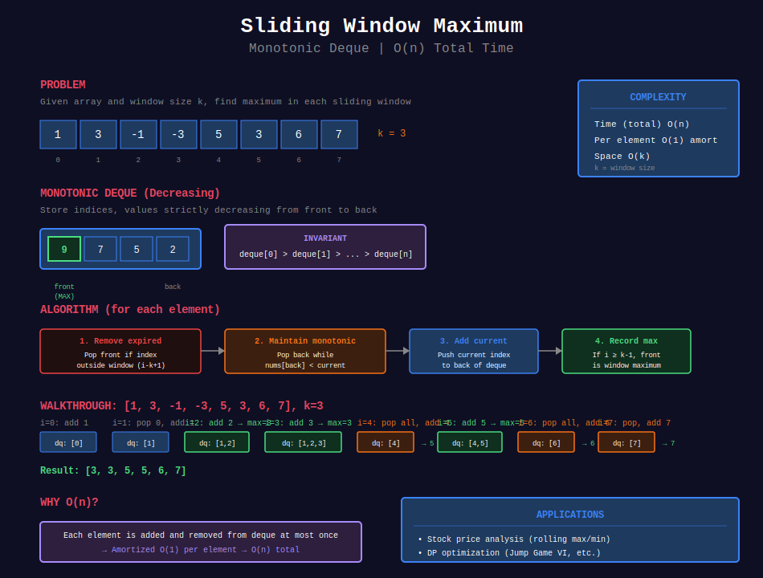

<div align="center">

# 🌐 Online Algorithms


<p>
  
  
  
</p>

**Process Data Sequentially Without Knowing the Future**

*When you can't look ahead*

</div>

---

## 📊 Visual Overview

<div align="center">



</div>

---

## 🧭 Navigation

| ⬅️ Previous | 📂 Current | ➡️ Next |
|:------------|:----------:|--------:|
| [← Interval Trees](../37_interval_trees/README.md) | **Online Algorithms** | [Approximation Algorithms →](../39_approximation_algorithms/README.md) |

---

## 📐 Mathematical Foundation

### Competitive Analysis

**Competitive Ratio:** Measure of online algorithm performance

```
ALGₒₙₗᵢₙₑ(σ) ≤ c · ALGₒₚₜ(σ) + α

Where:

- σ = input sequence

- c = competitive ratio

- α = additive constant

```

**Example:** LRU Cache is **k-competitive** for cache size k.

<div align="center">



</div>

### Adversarial Model

**Oblivious Adversary:** Generates input without seeing algorithm's random choices  
**Adaptive Adversary:** Sees algorithm's choices and adapts

---

## 💻 Core Implementations

### 1. LRU Cache (Doubly Linked List + HashMap)

<div align="center">



</div>

```python
class LRUCache:
    class Node:
        def __init__(self, key=0, val=0):
            self.key = key
            self.val = val
            self.prev = None
            self.next = None
    
    def __init__(self, capacity: int):
        self.capacity = capacity
        self.cache = {}  # key -> Node
        
        # Dummy head and tail
        self.head = self.Node()
        self.tail = self.Node()
        self.head.next = self.tail
        self.tail.prev = self.head
    
    def _remove(self, node):
        """Remove node from list."""
        node.prev.next = node.next
        node.next.prev = node.prev
    
    def _add_to_head(self, node):
        """Add node right after head."""
        node.next = self.head.next
        node.prev = self.head
        self.head.next.prev = node
        self.head.next = node
    
    def _move_to_head(self, node):
        """Move existing node to head (most recent)."""
        self._remove(node)
        self._add_to_head(node)
    
    def get(self, key: int) -> int:
        """O(1) get operation."""
        if key not in self.cache:
            return -1
        
        node = self.cache[key]
        self._move_to_head(node)
        return node.val
    
    def put(self, key: int, value: int) -> None:
        """O(1) put operation."""
        if key in self.cache:
            node = self.cache[key]
            node.val = value
            self._move_to_head(node)
        else:
            node = self.Node(key, value)
            self.cache[key] = node
            self._add_to_head(node)
            
            if len(self.cache) > self.capacity:
                # Remove LRU (tail.prev)
                lru = self.tail.prev
                self._remove(lru)
                del self.cache[lru.key]

```

### 2. Median from Data Stream (Two Heaps)

<div align="center">



</div>

```python
from heapq import *

class MedianFinder:
    def __init__(self):
        # Max heap for smaller half (negate values)
        self.small = []
        # Min heap for larger half
        self.large = []
    
    def addNum(self, num: int) -> None:
        """Add number maintaining heap invariants. O(log n)"""
        
        # Add to appropriate heap
        if not self.small or num <= -self.small[0]:
            heappush(self.small, -num)
        else:
            heappush(self.large, num)
        
        # Balance heaps (size difference ≤ 1)
        if len(self.small) > len(self.large) + 1:
            heappush(self.large, -heappop(self.small))
        elif len(self.large) > len(self.small):
            heappush(self.small, -heappop(self.large))
    
    def findMedian(self) -> float:
        """Return median. O(1)"""
        if len(self.small) > len(self.large):
            return -self.small[0]
        return (-self.small[0] + self.large[0]) / 2.0

# Invariant:
# |len(small) - len(large)| ≤ 1
# max(small) ≤ min(large)

```

### 3. LFU Cache (Frequency Tracking)

<div align="center">



</div>

```python
from collections import defaultdict

class LFUCache:
    def __init__(self, capacity: int):
        self.capacity = capacity
        self.min_freq = 0
        
        self.key_to_val = {}
        self.key_to_freq = {}
        self.freq_to_keys = defaultdict(dict)  # freq -> {key: None}
    
    def _update_freq(self, key):
        """Increment frequency of key."""
        freq = self.key_to_freq[key]
        
        # Remove from current frequency
        del self.freq_to_keys[freq][key]
        if not self.freq_to_keys[freq] and freq == self.min_freq:
            self.min_freq += 1
        
        # Add to next frequency
        self.key_to_freq[key] = freq + 1
        self.freq_to_keys[freq + 1][key] = None
    
    def get(self, key: int) -> int:
        """O(1) get."""
        if key not in self.key_to_val:
            return -1
        
        self._update_freq(key)
        return self.key_to_val[key]
    
    def put(self, key: int, value: int) -> None:
        """O(1) put."""
        if self.capacity == 0:
            return
        
        if key in self.key_to_val:
            self.key_to_val[key] = value
            self._update_freq(key)
            return
        
        # Evict if at capacity
        if len(self.key_to_val) >= self.capacity:
            # Remove first (oldest) key with min_freq
            evict_key = next(iter(self.freq_to_keys[self.min_freq]))
            del self.freq_to_keys[self.min_freq][evict_key]
            del self.key_to_val[evict_key]
            del self.key_to_freq[evict_key]
        
        # Insert new key
        self.key_to_val[key] = value
        self.key_to_freq[key] = 1
        self.freq_to_keys[1][key] = None
        self.min_freq = 1

```

### 4. Sliding Window Maximum (Monotonic Deque)

<div align="center">



</div>

```python
from collections import deque

class SlidingWindowMax:
    def __init__(self):
        self.dq = deque()  # Store indices
    
    def max_sliding_window(self, nums, k):
        """
        For each window of size k, find maximum.
        
        Time: O(n), each element added/removed once
        Space: O(k)
        """
        result = []
        
        for i, num in enumerate(nums):
            # Remove elements outside window
            while self.dq and self.dq[0] < i - k + 1:
                self.dq.popleft()
            
            # Remove smaller elements (they'll never be max)
            while self.dq and nums[self.dq[-1]] < num:
                self.dq.pop()
            
            self.dq.append(i)
            
            # Add to result after first window
            if i >= k - 1:
                result.append(nums[self.dq[0]])
        
        return result

```

---

## 🏆 LeetCode Problems by Pattern

### 🎯 Cache Design (6 problems)

| # | Problem | Difficulty | Competitive Ratio |
|:-:|---------|-----------|-------------------|
| 146 | [LRU Cache](https://leetcode.com/problems/lru-cache/) | ⭐⭐ | k-competitive |
| 460 | [LFU Cache](https://leetcode.com/problems/lfu-cache/) | ⭐⭐⭐⭐ | k-competitive |
| 432 | [All O`one Data Structure](https://leetcode.com/problems/all-oone-data-structure/) | ⭐⭐⭐⭐ | O(1) ops |
| 355 | [Design Twitter](https://leetcode.com/problems/design-twitter/) | ⭐⭐ | Timeline merging |

### 📊 Stream Statistics (8 problems)

| # | Problem | Difficulty | Key Insight |
|:-:|---------|-----------|-------------|
| 295 | [Find Median from Stream](https://leetcode.com/problems/find-median-from-data-stream/) | ⭐⭐⭐⭐ | Two heaps |
| 346 | [Moving Average](https://leetcode.com/problems/moving-average-from-data-stream/) | ⭐ | Circular buffer |
| 703 | [Kth Largest in Stream](https://leetcode.com/problems/kth-largest-element-in-a-stream/) | ⭐⭐ | Min heap of size k |
| 155 | [Min Stack](https://leetcode.com/problems/min-stack/) | ⭐⭐ | Auxiliary stack |
| 716 | [Max Stack](https://leetcode.com/problems/max-stack/) | ⭐⭐ | Two stacks or TreeMap |

### 🪟 Sliding Window (5 problems)

| # | Problem | Difficulty | Key Insight |
|:-:|---------|-----------|-------------|
| 239 | [Sliding Window Maximum](https://leetcode.com/problems/sliding-window-maximum/) | ⭐⭐⭐⭐ | Monotonic deque |
| 480 | [Sliding Window Median](https://leetcode.com/problems/sliding-window-median/) | ⭐⭐⭐⭐ | Two multisets |
| 1696 | [Jump Game VI](https://leetcode.com/problems/jump-game-vi/) | ⭐⭐⭐ | DP + monotonic deque |

### 🎲 Randomized Data Structures (4 problems)

| # | Problem | Difficulty | Key Insight |
|:-:|---------|-----------|-------------|
| 380 | [Insert Delete GetRandom O(1)](https://leetcode.com/problems/insert-delete-getrandom-o1/) | ⭐⭐ | Array + HashMap |
| 381 | [Insert Delete GetRandom with Duplicates](https://leetcode.com/problems/insert-delete-getrandom-o1-duplicates-allowed/) | ⭐⭐⭐⭐ | HashMap of sets |
| 710 | [Random Pick with Blacklist](https://leetcode.com/problems/random-pick-with-blacklist/) | ⭐⭐⭐⭐ | Virtual remapping |

---

## 🎯 Common Patterns

### Pattern 1: Doubly Linked List for LRU
**When:** Need O(1) access, insert, delete  
**Structure:** HashMap + DLL  
**Key Operations:** Move to head, remove tail

### Pattern 2: Two Heaps for Median
**When:** Need running median  
**Invariant:** |size(left) - size(right)| ≤ 1  
**Median:** Top of larger heap (or average)

### Pattern 3: Monotonic Deque for Sliding Window
**When:** Sliding window min/max  
**Invariant:** Decreasing (for max) or increasing (for min)  
**Amortized:** O(1) per element

### Pattern 4: Frequency Tracking for LFU
**When:** Evict by access frequency  
**Structure:** freq → keys, key → (val, freq)  
**Key:** Track min_freq for O(1) eviction

---

## 📊 Comparison Table

| Cache Policy | Get | Put | Eviction | Use Case |
|--------------|-----|-----|----------|----------|
| **LRU** | O(1) | O(1) | Least Recently Used | General purpose |
| **LFU** | O(1) | O(1) | Least Frequently Used | Popular items persist |
| **FIFO** | O(1) | O(1) | First In First Out | Simple, predictable |
| **Random** | O(1) | O(1) | Random | Surprisingly good! |

**Theoretical Results:**

- LRU is **k-competitive** (k = cache size)

- No deterministic online algorithm can beat k-competitive

- Random eviction is **2k-competitive** (worse but simpler)

---

## 📊 Practice Roadmap

### Week 1: Cache Design (5 problems)

- [ ] 146. LRU Cache ⭐

- [ ] 155. Min Stack

- [ ] 380. Insert Delete GetRandom O(1)

- [ ] 460. LFU Cache

- [ ] 432. All O`one Data Structure

### Week 2: Stream Processing (6 problems)

- [ ] 295. Find Median from Stream ⭐

- [ ] 346. Moving Average

- [ ] 703. Kth Largest in Stream

- [ ] 239. Sliding Window Maximum ⭐

- [ ] 352. Data Stream as Disjoint Intervals

- [ ] 716. Max Stack

---

## 🔍 Interview Focus

**Top 5 Must-Know:**

1. **LRU Cache** - Most common cache interview question

2. **Median from Stream** - Two heaps technique

3. **Sliding Window Maximum** - Monotonic deque mastery

4. **LFU Cache** - Complex frequency tracking

5. **Insert Delete GetRandom** - Array + HashMap trick

**Common Mistakes:**

- ❌ Using OrderedDict for LRU without understanding internals

- ❌ Not maintaining heap invariants properly

- ❌ Forgetting to update frequency mappings in LFU

- ❌ Off-by-one errors in sliding window

---

## 📚 References

| Resource | Link |
|----------|------|
| **Online Algorithms** | [Borodin & El-Yaniv Book](https://www.cs.toronto.edu/~bor/Papers/book.pdf) |
| **Competitive Analysis** | [Sleator & Tarjan](https://dl.acm.org/doi/10.1145/2160.2161) |
| **Cache Policies** | [Wikipedia](https://en.wikipedia.org/wiki/Cache_replacement_policies) |

---

## 💡 Key Insights

> **No Free Lunch:** No online algorithm can always beat competitive ratio of k for cache size k.

> **Randomization Helps:** Random eviction achieves 2k-competitive, only 2× worse!

> **Amortized Analysis:** Monotonic deque operations are O(1) amortized per element.

> **Trade-offs:** LRU simpler, LFU better for skewed access patterns.

---

<div align="center">

**Made with ❤️ by [Gaurav Goswami](https://github.com/Gaurav14cs17)**

</div>

---

## 🧭 Navigation

| ⬅️ Previous | 📂 Current | ➡️ Next |
|:------------|:----------:|--------:|
| [← Interval Trees](../37_interval_trees/README.md) | **Online Algorithms** | [Approximation Algorithms →](../39_approximation_algorithms/README.md) |
