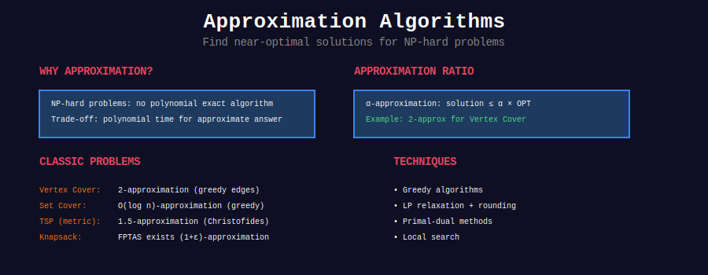
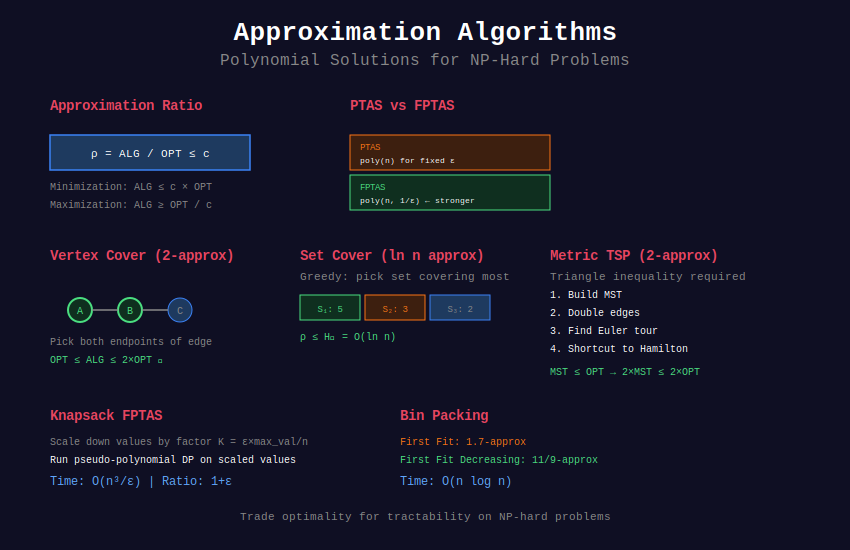
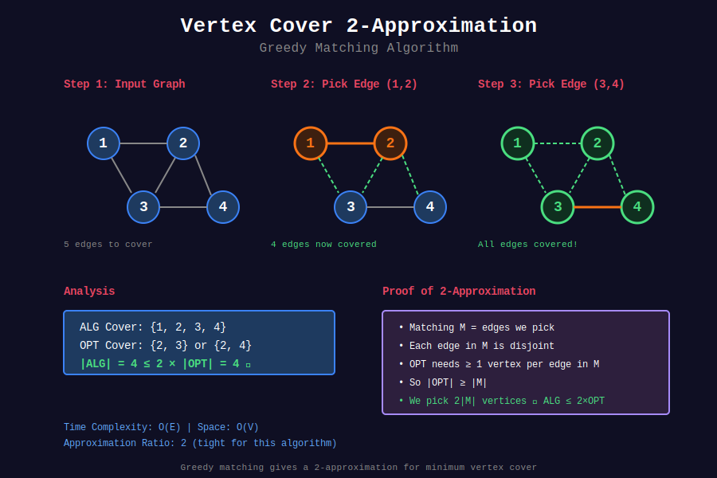
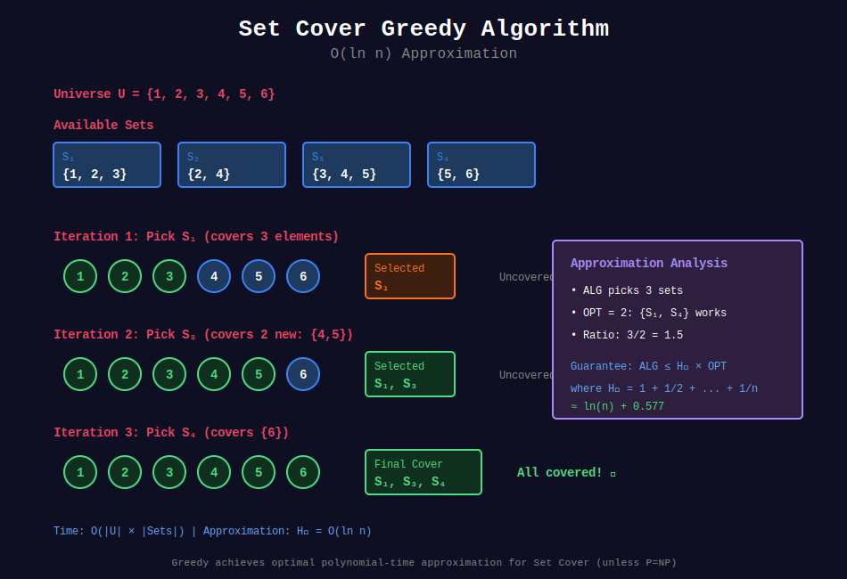
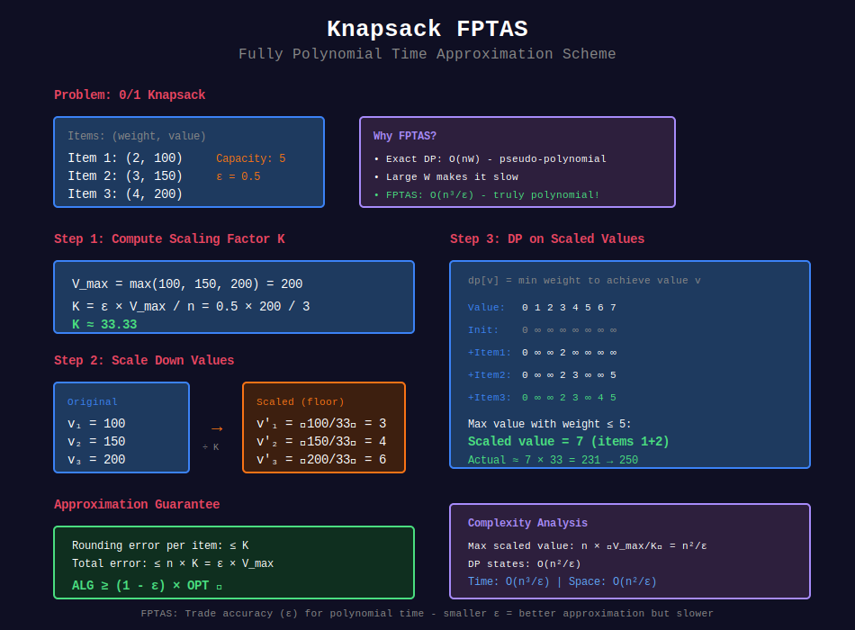
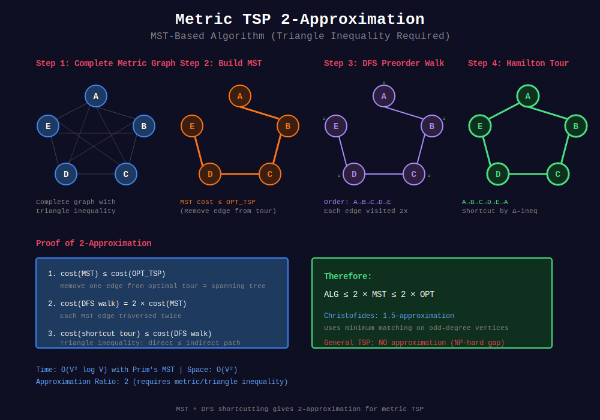
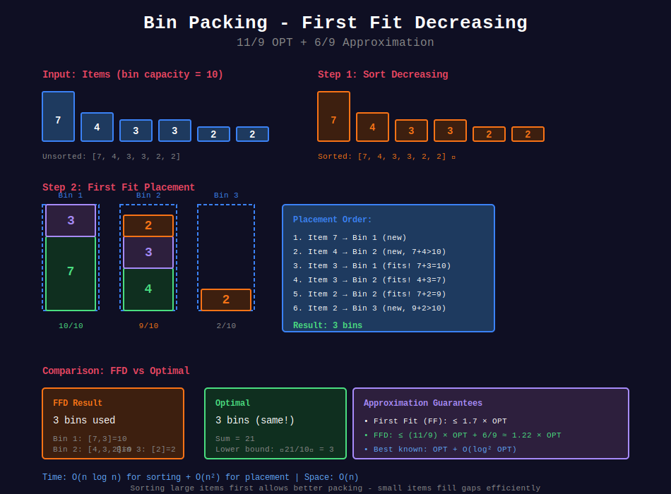
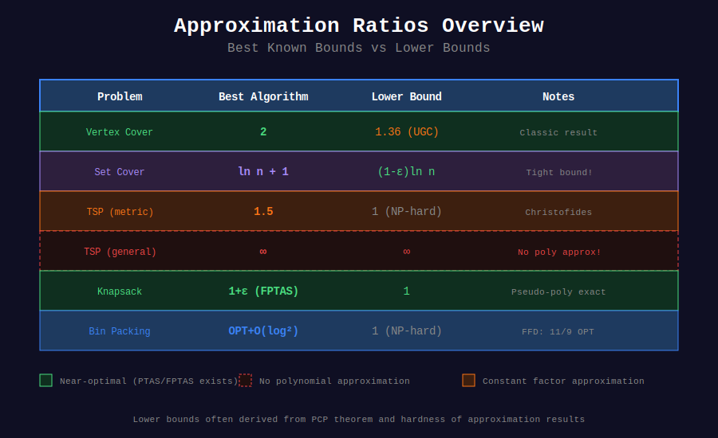

<div align="center">

# 🎯 Approximation Algorithms



<p>
  
  
  
</p>

**Near-Optimal Solutions for NP-Hard Problems**

*When exact is impossible, approximate intelligently*

</div>

---

## 🧭 Navigation

| ⬅️ Previous | 📂 Current | ➡️ Next |
|:------------|:----------:|--------:|
| [← Online Algorithms](../38_online_algorithms/README.md) | **Approximation Algorithms** | [DP Optimizations →](../40_dp_optimizations/README.md) |

---

## 📊 Visual Overview

<div align="center">

</div>

---

## 📐 Mathematical Foundation

### Approximation Ratio

**Definition:** Algorithm A has approximation ratio ρ(n) if for all inputs of size n:

```
max(ALG(I)/OPT(I), OPT(I)/ALG(I)) ≤ ρ(n)

Where:

- ALG(I) = algorithm's solution

- OPT(I) = optimal solution

- ρ(n) ≥ 1

```

**Example:** 2-approximation for Vertex Cover means:

```
ALG ≤ 2 · OPT

```

### PTAS vs FPTAS

**PTAS (Polynomial Time Approximation Scheme):**

- For any ε > 0, finds (1+ε)-approximation

- Time: O(n^f(1/ε))

**FPTAS (Fully PTAS):**

- PTAS where f(1/ε) is polynomial

- Time: O((n/ε)^c) for some constant c

---

## 💻 Core Implementations

### 1. Vertex Cover (2-Approximation)

<div align="center">

</div>

```python
def vertex_cover_approx(edges):
    """
    Find vertex cover using greedy matching.
    
    Approximation Ratio: 2
    Proof: Each edge in matching requires ≥1 vertex in OPT.
           We pick both endpoints ⟹ |ALG| ≤ 2|OPT|
    
    Time: O(E)
    """
    cover = set()
    uncovered = set(edges)
    
    while uncovered:
        # Pick any uncovered edge
        u, v = uncovered.pop()
        cover.add(u)
        cover.add(v)
        
        # Remove all edges incident to u or v
        uncovered = {(a, b) for a, b in uncovered 
                     if a not in {u, v} and b not in {u, v}}
    
    return cover

# Example:
# Edges: [(1,2), (2,3), (3,4)]
# Matching: {(1,2), (3,4)}
# Cover: {1, 2, 3, 4}
# OPT: {2, 3} (size 2)
# ALG: size 4 = 2 × OPT ✓

```

### 2. Set Cover (ln n + 1 Approximation)

<div align="center">

</div>

```python
def set_cover_greedy(universe, subsets):
    """
    Greedy set cover: pick set covering most uncovered elements.
    
    Approximation Ratio: H(n) = ln(n) + 1 (harmonic number)
    
    Time: O(|universe| × |subsets|)
    """
    uncovered = set(universe)
    cover = []
    
    while uncovered:
        # Find set covering most uncovered elements
        best_set = max(subsets, 
                      key=lambda s: len(s & uncovered))
        
        cover.append(best_set)
        uncovered -= best_set
        subsets.remove(best_set)
    
    return cover

# Greedy is optimal among polynomial algorithms
# (unless P = NP)

```

### 3. Knapsack FPTAS

<div align="center">

</div>

```python
def knapsack_fptas(weights, values, capacity, epsilon):
    """
    FPTAS for 0/1 Knapsack.
    
    Returns: (1-ε)-approximation of optimal value
    Time: O(n³/ε)
    Space: O(n²/ε)
    """
    n = len(values)
    
    # Scale values
    V_max = max(values)
    K = epsilon * V_max / n
    scaled_values = [int(v / K) for v in values]
    
    # Standard DP on scaled values
    max_value = sum(scaled_values)
    dp = [float('inf')] * (max_value + 1)
    dp[0] = 0
    
    for i in range(n):
        for v in range(max_value, scaled_values[i] - 1, -1):
            if dp[v - scaled_values[i]] + weights[i] <= capacity:
                dp[v] = min(dp[v], 
                           dp[v - scaled_values[i]] + weights[i])
    
    # Find maximum achievable value
    result = 0
    for v in range(max_value + 1):
        if dp[v] <= capacity:
            result = v * K
    
    return result

# Proof of approximation:
# Rounding error per item: ≤ K
# Total error: ≤ nK = ε·V_max
# ALG ≥ OPT - ε·V_max ≥ (1-ε)·OPT ✓

```

### 4. TSP (2-Approximation for Metric)

<div align="center">

</div>

```python
def tsp_mst_approx(distances):
    """
    TSP approximation using MST + shortcutting.
    
    Requirements: Triangle inequality (metric space)
    Approximation Ratio: 2
    
    Time: O(V²) with Prim's MST
    """
    n = len(distances)
    
    # 1. Compute MST
    mst = prim_mst(distances)
    
    # 2. DFS to get ordering
    visited = [False] * n
    tour = []
    
    def dfs(u):
        visited[u] = True
        tour.append(u)
        for v in mst[u]:
            if not visited[v]:
                dfs(v)
    
    dfs(0)
    tour.append(0)  # Return to start
    
    return tour

# Proof:
# cost(MST) ≤ cost(OPT_TSP)  (remove one edge from OPT tour)
# cost(DFS) = 2·cost(MST)    (traverse each edge twice)
# cost(shortcut) ≤ cost(DFS) (triangle inequality)
# ⟹ ALG ≤ 2·OPT ✓

```

### 5. Bin Packing (First Fit Decreasing)

<div align="center">

</div>

```python
def bin_packing_ffd(items, bin_capacity):
    """
    First Fit Decreasing for bin packing.
    
    Approximation Ratio: 11/9 OPT + 6/9
    Better than First Fit (17/10 OPT)
    
    Time: O(n log n)
    """
    items = sorted(items, reverse=True)
    bins = []
    
    for item in items:
        # Try to fit in existing bin
        placed = False
        for bin_items in bins:
            if sum(bin_items) + item <= bin_capacity:
                bin_items.append(item)
                placed = True
                break
        
        # Create new bin if needed
        if not placed:
            bins.append([item])
    
    return bins

# FFD Analysis:
# If OPT uses k bins, FFD uses ≤ (11/9)k + 6/9 bins
# For large k, ratio approaches 11/9 ≈ 1.222

```

---

## 🏆 LeetCode Problems by Pattern

### 🎯 Greedy Approximation (8 problems)

| # | Problem | Difficulty | Approximation |
|:-:|---------|-----------|---------------|
| 621 | [Task Scheduler](https://leetcode.com/problems/task-scheduler/) | ⭐⭐ | Optimal greedy |
| 1029 | [Two City Scheduling](https://leetcode.com/problems/two-city-scheduling/) | ⭐⭐ | Sorting greedy |
| 1326 | [Minimum Taps](https://leetcode.com/problems/minimum-number-of-taps-to-open-to-water-a-garden/) | ⭐⭐⭐⭐ | Interval cover |
| 630 | [Course Schedule III](https://leetcode.com/problems/course-schedule-iii/) | ⭐⭐⭐⭐ | Heap greedy |

### 🎒 Knapsack Variants (6 problems)

| # | Problem | Difficulty | Type |
|:-:|---------|-----------|------|
| 416 | [Partition Equal Subset Sum](https://leetcode.com/problems/partition-equal-subset-sum/) | ⭐⭐ | 0/1 Knapsack |
| 494 | [Target Sum](https://leetcode.com/problems/target-sum/) | ⭐⭐ | Subset sum |
| 1049 | [Last Stone Weight II](https://leetcode.com/problems/last-stone-weight-ii/) | ⭐⭐ | Partition |
| 879 | [Profitable Schemes](https://leetcode.com/problems/profitable-schemes/) | ⭐⭐⭐⭐ | 2D Knapsack |

### 📦 Packing/Covering (4 problems)

| # | Problem | Difficulty | Pattern |
|:-:|---------|-----------|---------|
| 1235 | [Maximum Profit in Job Scheduling](https://leetcode.com/problems/maximum-profit-in-job-scheduling/) | ⭐⭐⭐⭐ | Weighted interval |
| 1751 | [Maximum Events to Attend II](https://leetcode.com/problems/maximum-number-of-events-that-can-be-attended-ii/) | ⭐⭐⭐⭐ | Interval DP |

---

## 📊 Approximation Ratio Comparison

<div align="center">

</div>

| Problem | Best Known | Lower Bound | Note |
|---------|-----------|-------------|------|
| **Vertex Cover** | 2 | 1.36 (unless UGC) | Classic result |
| **Set Cover** | ln n + 1 | (1-ε)ln n | Tight! |
| **TSP (metric)** | 1.5 | 1 (NP-hard) | Christofides |
| **TSP (general)** | ∞ | ∞ | No approx! |
| **Knapsack** | (1+ε) FPTAS | 1 (with FPTAS) | Pseudo-poly |
| **Bin Packing** | 1.5 | 1 | OPT + O(1) |

---

## 🎯 Common Patterns

### Pattern 1: Greedy + Matching → 2-Approximation
**Example:** Vertex Cover  
**Key:** Each matching edge needs ≥1 vertex in OPT

### Pattern 2: Greedy Set Cover → O(log n)
**Example:** Set Cover, Dominating Set  
**Key:** Each step covers constant fraction of remaining

### Pattern 3: Scaling + DP → FPTAS
**Example:** Knapsack, Subset Sum  
**Key:** Scale values to reduce DP state space

### Pattern 4: MST + Shortcut → 2-Approximation
**Example:** Metric TSP  
**Key:** Triangle inequality allows shortcutting

---

## 📊 Practice Roadmap

### Week 1: Greedy Approximation (5 problems)

- [ ] 621. Task Scheduler

- [ ] 1029. Two City Scheduling

- [ ] 630. Course Schedule III

- [ ] 1326. Minimum Taps

- [ ] 1235. Maximum Profit in Job Scheduling

### Week 2: Knapsack & DP (5 problems)

- [ ] 416. Partition Equal Subset Sum ⭐

- [ ] 494. Target Sum

- [ ] 1049. Last Stone Weight II

- [ ] 879. Profitable Schemes

- [ ] 1751. Maximum Events II

---

## 🔍 Interview Focus

**Top 5 Must-Know:**

1. **Vertex Cover 2-Approximation** - Classic greedy matching

2. **Knapsack FPTAS** - Scaling technique

3. **Set Cover Greedy** - O(log n) approximation

4. **Task Scheduling** - Greedy with constraints

5. **Bin Packing FFD** - Practical heuristic

**Common Mistakes:**

- ❌ Confusing approximation ratio with error (ratio ≥ 1, error ≥ 0)

- ❌ Using approximation for problems with exact poly algorithms

- ❌ Not checking triangle inequality for TSP

- ❌ Forgetting that general TSP has no approximation

---

## 📚 References

| Resource | Link |
|----------|------|
| **Approximation Algorithms** | [Vazirani's Book](http://www.designofapproxalgs.com/) |
| **Complexity Zoo** | [Approximation Classes](https://complexityzoo.net/Complexity_Zoo) |
| **PCP Theorem** | [Hardness of Approximation](https://en.wikipedia.org/wiki/PCP_theorem) |

---

## 💡 Key Insights

> **P ≠ NP Implication:** Many problems have no PTAS unless P = NP (e.g., Vertex Cover).

> **PCP Theorem:** Explains tight lower bounds for approximation (e.g., Set Cover's ln n).

> **Greedy Surprisingly Good:** Simple greedy often achieves constant or log approximation.

> **Metric Matters:** Triangle inequality enables better approximations (TSP: 1.5 vs ∞).

---

<div align="center">

**Made with ❤️ by [Gaurav Goswami](https://github.com/Gaurav14cs17)**

</div>

---

## 🧭 Navigation

| ⬅️ Previous | 📂 Current | ➡️ Next |
|:------------|:----------:|--------:|
| [← Online Algorithms](../38_online_algorithms/README.md) | **Approximation Algorithms** | [DP Optimizations →](../40_dp_optimizations/README.md) |
