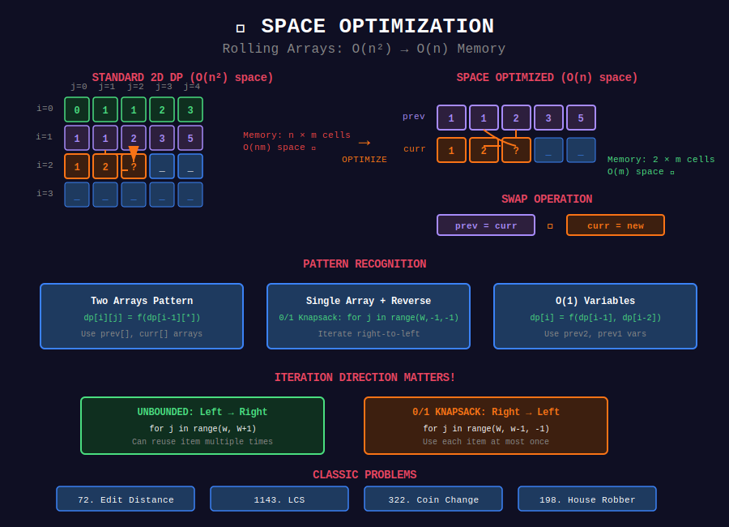

# 💾 Space Optimization

## 📊 Visual Diagram

<p align="center">
  
</p>

## Overview

**Space Optimization** reduces memory complexity by recognizing that many DP states don't need to be stored permanently.

**Key Insight:** If `dp[i]` only depends on `dp[i-1]` (or a fixed window), we can use **rolling arrays**.

**Complexity Reduction:** O(n×m) space → O(m) space

---

## 📐 Mathematical Foundation

### Observation

For many 2D DP problems:

```
dp[i][j] = f(dp[i-1][*], dp[i][*])

```

Only the **previous row** is needed to compute the **current row**.

### Memory Savings

```
Standard:    n × m array     → O(nm) space
Optimized:   2 × m array     → O(m) space
Further:     1 × m array     → O(m) space (if careful)

```

---

## 💻 Implementation Patterns

### Pattern 1: Two Arrays (Most Common)

```python
def dp_two_arrays(arr1, arr2):
    """
    Use two arrays: prev and curr.
    Swap after each iteration.
    
    Example: Longest Common Subsequence
    """
    n, m = len(arr1), len(arr2)
    
    prev = [0] * (m + 1)
    curr = [0] * (m + 1)
    
    for i in range(1, n + 1):
        for j in range(1, m + 1):
            if arr1[i-1] == arr2[j-1]:
                curr[j] = prev[j-1] + 1
            else:
                curr[j] = max(prev[j], curr[j-1])
        
        # Swap arrays
        prev, curr = curr, [0] * (m + 1)
    
    return prev[m]

```

### Pattern 2: Single Array (Advanced)

```python
def dp_single_array(arr1, arr2):
    """
    Use ONE array, update in correct order.
    
    Trick: Update right-to-left if depends on left values.
    """
    n, m = len(arr1), len(arr2)
    dp = [0] * (m + 1)
    
    for i in range(1, n + 1):
        # Save diagonal value
        prev_diag = 0
        
        for j in range(1, m + 1):
            temp = dp[j]
            
            if arr1[i-1] == arr2[j-1]:
                dp[j] = prev_diag + 1
            else:
                dp[j] = max(dp[j], dp[j-1])
            
            prev_diag = temp
    
    return dp[m]

```

### Pattern 3: Reverse Iteration

```python
def dp_reverse(arr, target):
    """
    0/1 Knapsack: Update right-to-left.
    
    Why? dp[j] depends on dp[j-weight], need old values.
    """
    n = len(arr)
    dp = [0] * (target + 1)
    
    for i in range(n):
        # RIGHT TO LEFT!
        for j in range(target, arr[i] - 1, -1):
            dp[j] = max(dp[j], dp[j - arr[i]] + arr[i])
    
    return dp[target]

```

---

## 🎯 Complete Examples

### Example 1: Edit Distance

```python
def edit_distance(word1, word2):
    """
    LeetCode 72: Edit Distance
    
    Standard: O(mn) space
    Optimized: O(n) space
    """
    m, n = len(word1), len(word2)
    
    # Use smaller dimension for space
    if m < n:
        word1, word2 = word2, word1
        m, n = n, m
    
    prev = list(range(n + 1))
    curr = [0] * (n + 1)
    
    for i in range(1, m + 1):
        curr[0] = i
        
        for j in range(1, n + 1):
            if word1[i-1] == word2[j-1]:
                curr[j] = prev[j-1]
            else:
                curr[j] = 1 + min(
                    prev[j],      # delete
                    curr[j-1],    # insert
                    prev[j-1]     # replace
                )
        
        prev, curr = curr, [0] * (n + 1)
    
    return prev[n]

```

### Example 2: Longest Common Subsequence

```python
def longest_common_subsequence(text1, text2):
    """
    LeetCode 1143: Longest Common Subsequence
    
    Standard: O(mn) space
    Optimized: O(min(m,n)) space
    """
    m, n = len(text1), len(text2)
    
    # Use shorter string for columns
    if m < n:
        text1, text2 = text2, text1
        m, n = n, m
    
    prev = [0] * (n + 1)
    
    for i in range(1, m + 1):
        curr = [0] * (n + 1)
        
        for j in range(1, n + 1):
            if text1[i-1] == text2[j-1]:
                curr[j] = prev[j-1] + 1
            else:
                curr[j] = max(prev[j], curr[j-1])
        
        prev = curr
    
    return prev[n]

```

### Example 3: Coin Change

```python
def coin_change(coins, amount):
    """
    LeetCode 322: Coin Change
    
    Standard: O(n × amount) space
    Optimized: O(amount) space
    """
    dp = [float('inf')] * (amount + 1)
    dp[0] = 0
    
    for coin in coins:
        for j in range(coin, amount + 1):
            dp[j] = min(dp[j], dp[j - coin] + 1)
    
    return dp[amount] if dp[amount] != float('inf') else -1

```

### Example 4: House Robber

```python
def rob(nums):
    """
    LeetCode 198: House Robber
    
    Standard: O(n) space
    Optimized: O(1) space
    """
    if not nums:
        return 0
    if len(nums) == 1:
        return nums[0]
    
    # Only need last 2 values
    prev2 = nums[0]
    prev1 = max(nums[0], nums[1])
    
    for i in range(2, len(nums)):
        curr = max(prev1, prev2 + nums[i])
        prev2 = prev1
        prev1 = curr
    
    return prev1

```

### Example 5: Partition Equal Subset Sum

```python
def can_partition(nums):
    """
    LeetCode 416: Partition Equal Subset Sum
    
    Standard: O(n × sum) space
    Optimized: O(sum) space
    """
    total = sum(nums)
    
    if total % 2 != 0:
        return False
    
    target = total // 2
    dp = [False] * (target + 1)
    dp[0] = True
    
    for num in nums:
        # RIGHT TO LEFT (important!)
        for j in range(target, num - 1, -1):
            dp[j] = dp[j] or dp[j - num]
    
    return dp[target]

```

---

## 📊 Visual Examples

### Two-Array Rolling

```
Original 2D DP:
    j:  0   1   2   3
i=0 |   0   1   1   1
i=1 |   1   1   2   2
i=2 |   1   2   2   3  ← Computing row 2
i=3 |   ?   ?   ?   ?

Space Optimized (2 arrays):
prev: [1   2   2   3]  ← Row 1 (previous)
curr: [1   2   2   ?]  ← Row 2 (computing)

Memory: 2×4 = 8 cells instead of 4×4 = 16 cells

```

### Single Array with Diagonal

```
Computing dp[i][j]:

- Needs: dp[i-1][j-1], dp[i-1][j], dp[i][j-1]

In 1D array:
Before:  [... dp[i-1][j-1]  dp[i-1][j] ...]
                ↑ save         ↑
              prev_diag      current position

After:   [... dp[i][j-1]    dp[i][j] ...]

```

---

## 🏆 LeetCode Problems

### 🟢 Easy (4 problems)

| # | Problem | Space Reduction |
|:-:|---------|----------------|
| 70 | [Climbing Stairs](https://leetcode.com/problems/climbing-stairs/) | O(n) → O(1) |
| 509 | [Fibonacci Number](https://leetcode.com/problems/fibonacci-number/) | O(n) → O(1) |
| 746 | [Min Cost Climbing Stairs](https://leetcode.com/problems/min-cost-climbing-stairs/) | O(n) → O(1) |
| 1137 | [N-th Tribonacci](https://leetcode.com/problems/n-th-tribonacci-number/) | O(n) → O(1) |

### 🟡 Medium (8 problems)

| # | Problem | Space Reduction |
|:-:|---------|----------------|
| 72 | [Edit Distance](https://leetcode.com/problems/edit-distance/) | O(mn) → O(n) |
| 198 | [House Robber](https://leetcode.com/problems/house-robber/) | O(n) → O(1) |
| 213 | [House Robber II](https://leetcode.com/problems/house-robber-ii/) | O(n) → O(1) |
| 300 | [Longest Increasing Subsequence](https://leetcode.com/problems/longest-increasing-subsequence/) | O(n) → O(1) with patience |
| 322 | [Coin Change](https://leetcode.com/problems/coin-change/) | O(nk) → O(k) |
| 416 | [Partition Equal Subset Sum](https://leetcode.com/problems/partition-equal-subset-sum/) | O(n×sum) → O(sum) |
| 494 | [Target Sum](https://leetcode.com/problems/target-sum/) | O(n×sum) → O(sum) |
| 518 | [Coin Change II](https://leetcode.com/problems/coin-change-2/) | O(nk) → O(k) |
| 1049 | [Last Stone Weight II](https://leetcode.com/problems/last-stone-weight-ii/) | O(n×sum) → O(sum) |
| 1143 | [Longest Common Subsequence](https://leetcode.com/problems/longest-common-subsequence/) | O(mn) → O(n) |

---

## 🎯 Common Patterns

### Pattern Recognition

| If you see... | Optimization |
|---------------|-------------|
| `dp[i][j] = f(dp[i-1][...])` | Use 2 arrays |
| `dp[i] = f(dp[i-1], dp[i-2])` | Use 2-3 variables |
| Knapsack (0/1) | Update right-to-left |
| Unbounded knapsack | Update left-to-right |
| LCS, Edit Distance | Rolling arrays |

### Direction Matters!

```python
# 0/1 Knapsack: RIGHT TO LEFT
for item in items:
    for w in range(W, weight[item] - 1, -1):
        dp[w] = max(dp[w], dp[w - weight[item]] + value[item])

# Unbounded: LEFT TO RIGHT
for item in items:
    for w in range(weight[item], W + 1):
        dp[w] = max(dp[w], dp[w - weight[item]] + value[item])

```

---

## 💡 Key Insights

> **Rolling Arrays:** When row i only depends on row i-1, use 2 arrays and swap.

> **Reverse Iteration:** For 0/1 knapsack, iterate backwards to avoid using updated values.

> **Forward Iteration:** For unbounded problems, iterate forward to allow reuse.

> **Always Ask:** "Do I really need to store all states?"

---

## 🚀 Practice Roadmap

### Week 1: Foundation (4 problems)

- [ ] 509. Fibonacci Number (O(n) → O(1))

- [ ] 70. Climbing Stairs (O(n) → O(1))

- [ ] 198. House Robber (O(n) → O(1))

- [ ] 746. Min Cost Climbing Stairs (O(n) → O(1))

### Week 2: 2D → 1D (4 problems)

- [ ] 1143. Longest Common Subsequence (O(mn) → O(n))

- [ ] 72. Edit Distance (O(mn) → O(n))

- [ ] 322. Coin Change (O(nk) → O(k))

- [ ] 518. Coin Change II (O(nk) → O(k))

### Week 3: Knapsack Variants (4 problems)

- [ ] 416. Partition Equal Subset Sum

- [ ] 494. Target Sum

- [ ] 1049. Last Stone Weight II

- [ ] 213. House Robber II

---

## 🔍 Common Mistakes

❌ **Wrong iteration direction** - Use forward for unbounded, backward for 0/1
❌ **Not saving diagonal** - LCS needs dp[i-1][j-1], save before overwriting
❌ **Forgetting to swap** - After computing curr, swap with prev
❌ **Index confusion** - Off-by-one when mapping 2D indices to 1D

---

## 📚 References

| Resource | Link |
|----------|------|
| **Space Optimization** | [GeeksforGeeks](https://www.geeksforgeeks.org/space-optimized-solution-lcs/) |
| **Knapsack Optimization** | [CP-Algorithms](https://cp-algorithms.com/dynamic_programming/knapsack.html) |

---

<div align="center">

**[⬅️ Back to DP Optimizations](../README.md)**

</div>

