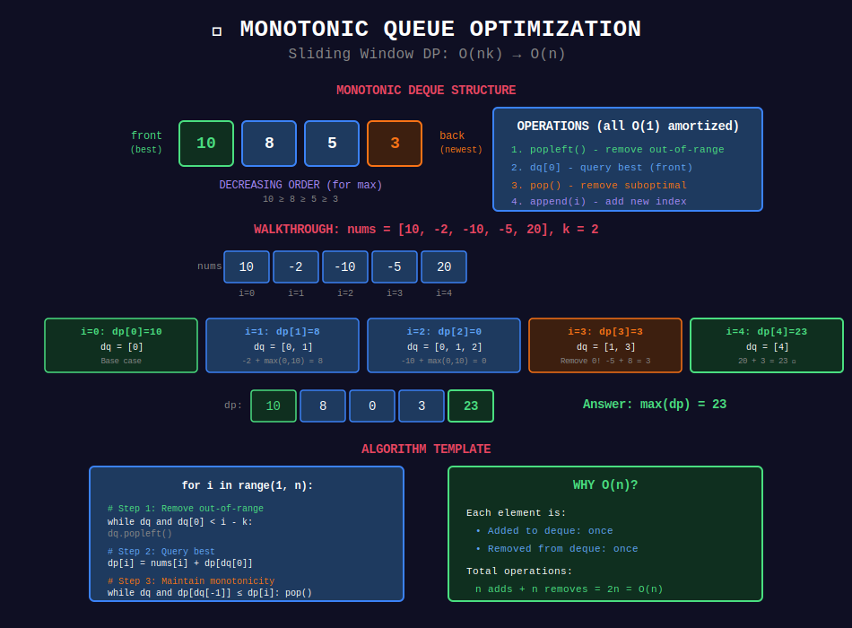

# 📊 Monotonic Queue Optimization

## 📊 Visual Diagram

<p align="center">
  
</p>

## Overview

**Monotonic Queue** optimizes DP when transitions involve finding min/max over a **sliding window** of previous states.

**Key Pattern:**
```
dp[i] = min/max(dp[j] + cost(j, i)) for j ∈ [i-k, i-1]
```

**Complexity:** O(nk) → O(n)

---

## 📐 Mathematical Foundation

### Problem Structure

**Without Optimization:**
```python
for i in range(n):
    for j in range(max(0, i-k), i):  # O(k) iterations
        dp[i] = min(dp[i], dp[j] + cost[j][i])
```
**Total:** O(nk)

**With Monotonic Deque:**
```python
for i in range(n):
    # Remove out-of-range: O(1) amortized
    # Query min/max: O(1)
    # Update deque: O(1) amortized
    dp[i] = compute()
```
**Total:** O(n)

### Amortized Analysis

**Key Insight:** Each element is added to deque **once** and removed **once**.

```
Total operations = n adds + n removes = 2n = O(n)
Amortized per element = O(1)
```

---

## 💻 Core Implementation

### Template: Monotonic Deque for DP

```python
from collections import deque

def monotonic_deque_dp(nums, k, minimize=True):
    """
    General template for monotonic deque DP.
    
    Args:
        nums: Input array
        k: Window size constraint
        minimize: True for min, False for max
    
    Time: O(n)
    Space: O(k) for deque
    """
    n = len(nums)
    dp = [float('inf') if minimize else float('-inf')] * n
    dp[0] = nums[0]
    
    # Deque stores indices
    dq = deque([0])
    
    for i in range(1, n):
        # Step 1: Remove indices outside window [i-k, i-1]
        while dq and dq[0] < i - k:
            dq.popleft()
        
        # Step 2: Query best value from valid range
        if dq:
            if minimize:
                dp[i] = nums[i] + dp[dq[0]]
            else:
                dp[i] = nums[i] + dp[dq[0]]
        else:
            dp[i] = nums[i]
        
        # Step 3: Maintain monotonic property
        if minimize:
            # Keep increasing order (front = minimum)
            while dq and dp[dq[-1]] >= dp[i]:
                dq.pop()
        else:
            # Keep decreasing order (front = maximum)
            while dq and dp[dq[-1]] <= dp[i]:
                dq.pop()
        
        dq.append(i)
    
    return dp[n - 1]
```

---

## 🎯 Complete Problem Solutions

### Example 1: Constrained Subsequence Sum

```python
def constrained_subset_sum(nums, k):
    """
    LeetCode 1425: Constrained Subsequence Sum
    
    Find max sum of non-empty subsequence such that
    distance between consecutive elements ≤ k.
    
    DP: dp[i] = nums[i] + max(0, max(dp[j])) for j ∈ [i-k, i-1]
    
    Time: O(n) with monotonic deque
    Space: O(n)
    """
    n = len(nums)
    dp = [0] * n
    dp[0] = nums[0]
    
    # Deque stores indices in decreasing dp value order
    dq = deque([0])
    
    for i in range(1, n):
        # Remove out-of-range indices
        while dq and dq[0] < i - k:
            dq.popleft()
        
        # Take best from window (or start fresh)
        dp[i] = nums[i] + max(0, dp[dq[0]])
        
        # Maintain decreasing order
        while dq and dp[dq[-1]] <= dp[i]:
            dq.pop()
        
        dq.append(i)
    
    return max(dp)

# Example:
# nums = [10, -2, -10, -5, 20], k = 2
# dp = [10, 8, 0, 3, 23]
# Answer: 23 (take 10, -2, 20)
```

### Visual Walkthrough

```
nums = [10, -2, -10, -5, 20], k = 2

i=0:
  dp[0] = 10
  dq = [0]

i=1: window [0,0]
  dp[1] = -2 + max(0, dp[0]) = -2 + 10 = 8
  dq = [0, 1]  (8 < 10, keep both)

i=2: window [0,1]
  dp[2] = -10 + max(0, dp[0]) = -10 + 10 = 0
  dq = [0, 1, 2]  (0 < 8 < 10, keep all)

i=3: window [1,2] (remove 0)
  dp[3] = -5 + max(0, dp[1]) = -5 + 8 = 3
  dq = [1, 2, 3]

i=4: window [2,3] (remove 1)
  dp[4] = 20 + max(0, dp[2]) = 20 + 3 = 23
  Remove 2,3 (23 > 3,0)
  dq = [4]

Final dp = [10, 8, 0, 3, 23]
max = 23
```

### Example 2: Jump Game VI

```python
def max_result(nums, k):
    """
    LeetCode 1696: Jump Game VI
    
    Start at index 0, end at index n-1.
    At position i, jump to i+j where 1 ≤ j ≤ k.
    Score = sum of nums[indices].
    Find maximum score.
    
    DP: dp[i] = nums[i] + max(dp[j]) for j ∈ [i-k, i-1]
    
    Time: O(n)
    Space: O(n)
    """
    n = len(nums)
    dp = [float('-inf')] * n
    dp[0] = nums[0]
    
    dq = deque([0])
    
    for i in range(1, n):
        # Remove indices outside window
        while dq and dq[0] < i - k:
            dq.popleft()
        
        # Best score to reach i
        dp[i] = nums[i] + dp[dq[0]]
        
        # Maintain decreasing dp values
        while dq and dp[dq[-1]] <= dp[i]:
            dq.pop()
        
        dq.append(i)
    
    return dp[n - 1]

# Example:
# nums = [1, -1, -2, 4, -7, 3], k = 2
# Path: 0 → 1 → 3 → 5 → score = 1 + (-1) + 4 + 3 = 7
```

### Example 3: Max Value of Equation

```python
def find_max_value_of_equation(points, k):
    """
    LeetCode 1499: Max Value of Equation
    
    Find max value of y[i] + y[j] + |x[i] - x[j]|
    where |x[i] - x[j]| ≤ k
    
    Transform: y[i] + y[j] + x[i] - x[j]  (since x[i] > x[j])
             = (y[i] + x[i]) + (y[j] - x[j])
             
    DP: For each i, find max(y[j] - x[j]) for j < i where x[i] - x[j] ≤ k
    
    Time: O(n)
    Space: O(n)
    """
    # Deque stores (y - x, x) pairs
    dq = deque()
    max_val = float('-inf')
    
    for x, y in points:
        # Remove points where x[i] - x[j] > k
        while dq and x - dq[0][1] > k:
            dq.popleft()
        
        # Calculate max value
        if dq:
            max_val = max(max_val, y + x + dq[0][0])
        
        # Maintain decreasing order of (y - x)
        while dq and dq[-1][0] <= y - x:
            dq.pop()
        
        dq.append((y - x, x))
    
    return max_val

# Key Transformation:
# Original: max(y[i] + y[j] + |x[i] - x[j]|)
# Rewrite: max((y[i] + x[i]) + (y[j] - x[j]))
# At each i, query max(y[j] - x[j]) from valid j's
```

### Example 4: Shortest Subarray with Sum ≥ K

```python
def shortest_subarray(nums, k):
    """
    LeetCode 862: Shortest Subarray with Sum at Least K
    
    Find shortest subarray with sum ≥ k.
    Can have negative numbers (makes it hard!).
    
    Key: Use prefix sums + monotonic deque
    
    Time: O(n)
    Space: O(n)
    """
    n = len(nums)
    
    # Compute prefix sums
    prefix = [0] * (n + 1)
    for i in range(n):
        prefix[i + 1] = prefix[i] + nums[i]
    
    # Find shortest subarray where prefix[j] - prefix[i] ≥ k
    dq = deque()
    min_len = float('inf')
    
    for i in range(n + 1):
        # Check if current prefix can form valid subarray
        while dq and prefix[i] - prefix[dq[0]] >= k:
            min_len = min(min_len, i - dq.popleft())
        
        # Maintain increasing order of prefix sums
        # Remove larger prefix sums (they give worse results)
        while dq and prefix[dq[-1]] >= prefix[i]:
            dq.pop()
        
        dq.append(i)
    
    return min_len if min_len != float('inf') else -1

# Why monotonic?
# If prefix[j] ≥ prefix[i] and j > i, then j is always better
# (shorter subarray, same or larger sum difference)
```

### Example 5: Sliding Window Maximum

```python
def max_sliding_window(nums, k):
    """
    LeetCode 239: Sliding Window Maximum
    
    Classic monotonic deque problem.
    
    Time: O(n)
    Space: O(k)
    """
    result = []
    dq = deque()  # Store indices
    
    for i in range(len(nums)):
        # Remove indices outside window
        while dq and dq[0] < i - k + 1:
            dq.popleft()
        
        # Remove smaller elements (they'll never be max)
        while dq and nums[dq[-1]] < nums[i]:
            dq.pop()
        
        dq.append(i)
        
        # Add to result after first window is complete
        if i >= k - 1:
            result.append(nums[dq[0]])
    
    return result
```

---

## 📊 Visual: Monotonic Deque Operations

```
Example: [3, 1, 4, 1, 5, 9, 2, 6], k = 3

i=0: dq=[0] → [3]
i=1: dq=[0,1] → [3,1]  (1 < 3, keep)
i=2: Remove 0,1 (4 > both), dq=[2] → [4]
     Window [3,1,4], max = 4 ✓

i=3: dq=[2,3] → [4,1]  (1 < 4, keep)
     Window [1,4,1], max = 4 ✓

i=4: Remove 2,3 (5 > both), dq=[4] → [5]
     Window [4,1,5], max = 5 ✓

i=5: Remove 4 (9 > 5), dq=[5] → [9]
     Window [1,5,9], max = 9 ✓

i=6: Remove 5 (out of range), dq=[5,6] → [9,2]
     Window [5,9,2], max = 9 ✓

i=7: Remove 5 (out of range), dq=[6,7] → [2,6]
     Window [9,2,6], max = 9... wait, 9 is at index 5
     Actually: Remove 6 (6 > 2), dq=[5,7] → [9,6]
     Window [9,2,6], max = 9 ✓

Invariant: Deque always decreasing, front = maximum
```

---

## 🏆 LeetCode Problems

### 🟢 Easy (2 problems)
| # | Problem | Key Insight |
|:-:|---------|-------------|
| 239 | [Sliding Window Maximum](https://leetcode.com/problems/sliding-window-maximum/) | Classic template |
| 1475 | [Final Prices With Discount](https://leetcode.com/problems/final-prices-with-a-special-discount-in-a-shop/) | Next smaller element |

### 🟡 Medium (6 problems)
| # | Problem | Key Insight |
|:-:|---------|-------------|
| 739 | [Daily Temperatures](https://leetcode.com/problems/daily-temperatures/) | Next greater element |
| 901 | [Online Stock Span](https://leetcode.com/problems/online-stock-span/) | Count previous ≤ current |
| 907 | [Sum of Subarray Minimums](https://leetcode.com/problems/sum-of-subarray-minimums/) | Count subarrays with each min |
| 1696 | [Jump Game VI](https://leetcode.com/problems/jump-game-vi/) | Max in sliding window |
| 1673 | [Most Competitive Subsequence](https://leetcode.com/problems/find-the-most-competitive-subsequence/) | Monotonic stack variant |

### 🔴 Hard (5 problems)
| # | Problem | Key Insight |
|:-:|---------|-------------|
| 862 | [Shortest Subarray Sum ≥ K](https://leetcode.com/problems/shortest-subarray-with-sum-at-least-k/) | Prefix sum + deque |
| 1425 | [Constrained Subsequence Sum](https://leetcode.com/problems/constrained-subsequence-sum/) | Max in window DP |
| 1499 | [Max Value of Equation](https://leetcode.com/problems/max-value-of-equation/) | Transform to (y-x) |
| 1687 | [Delivering Boxes](https://leetcode.com/problems/delivering-boxes-from-storage-to-ports/) | Complex DP + deque |

---

## 🎯 Pattern Recognition

### When to Use Monotonic Deque

| Pattern | Complexity | Use Deque? |
|---------|-----------|-----------|
| `dp[i] = min(dp[j])` for j ∈ [i-k, i-1] | O(nk) → O(n) | ✅ YES |
| `dp[i] = f(dp[j])` where f is non-linear | No speedup | ❌ NO |
| Next greater/smaller element | O(n²) → O(n) | ✅ YES |
| Range min/max queries (online) | - | ✅ YES |

### Transformation Tricks

```python
# Original: max(y[i] + y[j] + x[i] - x[j])
# Transform: max((y[i] + x[i]) + (y[j] - x[j]))
#            fixed for i     maximize this

# Strategy: Separate into "fixed" and "variable" parts
# Query max/min of variable part from deque
```

---

## 💡 Key Insights

> **Amortized O(1):** Each element enters and leaves deque exactly once.

> **Maintain Invariant:** Deque is always monotonic (increasing or decreasing).

> **Two Phases:** (1) Remove out-of-range, (2) Query, (3) Update deque.

> **Why It Works:** Suboptimal elements can't become optimal later.

---

## 🚀 Practice Roadmap

### Week 1: Foundation (3 problems)
- [ ] 239. Sliding Window Maximum (Master the template!)
- [ ] 1696. Jump Game VI
- [ ] 739. Daily Temperatures

### Week 2: Advanced (4 problems)
- [ ] 1425. Constrained Subsequence Sum
- [ ] 1499. Max Value of Equation
- [ ] 862. Shortest Subarray Sum ≥ K
- [ ] 907. Sum of Subarray Minimums

---

## 🔍 Common Mistakes

❌ **Wrong direction** - Increasing for min, decreasing for max
❌ **Not removing out-of-range** - Leads to wrong answers
❌ **Comparing values instead of indices** - Store indices, not values
❌ **Forgetting ≤ vs <** - When to keep equal elements

---

## 📚 References

| Resource | Link |
|----------|------|
| **Monotonic Queue** | [CP-Algorithms](https://cp-algorithms.com/data_structures/stack_queue_modification.html) |
| **Sliding Window** | [LeetCode Discuss](https://leetcode.com/tag/sliding-window/) |

---

<div align="center">

**[⬅️ Back to DP Optimizations](../README.md)**

</div>

