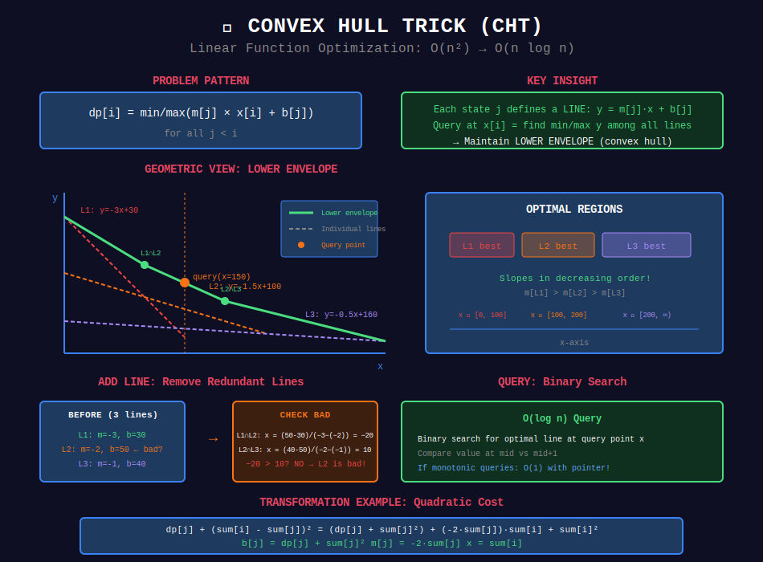

# 🔺 Convex Hull Trick (CHT)

## 📊 Visual Diagram

<p align="center">
  
</p>

## Overview

**Convex Hull Trick** optimizes DP when transitions are **linear functions** and we need to find minimum or maximum.

**Problem Pattern:**
```
dp[i] = min/max(m[j] × x[i] + b[j]) for all j < i
```

**Geometric View:** Find lower/upper envelope of lines.

**Complexity:** O(n²) → O(n log n) or O(n)

---

## 📐 Mathematical Foundation

### Line Representation

Each previous DP state j gives a **line**:
```
f[j](x) = m[j] · x + b[j]

Where:
- m[j] = slope (from dp[j])
- b[j] = intercept (from dp[j])
- x = query point (current state)
```

### Lower Envelope

**For minimization:**
```
The lower envelope is the pointwise minimum of all lines.

At any x, we want: min(f[0](x), f[1](x), ..., f[k](x))
```

**Geometric Insight:**
```
    y
    │ Line 1 (steep)
    │╲
    │ ╲  Line 2 (medium)
    │  ╲╲
    │   ╲╲╲  Line 3 (flat)
    │    ╲╲╲╲╲
    │     ╲╲╲╲╲───────
    └────────────────── x

Lower envelope = piece

wise minimum
Keep only lines that form convex hull
```

### When CHT Applies

✅ **Required:**
1. DP transitions are **linear**: `dp[i] = m[j]·x[i] + b[j]`
2. Need min/max over all j

✅ **For O(n) complexity:**
- Slopes added in monotonic order (m[i] ≥ m[i+1])
- Queries in monotonic order (x[i] ≤ x[i+1])

---

## 💻 Core Implementation

### Basic CHT (O(n log n))

```python
class ConvexHullTrick:
    """
    Maintains lower envelope of lines for minimum queries.
    
    Supports:
    - add_line(m, b): Add line y = mx + b
    - query(x): Find minimum value at x
    
    Time: O(log n) per operation
    Space: O(n)
    """
    def __init__(self):
        self.lines = []  # List of (m, b) tuples
    
    def _bad(self, l1, l2, l3):
        """
        Check if line l2 is never optimal.
        
        l2 is bad if its left intersection with l1
        is at or after its right intersection with l3.
        
        Intersection of (m1,b1) and (m2,b2):
        m1·x + b1 = m2·x + b2
        x = (b2 - b1) / (m1 - m2)
        
        Compare: (b2-b1)/(m1-m2) vs (b3-b2)/(m2-m3)
        Cross-multiply to avoid division.
        """
        m1, b1 = l1
        m2, b2 = l2
        m3, b3 = l3
        
        # (b2-b1)/(m1-m2) >= (b3-b2)/(m2-m3)
        # (b2-b1)·(m2-m3) >= (b3-b2)·(m1-m2)
        return ((b2 - b1) * (m2 - m3) >= (b3 - b2) * (m1 - m2))
    
    def add_line(self, m, b):
        """
        Add line y = mx + b to the hull.
        
        For minimum: slopes should be decreasing (m[i] ≥ m[i+1])
        For maximum: negate m and b, then query negatively
        
        Time: O(1) amortized
        """
        new_line = (m, b)
        
        # Remove lines that become suboptimal
        while len(self.lines) >= 2:
            if self._bad(self.lines[-2], self.lines[-1], new_line):
                self.lines.pop()
            else:
                break
        
        self.lines.append(new_line)
    
    def query(self, x):
        """
        Find minimum value at x using binary search.
        
        Time: O(log n)
        """
        if not self.lines:
            return float('inf')
        
        # Binary search for optimal line
        left, right = 0, len(self.lines) - 1
        
        while left < right:
            mid = (left + right) // 2
            
            # Compare line mid with mid+1 at x
            val_mid = self.lines[mid][0] * x + self.lines[mid][1]
            val_next = self.lines[mid + 1][0] * x + self.lines[mid + 1][1]
            
            if val_mid >= val_next:
                left = mid + 1
            else:
                right = mid
        
        m, b = self.lines[left]
        return m * x + b
```

### Optimized CHT with Pointer (O(n))

```python
class ConvexHullTrickFast:
    """
    CHT optimized for monotonic queries.
    
    Requirements:
    - Slopes added in decreasing order
    - Queries in increasing order
    
    Time: O(1) amortized per operation
    """
    def __init__(self):
        self.lines = []
        self.ptr = 0  # Pointer to current best line
    
    def _bad(self, l1, l2, l3):
        """Check if l2 is redundant."""
        m1, b1 = l1
        m2, b2 = l2
        m3, b3 = l3
        return ((b2 - b1) * (m2 - m3) >= (b3 - b2) * (m1 - m2))
    
    def add_line(self, m, b):
        """Add line, maintain convex hull."""
        new_line = (m, b)
        
        while len(self.lines) >= 2:
            if self._bad(self.lines[-2], self.lines[-1], new_line):
                self.lines.pop()
                self.ptr = min(self.ptr, len(self.lines) - 1)
            else:
                break
        
        self.lines.append(new_line)
    
    def query(self, x):
        """
        Query with monotonic x values.
        
        Move pointer forward while next line is better.
        
        Time: O(1) amortized
        """
        if not self.lines:
            return float('inf')
        
        self.ptr = min(self.ptr, len(self.lines) - 1)
        
        # Move pointer right while next line is better
        while (self.ptr < len(self.lines) - 1 and
               self.lines[self.ptr][0] * x + self.lines[self.ptr][1] >=
               self.lines[self.ptr + 1][0] * x + self.lines[self.ptr + 1][1]):
            self.ptr += 1
        
        m, b = self.lines[self.ptr]
        return m * x + b
```

---

## 🎯 Complete Example: Split Array with Min Cost

```python
def min_cost_split_array(arr):
    """
    Split array into subarrays. Cost of subarray = (sum)²
    Minimize total cost.
    
    DP Recurrence:
    dp[i] = min(dp[j] + (prefix[i] - prefix[j])²) for j < i
    
    Expand:
    dp[j] + prefix[i]² - 2·prefix[i]·prefix[j] + prefix[j]²
    = (dp[j] + prefix[j]²) - 2·prefix[j]·prefix[i] + prefix[i]²
    =       b[j]          +    m[j]   ·   x[i]    + prefix[i]²
    
    Where:
    - m[j] = -2·prefix[j]  (slope, decreasing!)
    - b[j] = dp[j] + prefix[j]²  (intercept)
    - x[i] = prefix[i]  (query point, increasing!)
    
    Perfect for CHT with O(n) optimization!
    """
    n = len(arr)
    
    # Compute prefix sums
    prefix = [0] * (n + 1)
    for i in range(n):
        prefix[i + 1] = prefix[i] + arr[i]
    
    # CHT for minimum
    cht = ConvexHullTrickFast()
    dp = [0] * (n + 1)
    
    # Base case
    cht.add_line(0, 0)  # m=0, b=0
    
    for i in range(1, n + 1):
        x = prefix[i]
        
        # Query minimum cost
        dp[i] = cht.query(x) + x * x
        
        # Add new line for future states
        m = -2 * prefix[i]
        b = dp[i] + prefix[i] ** 2
        cht.add_line(m, b)
    
    return dp[n]

# Example:
# arr = [1, 2, 3]
# prefix = [0, 1, 3, 6]
#
# i=1: x=1, dp[1] = 0 + 1² = 1
#      Add line: m=-2, b=2
#
# i=2: x=3, dp[2] = min(query(3)) + 9
#           = min(-2·3 + 2, 0) + 9 = -4 + 9 = 5
#      Add line: m=-6, b=14
#
# i=3: x=6, dp[3] = min(query(6)) + 36
#           = min(-6·6 + 14, ...) + 36 = -22 + 36 = 14
```

### Visual Walkthrough

```
Lines in CHT:

    y
    │
    │     Line 0: y = 0
 20 ├──────────────────
    │      ╲
 10 ├       ╲ Line 1: y = -2x + 2
    │        ╲╲
  0 ├─────────╲╲─────
    │          ╲╲╲╲
-10 ├───────────╲╲╲╲─── Line 2: y = -6x + 14
    │            ╲╲╲╲╲╲
-20 ├─────────────╲╲╲╲╲╲
    └──────────────────── x
    0   1   2   3   4   5

Query at x=1: Line 0 is best (y=0)
Query at x=3: Line 1 is best (y=-4)
Query at x=6: Line 2 is best (y=-22)
```

---

## 🏆 LeetCode Problems

### 🟡 Medium (3 problems)
| # | Problem | Transformation |
|:-:|---------|---------------|
| 1889 | [Minimum Space Wasted](https://leetcode.com/problems/minimum-space-wasted-from-packaging/) | Split into groups |

### 🔴 Hard (5 problems)
| # | Problem | Transformation |
|:-:|---------|---------------|
| 1687 | [Delivering Boxes](https://leetcode.com/problems/delivering-boxes-from-storage-to-ports/) | Complex cost function |
| 2617 | [Minimum Visited Cells](https://leetcode.com/problems/minimum-number-of-visited-cells-in-a-grid/) | Grid DP optimization |

---

## 🎯 Transformation Examples

### Pattern 1: Quadratic Cost

```
Original: dp[i] = min(dp[j] + (sum[i] - sum[j])²)

Expand: dp[j] + sum[i]² - 2·sum[i]·sum[j] + sum[j]²

Rearrange: (dp[j] + sum[j]²) - 2·sum[j]·sum[i] + sum[i]²
                b[j]        +   m[j]  · x[i]   + constant

CHT: m[j] = -2·sum[j], b[j] = dp[j] + sum[j]², x = sum[i]
```

### Pattern 2: Distance × Cost

```
Original: dp[i] = min(dp[j] + cost[j] · (i - j))

Rearrange: min(dp[j] + cost[j]·i - cost[j]·j)
         = min((dp[j] - cost[j]·j) + cost[j]·i)
         =       b[j]              + m[j]  ·x[i]

CHT: m[j] = cost[j], b[j] = dp[j] - cost[j]·j, x = i
```

### Pattern 3: Product of Sums

```
Original: dp[i] = min(dp[j] + A[i]·B[j])

Direct form: m[j] = B[j], b[j] = dp[j], x = A[i]

CHT: Already in linear form!
```

---

## 💡 Key Insights

> **Geometric View:** CHT finds the lower/upper envelope of lines = convex hull.

> **Amortized O(1):** With monotonic slopes and queries, each line is added and removed once.

> **Transformation:** Expand quadratic expressions, separate into fixed and variable parts.

> **Check Monotonicity:** If slopes or queries not monotonic, use Li Chao Tree instead.

---

## 🚀 Practice Roadmap

### Week 1: Understanding (2 problems)
- [ ] Implement basic CHT from scratch
- [ ] Solve 1 example problem with quadratic cost

### Week 2: Application (2 problems)
- [ ] 1687. Delivering Boxes (complex transformation)
- [ ] Practice identifying CHT patterns

---

## 🔍 Common Mistakes

❌ **Wrong slope order** - Must be monotonic for O(n) version
❌ **Forgetting to check bad() function** - Cross-multiplication matters
❌ **Not transforming correctly** - Expand and rearrange carefully
❌ **Using when not linear** - CHT only works for linear transitions

---

## 📚 References

| Resource | Link |
|----------|------|
| **CHT Tutorial** | [WCIPEG](https://wcipeg.com/wiki/Convex_hull_trick) |
| **Geometric Interpretation** | [Codeforces](https://codeforces.com/blog/entry/63823) |

---

<div align="center">

**[⬅️ Back to DP Optimizations](../README.md)**

</div>

