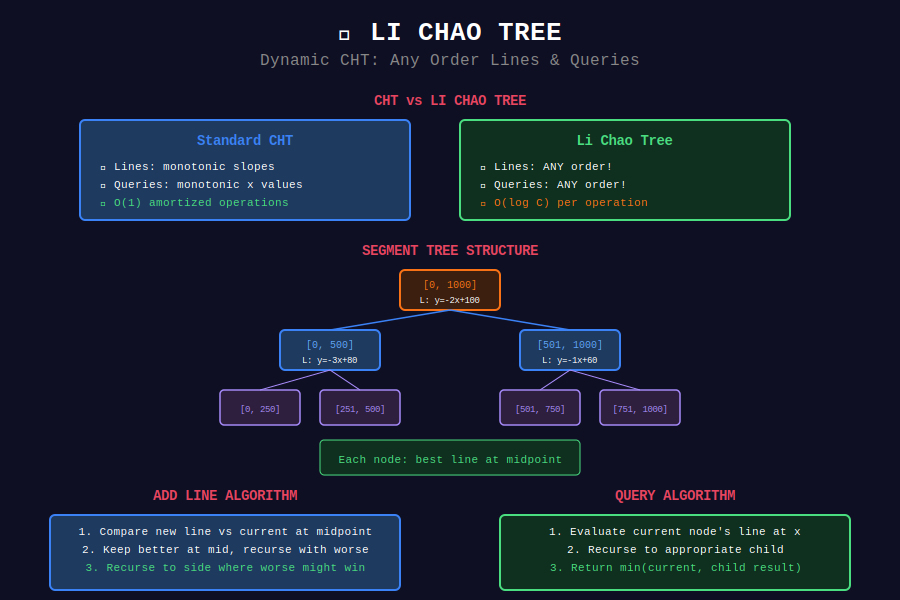

# 🌳 Li Chao Tree

## 📊 Visual Diagram

<p align="center">
  
</p>

## Overview

**Li Chao Tree** is a dynamic Convex Hull Trick that allows adding lines in **any order** and supports **online queries**.

**When to Use:**
- Lines added in arbitrary order (no monotonicity)
- Online queries (can't preprocess all queries)
- Dynamic line insertion

**Complexity:**
- Add line: O(log C) where C is coordinate range
- Query: O(log C)

---

## 📐 Core Idea

Li Chao Tree is a **segment tree** where each node stores the **best line for its range's midpoint**.

**Key Property:**
If a line is best at the midpoint, it might be best for the entire half-range.

---

## 💻 Implementation

```python
class LiChaoTree:
    def __init__(self, x_min, x_max):
        self.x_min = x_min
        self.x_max = x_max
        self.tree = {}  # Sparse segment tree
    
    def _eval(self, line, x):
        if line is None:
            return float('inf')
        m, b = line
        return m * x + b
    
    def add_line(self, m, b, node=1, l=None, r=None):
        """Add line y = mx + b. Time: O(log C)"""
        if l is None:
            l, r = self.x_min, self.x_max
        
        mid = (l + r) // 2
        line = (m, b)
        
        if node not in self.tree:
            self.tree[node] = line
            return
        
        curr = self.tree[node]
        
        if l == r:
            if self._eval(line, l) < self._eval(curr, l):
                self.tree[node] = line
            return
        
        # Check which is better at mid
        if self._eval(line, mid) < self._eval(curr, mid):
            curr, line = line, curr
            self.tree[node] = curr
        
        # Recurse on the side where line might be better
        if self._eval(line, l) < self._eval(curr, l):
            self.add_line(line[0], line[1], 2*node, l, mid)
        else:
            self.add_line(line[0], line[1], 2*node+1, mid+1, r)
    
    def query(self, x, node=1, l=None, r=None):
        """Find minimum at x. Time: O(log C)"""
        if l is None:
            l, r = self.x_min, self.x_max
        
        if node not in self.tree:
            return float('inf')
        
        result = self._eval(self.tree[node], x)
        
        if l == r:
            return result
        
        mid = (l + r) // 2
        if x <= mid:
            return min(result, self.query(x, 2*node, l, mid))
        else:
            return min(result, self.query(x, 2*node+1, mid+1, r))
```

---

## 🎯 When to Use Li Chao vs CHT

| Feature | CHT | Li Chao Tree |
|---------|-----|-------------|
| **Line Order** | Must be monotonic | Any order ✅ |
| **Query Order** | Must be monotonic | Any order ✅ |
| **Complexity** | O(1) amortized | O(log C) |
| **Implementation** | Simpler | More complex |

**Use Li Chao when:** Lines or queries are not monotonic.

---

## 💡 Key Insights

> **Dynamic:** Can add lines in any order, unlike standard CHT.

> **Log Factor:** Pays O(log C) per operation, but handles general case.

> **Sparse Tree:** Use hashmap for memory efficiency.

---

<div align="center">

**[⬅️ Back to DP Optimizations](../README.md)**

</div>
