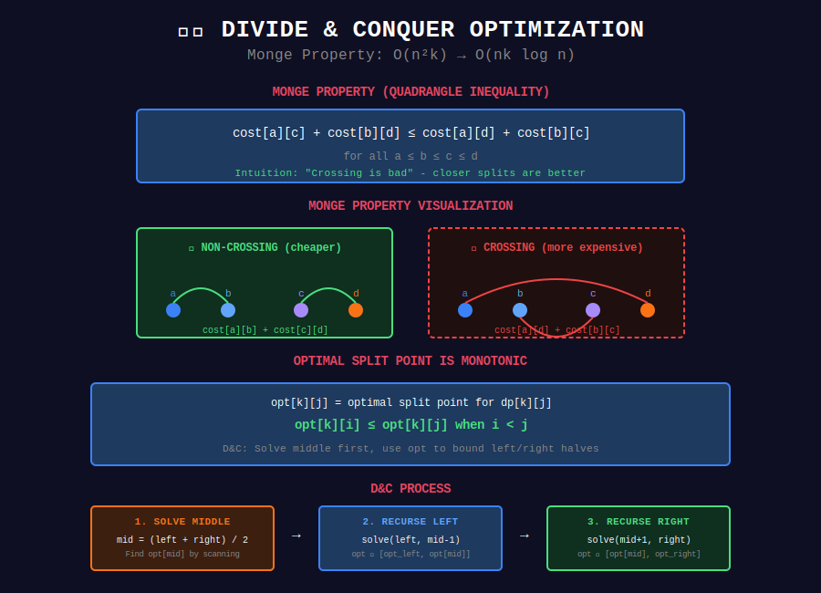

# ✂️ Divide & Conquer Optimization

## 📊 Visual Diagram

<p align="center">
  
</p>

## Overview

**D&C Optimization** speeds up DP when the optimal split point is **monotonic**.

**Condition:** `opt[i][j] ≤ opt[i][j+1]` (Monge property)

**Complexity:** O(n²k) → O(nk log n)

---

## 📐 Mathematical Foundation

### Monge Property (Quadrangle Inequality)

```
cost[a][c] + cost[b][d] ≤ cost[a][d] + cost[b][c]
for all a ≤ b ≤ c ≤ d

```

**Intuition:** "Crossing is bad" - closer splits are better.

**Examples:**

- Warehouse placement (distance to cities)

- Mailbox allocation

- Job scheduling by deadline

---

## 💻 Implementation

```python
def divide_conquer_dp(arr, K):
    """
    Partition array into K groups minimizing cost.
    
    dp[k][i] = min(dp[k-1][j] + cost[j+1][i]) for j < i
    
    Standard: O(n²K)
    With D&C: O(nK log n)
    """
    n = len(arr)
    
    # Precompute costs
    cost = [[0] * n for _ in range(n)]
    for i in range(n):
        for j in range(i, n):
            cost[i][j] = compute_cost(arr[i:j+1])
    
    # DP table
    INF = float('inf')
    dp = [[INF] * n for _ in range(K + 1)]
    
    # Base case
    for i in range(n):
        dp[1][i] = cost[0][i]
    
    def solve(k, left, right, opt_left, opt_right):
        """
        Compute dp[k][left:right+1].
        Know that opt is in [opt_left, opt_right].
        """
        if left > right:
            return
        
        mid = (left + right) // 2
        best_cost = INF
        best_opt = opt_left
        
        # Find best split for mid
        for j in range(opt_left, min(mid, opt_right) + 1):
            curr = dp[k-1][j] + cost[j+1][mid]
            if curr < best_cost:
                best_cost = curr
                best_opt = j
        
        dp[k][mid] = best_cost
        
        # Recurse with tighter bounds
        solve(k, left, mid-1, opt_left, best_opt)
        solve(k, mid+1, right, best_opt, opt_right)
    
    # Compute each level
    for k in range(2, K + 1):
        solve(k, 0, n-1, 0, n-1)
    
    return dp[K][n-1]

def compute_cost(subarray):
    """Example: sum of elements."""
    return sum(subarray)

```

---

## 🏆 LeetCode Problems

| # | Problem | Difficulty |
|:-:|---------|-----------|
| 410 | [Split Array Largest Sum](https://leetcode.com/problems/split-array-largest-sum/) | ⭐⭐⭐⭐ |
| 1478 | [Allocate Mailboxes](https://leetcode.com/problems/allocate-mailboxes/) | ⭐⭐⭐⭐ |
| 1335 | [Minimum Difficulty](https://leetcode.com/problems/minimum-difficulty-of-a-job-schedule/) | ⭐⭐⭐⭐ |

---

## 💡 Key Insights

> **Monge Property:** Enables binary search on optimal split point.

> **Recursion:** Solve middle first, then recurse on halves with tighter bounds.

> **Verification:** Check quadrangle inequality on cost matrix.

---

<div align="center">

**[⬅️ Back to DP Optimizations](../README.md)**

</div>
