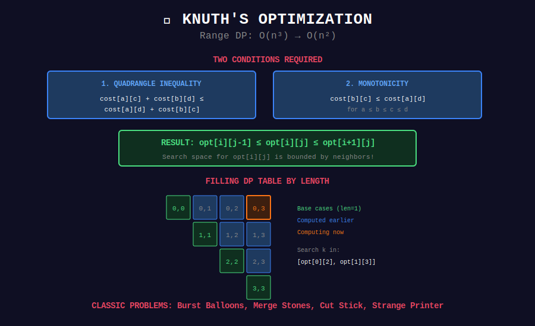

# 🎯 Knuth's Optimization

## 📊 Visual Diagram

<p align="center">
  
</p>

## Overview

**Knuth's Optimization** reduces O(n³) to O(n²) for range DP problems.

**Conditions (both required):**
1. **Quadrangle Inequality:** `cost[a][c] + cost[b][d] ≤ cost[a][d] + cost[b][c]`
2. **Monotonicity:** `cost[b][c] ≤ cost[a][d]` for a ≤ b ≤ c ≤ d

**Result:** `opt[i][j-1] ≤ opt[i][j] ≤ opt[i+1][j]`

**Complexity:** O(n³) → O(n²)

---

## 💻 Implementation

```python
def knuth_optimization(arr):
    """
    Range DP with Knuth optimization.
    
    Recurrence:
    dp[i][j] = min(dp[i][k] + dp[k+1][j] + cost[i][j])
    
    Without opt: Try all k ∈ [i, j-1] → O(n³)
    With opt: Try k ∈ [opt[i][j-1], opt[i+1][j]] → O(n²)
    """
    n = len(arr)
    
    # Initialize
    dp = [[float('inf')] * n for _ in range(n)]
    opt = [[0] * n for _ in range(n)]
    
    # Base case
    for i in range(n):
        dp[i][i] = 0
        opt[i][i] = i
    
    # Fill by increasing length
    for length in range(2, n + 1):
        for i in range(n - length + 1):
            j = i + length - 1
            
            # Search range: [opt[i][j-1], opt[i+1][j]]
            start = opt[i][j-1] if j > i else i
            end = opt[i+1][j] if i+1 < n else j-1
            
            for k in range(start, min(end, j-1) + 1):
                cost = dp[i][k] + dp[k+1][j] + arr[i] + arr[j]
                if cost < dp[i][j]:
                    dp[i][j] = cost
                    opt[i][j] = k
    
    return dp[0][n-1]

```

---

## 🏆 LeetCode Problems

| # | Problem | Difficulty |
|:-:|---------|-----------|
| 312 | [Burst Balloons](https://leetcode.com/problems/burst-balloons/) | ⭐⭐⭐⭐ |
| 1000 | [Merge Stones](https://leetcode.com/problems/minimum-cost-to-merge-stones/) | ⭐⭐⭐⭐ |
| 1547 | [Cut Stick](https://leetcode.com/problems/minimum-cost-to-cut-a-stick/) | ⭐⭐⭐⭐ |
| 664 | [Strange Printer](https://leetcode.com/problems/strange-printer/) | ⭐⭐⭐⭐ |
| 546 | [Remove Boxes](https://leetcode.com/problems/remove-boxes/) | ⭐⭐⭐⭐⭐ |

---

## 💡 Key Insights

> **Search Space Reduction:** From O(n) to O(1) amortized per cell.

> **Opt Monotonicity:** Guaranteed by quadrangle inequality.

> **Classic Problems:** Matrix chain, optimal BST, stone merging.

---

<div align="center">

**[⬅️ Back to DP Optimizations](../README.md)**

</div>
