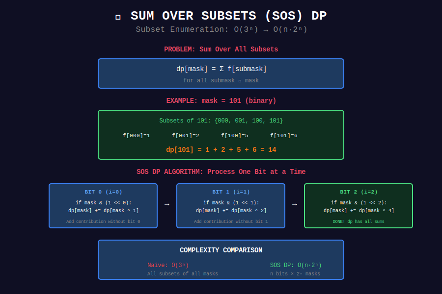

# 🎲 Sum over Subsets (SOS) DP

## 📊 Visual Diagram

<p align="center">
  
</p>

## Overview

**SOS DP** efficiently computes functions over all subsets of a bitmask.

**Problem:** For each mask, compute sum over all its subsets.

**Complexity:** O(3ⁿ) → O(n·2ⁿ)

---

## 💻 Implementation

```python
def sos_dp(arr):
    """
    Given f[mask], compute dp[mask] = sum of f[submask] for all submask ⊆ mask.
    
    Time: O(n * 2^n)
    Space: O(2^n)
    """
    n = len(arr).bit_length() - 1
    MAX_MASK = 1 << n
    
    dp = arr[:]
    
    # Iterate over each bit
    for i in range(n):
        for mask in range(MAX_MASK):
            if mask & (1 << i):

                # If bit i is set, add contribution without bit i
                dp[mask] += dp[mask ^ (1 << i)]
    
    return dp

# Example:
# arr = [1, 2, 3, 4, 5, 6, 7, 8]  # f[000] to f[111]
# dp[5] = dp[101] = f[000] + f[001] + f[100] + f[101]
#                 = 1 + 2 + 5 + 6 = 14
```

---

## 🏆 LeetCode Problems

| # | Problem | Difficulty |
|:-:|---------|-----------|
| 898 | [Bitwise ORs](https://leetcode.com/problems/bitwise-ors-of-subarrays/) | ⭐⭐ |
| 1986 | [Work Sessions](https://leetcode.com/problems/minimum-number-of-work-sessions-to-finish-the-tasks/) | ⭐⭐⭐ |

---

## 💡 Key Insights

> **Process One Bit at a Time:** Transform O(3ⁿ) to O(n·2ⁿ).

> **Subset Enumeration:** For each mask, iterate bits, not all subsets.

> **DP on Bitmasks:** Core technique for subset-related problems.

---

<div align="center">

**[⬅️ Back to DP Optimizations](../README.md)**

</div>
