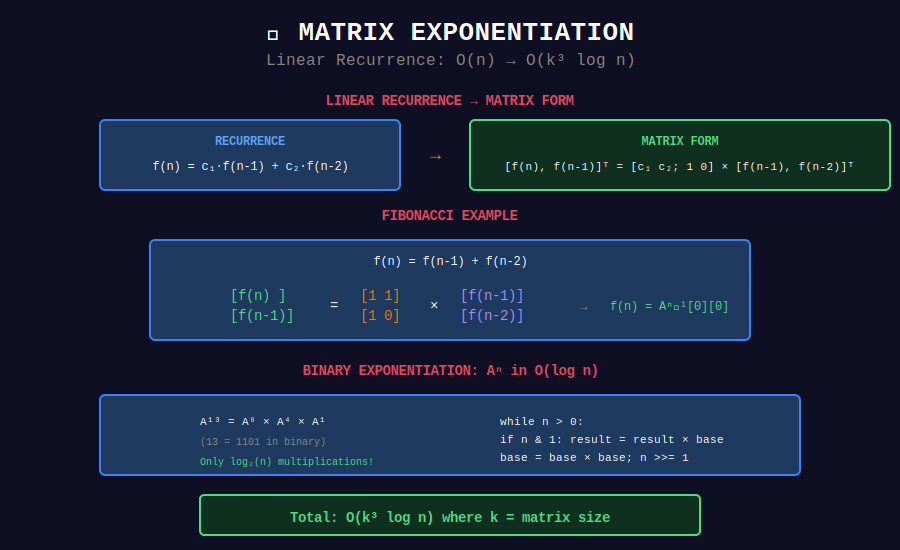

# 🔢 Matrix Exponentiation

## 📊 Visual Diagram

<p align="center">
  
</p>

## Overview

**Matrix Exponentiation** solves linear recurrences in **O(k³ log n)** time.

**Pattern:** `f(n) = c₁·f(n-1) + c₂·f(n-2) + ... + cₖ·f(n-k)`

**Complexity:** O(n) → O(k³ log n)

---

## 💻 Implementation

```python
class MatrixExp:
    def __init__(self, MOD=10**9 + 7):
        self.MOD = MOD
    
    def multiply(self, A, B):
        """Matrix multiplication O(k³)."""
        k = len(A)
        C = [[0] * k for _ in range(k)]
        for i in range(k):
            for j in range(k):
                for p in range(k):
                    C[i][j] = (C[i][j] + A[i][p] * B[p][j]) % self.MOD
        return C
    
    def power(self, A, n):
        """Compute A^n using binary exponentiation."""
        k = len(A)
        result = [[1 if i == j else 0 for j in range(k)] for i in range(k)]
        base = [row[:] for row in A]
        
        while n > 0:
            if n % 2 == 1:
                result = self.multiply(result, base)
            base = self.multiply(base, base)
            n //= 2
        
        return result
    
    def fibonacci(self, n):
        """f(n) = f(n-1) + f(n-2)."""
        if n <= 1:
            return n
        A = [[1, 1], [1, 0]]
        A_n = self.power(A, n-1)
        return A_n[0][0]

```

---

## 🏆 LeetCode Problems

| # | Problem | Difficulty |
|:-:|---------|-----------|
| 509 | [Fibonacci](https://leetcode.com/problems/fibonacci-number/) | ⭐ |
| 1137 | [Tribonacci](https://leetcode.com/problems/n-th-tribonacci-number/) | ⭐ |
| 70 | [Climbing Stairs](https://leetcode.com/problems/climbing-stairs/) | ⭐ |
| 552 | [Attendance Record II](https://leetcode.com/problems/student-attendance-record-ii/) | ⭐⭐⭐⭐ |

---

## 💡 Key Insights

> **Linear Recurrence → Matrix:** Convert to matrix form, use binary exp.

> **O(log n):** Essential for n up to 10¹⁸.

> **State Machines:** Can be expressed as matrix multiplication.

---

<div align="center">

**[⬅️ Back to DP Optimizations](../README.md)**

</div>
