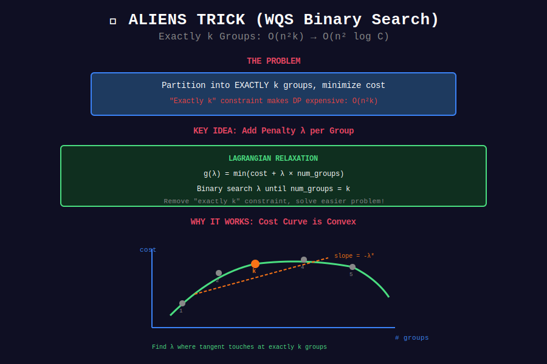

# 👽 Aliens Trick (Wqs Binary Search)

## 📊 Visual Diagram

<p align="center">
  
</p>

## Overview

**Aliens Trick** solves "exactly k groups" problems by **binary searching on penalty**.

**Problem:** Partition into exactly k groups, but DP is O(n²k).

**Solution:** Add penalty λ per group, binary search λ until k groups optimal.

**Complexity:** O(n²k) → O(n² log C)

---

## 💻 Implementation

```python
def aliens_trick(arr, k):
    """
    Partition into exactly k groups minimizing cost.
    
    Key: Binary search on Lagrange multiplier λ.
    """
    n = len(arr)
    
    def dp_with_penalty(lam):
        """
        Solve without "exactly k" constraint.
        Add penalty λ for each group.
        
        Returns: (num_groups, cost)
        """
        dp = [float('inf')] * n
        count = [0] * n
        
        for i in range(n):
            # Start new group at i
            dp[i] = compute_cost(arr[0:i+1]) + lam
            count[i] = 1
            
            # Extend from previous
            for j in range(i):
                cost = dp[j] + compute_cost(arr[j+1:i+1]) + lam
                if cost < dp[i]:
                    dp[i] = cost
                    count[i] = count[j] + 1
        
        return count[n-1], dp[n-1]
    
    def compute_cost(subarray):
        return sum(x**2 for x in subarray)
    
    # Binary search on λ
    left, right = 0, sum(x**2 for x in arr)
    best_cost = float('inf')
    
    while right - left > 1e-9:
        mid = (left + right) / 2
        groups, cost = dp_with_penalty(mid)
        
        if groups <= k:
            right = mid
            if groups == k:
                best_cost = cost + k * mid
        else:
            left = mid
    
    return best_cost
```

---

## 🏆 LeetCode Problems

| # | Problem | Difficulty |
|:-:|---------|-----------|
| 410 | [Split Array Largest Sum](https://leetcode.com/problems/split-array-largest-sum/) | ⭐⭐⭐⭐ |
| 1478 | [Allocate Mailboxes](https://leetcode.com/problems/allocate-mailboxes/) | ⭐⭐⭐⭐ |

---

## 💡 Key Insights

> **Lagrangian Relaxation:** Remove "exactly k" constraint, add penalty.

> **Convexity:** Cost curve in #groups is convex, binary search works.

> **Advanced:** One of the hardest DP optimization techniques!

---

<div align="center">

**[⬅️ Back to DP Optimizations](../README.md)**

</div>
