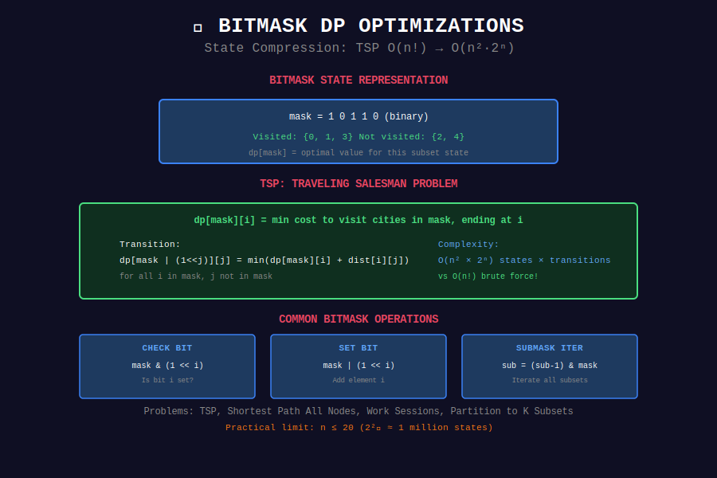

# 🎭 Bitmask DP Optimizations

## 📊 Visual Diagram

<p align="center">
  
</p>

## Overview

**Bitmask DP** represents states as bitmasks, enabling subset enumeration and manipulation.

**Common Patterns:**
- TSP: O(n! ) → O(n²·2ⁿ)
- Assignment: O(n!) → O(n·2ⁿ)
- Profile DP: Grid tiling

**Key Optimization:** Process one bit at a time.

---

## 💻 Core Patterns

### Pattern 1: TSP (Traveling Salesman)

```python
def tsp(dist):
    """
    Visit all cities exactly once, return to start.
    Minimize total distance.
    
    dp[mask][i] = min cost to visit cities in mask, ending at i
    
    Time: O(n² * 2^n)
    Space: O(n * 2^n)
    """
    n = len(dist)
    dp = [[float('inf')] * n for _ in range(1 << n)]
    dp[1][0] = 0  # Start at city 0
    
    for mask in range(1 << n):
        for i in range(n):
            if not (mask & (1 << i)):
                continue
            
            for j in range(n):
                if mask & (1 << j):
                    continue
                
                new_mask = mask | (1 << j)
                dp[new_mask][j] = min(
                    dp[new_mask][j],
                    dp[mask][i] + dist[i][j]
                )
    
    # Return to start
    final_mask = (1 << n) - 1
    return min(dp[final_mask][i] + dist[i][0] for i in range(n))
```

### Pattern 2: Assignment Problems

```python
def assignment(tasks, k):
    """
    Assign tasks to k workers, each task to one worker.
    Minimize maximum load.
    
    dp[mask] = min max load for tasks in mask
    
    Time: O(2^n * n)
    """
    n = len(tasks)
    dp = [float('inf')] * (1 << n)
    dp[0] = 0
    
    for mask in range(1 << n):
        # Try assigning remaining tasks to one worker
        remaining = ((1 << n) - 1) ^ mask
        
        submask = remaining
        while submask > 0:
            # Assign submask to one worker
            cost = sum(tasks[i] for i in range(n) if submask & (1 << i))
            dp[mask | submask] = min(
                dp[mask | submask],
                max(dp[mask], cost)
            )
            submask = (submask - 1) & remaining
    
    return dp[(1 << n) - 1]
```

---

## 🏆 LeetCode Problems

| # | Problem | Difficulty |
|:-:|---------|-----------|
| 464 | [Can I Win](https://leetcode.com/problems/can-i-win/) | ⭐⭐ |
| 526 | [Beautiful Arrangement](https://leetcode.com/problems/beautiful-arrangement/) | ⭐⭐ |
| 698 | [Partition to K Equal Subsets](https://leetcode.com/problems/partition-to-k-equal-sum-subsets/) | ⭐⭐ |
| 847 | [Shortest Path Visiting All Nodes](https://leetcode.com/problems/shortest-path-visiting-all-nodes/) | ⭐⭐⭐⭐ |
| 943 | [Find Shortest Superstring](https://leetcode.com/problems/find-the-shortest-superstring/) | ⭐⭐⭐⭐ |
| 980 | [Unique Paths III](https://leetcode.com/problems/unique-paths-iii/) | ⭐⭐⭐⭐ |
| 1986 | [Work Sessions](https://leetcode.com/problems/minimum-number-of-work-sessions-to-finish-the-tasks/) | ⭐⭐⭐ |

---

## 💡 Key Insights

> **State Compression:** Use bits to represent subsets.

> **Iterate Masks:** Loop through all 2ⁿ states.

> **Submask Enumeration:** Use (submask-1) & mask trick.

> **Practical Limit:** n ≤ 20 for most problems.

---

<div align="center">

**[⬅️ Back to DP Optimizations](../README.md)**

</div>
