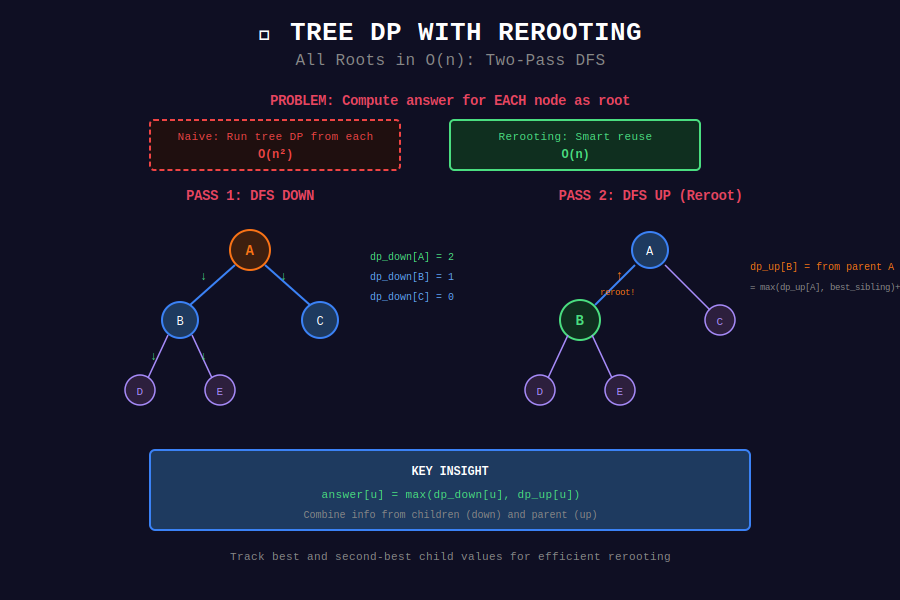

# 🌲 Tree DP with Rerooting

## 📊 Visual Diagram

<p align="center">
  
</p>

## Overview

**Rerooting** computes tree DP with **each node as root** in O(n) time.

**Problem:** Need answer for all possible roots.

**Naive:** Run tree DP from each node → O(n²)
**Rerooting:** Smart reuse of computation → O(n)

---

## 💻 Implementation

```python
def rerooting_dp(graph, n):
    """
    Compute tree DP with each node as root.
    
    Example: Max distance from each node to any other node.
    
    Time: O(n)
    Space: O(n)
    """
    # Step 1: DFS down (compute subtree info)
    dp_down = [0] * n
    
    def dfs_down(u, parent):
        max_dist = 0
        for v in graph[u]:
            if v != parent:
                max_dist = max(max_dist, 1 + dfs_down(v, u))
        dp_down[u] = max_dist
        return dp_down[u]
    
    dfs_down(0, -1)
    
    # Step 2: DFS up (reroot to compute up info)
    dp_up = [0] * n
    answer = [0] * n
    
    def dfs_up(u, parent, up_value):
        dp_up[u] = up_value
        answer[u] = max(dp_down[u], dp_up[u])
        
        # Find two best children
        children = []
        for v in graph[u]:
            if v != parent:
                children.append((dp_down[v] + 1, v))
        
        children.sort(reverse=True)
        
        # Reroot to each child
        for v in graph[u]:
            if v != parent:
                # Best path through u (excluding v's subtree)
                if children[0][1] == v:
                    best = children[1][0] if len(children) > 1 else 0
                else:
                    best = children[0][0]
                
                new_up = max(up_value, best) + 1
                dfs_up(v, u, new_up)
    
    dfs_up(0, -1, 0)
    return answer

```

---

## 💡 Key Insights

> **Two-Pass DFS:** First compute down, then compute up while rerooting.

> **Reuse Computation:** Don't restart from scratch for each root.

> **Track Two Best:** Often need best and second-best child values.

---

<div align="center">

**[⬅️ Back to DP Optimizations](../README.md)**

</div>
