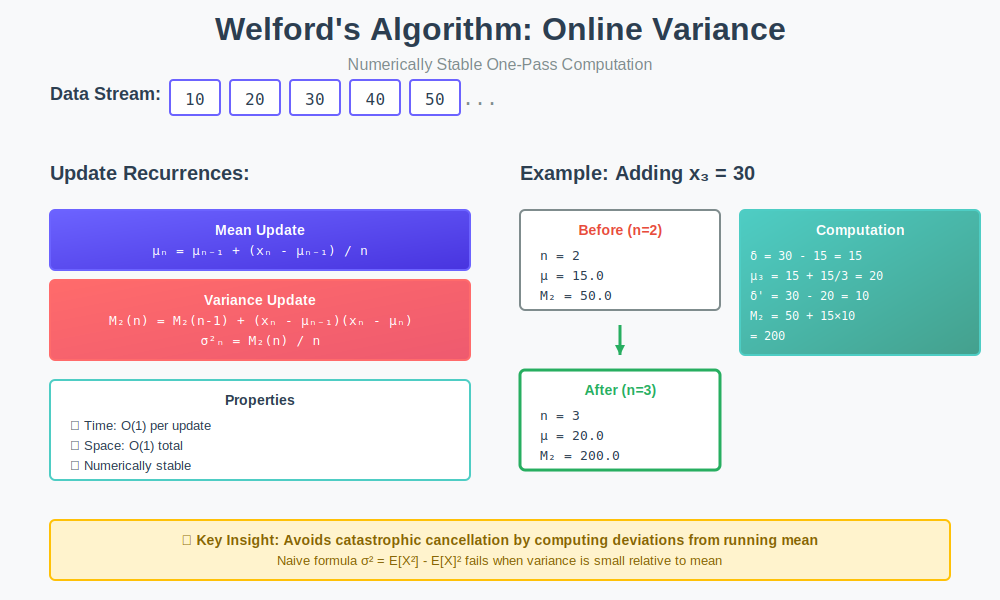

<div align="center">

# 🎯 Welford's Algorithm

<p>
  
  
</p>

</div>

---

## 🧭 Navigation

| ⬅️ Previous | 📂 Current | ➡️ Next |
|:------------|:----------:|--------:|
| [🏠 Loop Fusion Home](../README.md) | **01. Welford's Algorithm** | [02. Kadane's Pattern →](../02_kadane_pattern/README.md) |

---

## 📊 Visual Guide

<div align="center">
  
</div>

---

## 📐 Mathematical Foundation

### Problem Statement

Given a sequence of values $x\_1, x\_2, \ldots, x\_n$, compute:

**Sample Mean:**

```math
\mu_n = \frac{1}{n} \sum_{i=1}^{n} x_i

```

**Sample Variance:**

```math
\sigma_n^2 = \frac{1}{n} \sum_{i=1}^{n} (x_i - \mu_n)^2

```

The challenge: Compute these in **one pass** with **O(1) space** while maintaining **numerical stability**.

---

### Recurrence Relations

**Mean Update:**

```math
\mu_n = \mu_{n-1} + \frac{x_n - \mu_{n-1}}{n}

```

**Variance Update:**

Define $M\_2(n) = \sum\_{i=1}^{n} (x\_i - \mu\_n)^2$, then:

```math
M_2(n) = M_2(n-1) + (x_n - \mu_{n-1})(x_n - \mu_n)
\sigma_n^2 = \frac{M_2(n)}{n}

```

---

### Why It's Numerically Stable

The **naive formula** $\sigma^2 = E[X^2] - E[X]^2$ suffers from **catastrophic cancellation** when variance is small relative to mean.

**Example:**

```
Data: [10^9, 10^9 + 1, 10^9 + 2]
True variance: ≈ 0.667

Naive approach:
  E[X²] ≈ 10^18
  E[X]² ≈ 10^18
  Difference may give NEGATIVE variance due to rounding!

Welford's approach:
  Computes (x - μ) which is small
  Avoids subtracting large numbers
  ✓ Numerically stable

```

---

## 💻 Code Implementations

```python
class WelfordVariance:
    """
    Online algorithm for computing mean and variance.
    
    Time: O(1) per update
    Space: O(1)
    """
    
    def __init__(self):
        self.n = 0
        self.mean = 0.0
        self.M2 = 0.0
    
    def update(self, x: float) -> None:
        """Add a new value and update statistics."""
        self.n += 1
        delta = x - self.mean
        self.mean += delta / self.n
        delta2 = x - self.mean
        self.M2 += delta * delta2
    
    def get_mean(self) -> float:
        """Return current mean."""
        return self.mean
    
    def get_variance(self, ddof: int = 0) -> float:
        """
        Return variance.
        
        Args:
            ddof: Delta degrees of freedom (0 for population, 1 for sample)
        """
        if self.n < 2:
            return 0.0
        return self.M2 / (self.n - ddof)
    
    def get_std(self, ddof: int = 0) -> float:
        """Return standard deviation."""
        import math
        return math.sqrt(self.get_variance(ddof))

# Example usage
stats = WelfordVariance()
data = [10, 20, 30, 40, 50]

for x in data:
    stats.update(x)
    print(f"After {stats.n} values: mean={stats.get_mean():.2f}, std={stats.get_std():.2f}")

# Output:
# After 1 values: mean=10.00, std=0.00
# After 2 values: mean=15.00, std=5.00
# After 3 values: mean=20.00, std=8.16
# After 4 values: mean=25.00, std=11.18
# After 5 values: mean=30.00, std=14.14

```

### Parallel Computation (Chan's Algorithm)

```python
def welford_merge(stats1: WelfordVariance, stats2: WelfordVariance) -> WelfordVariance:
    """
    Merge two Welford statistics (for parallel computation).
    
    Time: O(1), Space: O(1)
    """
    result = WelfordVariance()
    
    n_a = stats1.n
    n_b = stats2.n
    n = n_a + n_b
    
    if n == 0:
        return result
    
    result.n = n
    
    # Combine means
    delta = stats2.mean - stats1.mean
    result.mean = (n_a * stats1.mean + n_b * stats2.mean) / n
    
    # Combine M2 values
    result.M2 = stats1.M2 + stats2.M2 + delta * delta * n_a * n_b / n
    
    return result

```

---

## 🔬 Mathematical Proof with Intuition

### 🤔 How to Think About This Proof

**Goal:** We want to update variance online without storing all values.

**Key Insight:** When we add a new value $x\_n$, the mean changes from $\mu\_{n-1}$ to $\mu\_n$. This means all previous deviations $(x\_i - \mu\_{n-1})$ need to be adjusted to $(x\_i - \mu\_n)$.

**Strategy:**
1. Express new variance in terms of old variance
2. Account for the shift in mean
3. Simplify to get a clean recurrence

---

### 📝 Step-by-Step Proof

**Theorem:** Welford's variance recurrence is correct.

```math
M_2(n) = M_2(n-1) + (x_n - \mu_{n-1})(x_n - \mu_n)

```

**Proof:**

**Step 1: Write out what we want**

By definition:

```math
M_2(n) = \sum_{i=1}^{n} (x_i - \mu_n)^2

```

Split this into old elements and the new element:

```math
M_2(n) = \sum_{i=1}^{n-1} (x_i - \mu_n)^2 + (x_n - \mu_n)^2

```

**Step 2: Connect old mean to new mean**

The mean changed! We know:

```math
\mu_n = \mu_{n-1} + \frac{x_n - \mu_{n-1}}{n}

```

Let $\delta = x\_n - \mu\_{n-1}$ (how far new value is from old mean).

Then: $\mu\_n = \mu\_{n-1} + \frac{\delta}{n}$

**Step 3: Adjust old deviations for new mean**

For each old element $x\_i$ (where $i < n$):

```math
x_i - \mu_n = (x_i - \mu_{n-1}) - (\mu_n - \mu_{n-1})
= (x_i - \mu_{n-1}) - \frac{\delta}{n}

```

**Step 4: Square and sum the old deviations**

```math
\sum_{i=1}^{n-1} (x_i - \mu_n)^2 = \sum_{i=1}^{n-1} \left[(x_i - \mu_{n-1}) - \frac{\delta}{n}\right]^2

```

Expand using $(a - b)^2 = a^2 - 2ab + b^2$:

```math
= \sum_{i=1}^{n-1} (x_i - \mu_{n-1})^2 - 2\frac{\delta}{n}\sum_{i=1}^{n-1}(x_i - \mu_{n-1}) + (n-1)\frac{\delta^2}{n^2}

```

**Key observation:** $\sum\_{i=1}^{n-1}(x\_i - \mu\_{n-1}) = 0$ (property of mean!)

So:

```math
= M_2(n-1) + (n-1)\frac{\delta^2}{n^2}

```

**Step 5: Handle the new element**

```math
(x_n - \mu_n)^2 = \left(x_n - \mu_{n-1} - \frac{\delta}{n}\right)^2 = \left(\delta - \frac{\delta}{n}\right)^2
= \left(\frac{n\delta - \delta}{n}\right)^2 = \frac{(n-1)^2\delta^2}{n^2}

```

**Step 6: Combine everything**

```math
M_2(n) = M_2(n-1) + (n-1)\frac{\delta^2}{n^2} + \frac{(n-1)^2\delta^2}{n^2}

```

Factor out $(n-1)\delta^2/n^2$:

```math
= M_2(n-1) + \frac{(n-1)\delta^2}{n^2}[1 + (n-1)]
= M_2(n-1) + \frac{(n-1)\delta^2}{n^2} \cdot n
= M_2(n-1) + \frac{(n-1)\delta^2}{n}

```

**Step 7: Simplify to final form**

Note that $x\_n - \mu\_n = \delta - \frac{\delta}{n} = \frac{(n-1)\delta}{n}$

Therefore:

```math
\frac{(n-1)\delta^2}{n} = \delta \cdot \frac{(n-1)\delta}{n} = (x_n - \mu_{n-1})(x_n - \mu_n)

```

**Final result:**

```math
M_2(n) = M_2(n-1) + (x_n - \mu_{n-1})(x_n - \mu_n) \quad \blacksquare

```

---

### 💡 Proof Intuition

**Why does this work?**

1. **Old elements shift:** When mean changes, all old deviations shift by the same amount
2. **Cancellation:** The sum of deviations is always zero (definition of mean)
3. **Two deltas:** We use both $\delta = x\_n - \mu\_{n-1}$ (before) and $x\_n - \mu\_n$ (after)
4. **Factorization:** The algebra simplifies beautifully to a product of these two deltas

**The "Aha!" moment:** Instead of recomputing all $n$ squared deviations, we just add a correction term that accounts for the mean shift!

---

## 🎯 LeetCode Problems

| # | Problem | Difficulty | Pattern |
|:-:|---------|-----------|---------|
| 1588 | [Sum of All Odd Length Subarrays](https://leetcode.com/problems/sum-of-all-odd-length-subarrays/) | 🟢 Easy | Online computation |
| 303 | [Range Sum Query - Immutable](https://leetcode.com/problems/range-sum-query-immutable/) | 🟢 Easy | Prefix sum |
| 304 | [Range Sum Query 2D - Immutable](https://leetcode.com/problems/range-sum-query-2d-immutable/) | 🟡 Medium | 2D prefix sum |
| 295 | [Find Median from Data Stream](https://leetcode.com/problems/find-median-from-data-stream/) | 🔴 Hard | Two heaps (related) |
| 480 | [Sliding Window Median](https://leetcode.com/problems/sliding-window-median/) | 🔴 Hard | Online median |

---

## 📊 Complexity Analysis

| Operation | Time | Space | Numerical Error |
|-----------|------|-------|-----------------|
| **Update** | $O(1)$ | $O(1)$ | $O(n\epsilon)$ |
| **Get Mean** | $O(1)$ | $O(1)$ | - |
| **Get Variance** | $O(1)$ | $O(1)$ | - |
| **Merge** | $O(1)$ | $O(1)$ | $O(n\epsilon)$ |

Compare to naive approach:
- Time: $O(n)$ for two passes
- Space: $O(n)$ to store all values
- Error: $O(n^2\epsilon)$ (catastrophic cancellation)

---

## 🎓 Key Insights

> **Numerical Stability**: By computing deviations from the running mean, Welford's algorithm avoids catastrophic cancellation.

> **Online Processing**: Processes data in a single pass, suitable for streaming applications.

> **Parallelizable**: Chan's extension allows efficient parallel computation.

> **Optimal Space**: Uses only $O(1)$ space regardless of dataset size.

---

## 📚 Resources

| Resource | Link |
|----------|------|
| **Welford's Paper (1962)** | [Technometrics](https://www.jstor.org/stable/1266577) |
| **Chan et al. (1979)** | [Parallel Algorithm](https://en.wikipedia.org/wiki/Algorithms_for_calculating_variance) |
| **Knuth TAOCP Vol 2** | Section 4.2.2 |

---

<div align="center">

**Made with ❤️ by [Gaurav Goswami](https://github.com/Gaurav14cs17)**

</div>

---

## 🧭 Navigation

| ⬅️ Previous | 📂 Current | ➡️ Next |
|:------------|:----------:|--------:|
| [🏠 Loop Fusion Home](../README.md) | **01. Welford's Algorithm** | [02. Kadane's Pattern →](../02_kadane_pattern/README.md) |
