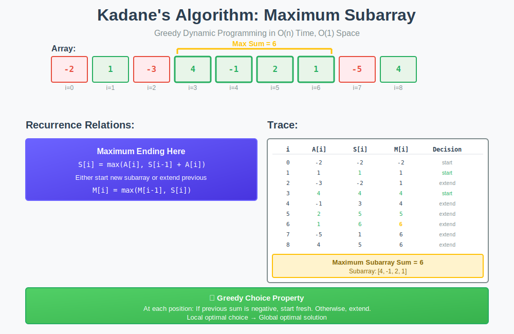

<div align="center">

# 🎯 Kadane's Algorithm Pattern

<p>
  
  
</p>

</div>

---

## 🧭 Navigation

| ⬅️ Previous | 📂 Current | ➡️ Next |
|:------------|:----------:|--------:|
| [← Welford's Algorithm](../01_welford_algorithm/README.md) | **02. Kadane's Pattern** | [03. Higher Moments →](../03_higher_moments/README.md) |

---

## 📊 Visual Guide

<div align="center">
  
</div>

---

## 📐 Mathematical Foundation

### Problem Statement

**Maximum Subarray Problem:**

Given an array $A[1..n]$ of real numbers, find indices $i$ and $j$ such that:

```math
\sum_{k=i}^{j} A[k] \text{ is maximized}
```

**Constraints:**
- Subarray must be contiguous
- Must contain at least one element
- Time: $O(n)$, Space: $O(1)$

---

### Recurrence Relation

Define:
- $S[i]$ = maximum sum of subarray **ending at position** $i$
- $M[i]$ = maximum sum of **any** subarray in $A[1..i]$

**Kadane's Recurrence:**

```math
S[i] = \max(A[i], S[i-1] + A[i])
M[i] = \max(M[i-1], S[i])
```

**Key Insight:** At each position, either:
1. Start a new subarray (if previous sum is negative)
2. Extend the existing subarray

---

## 💻 Code Implementations

### Basic Kadane's Algorithm

```python
def max_subarray(arr: list[int]) -> int:
    """
    Maximum subarray sum (LeetCode 53).
    
    Time: O(n), Space: O(1)
    
    Example:
        arr = [-2, 1, -3, 4, -1, 2, 1, -5, 4]
        returns 6 (subarray [4, -1, 2, 1])
    """
    if not arr:
        return 0
    
    max_ending_here = max_so_far = arr[0]
    
    for num in arr[1:]:
        max_ending_here = max(num, max_ending_here + num)
        max_so_far = max(max_so_far, max_ending_here)
    
    return max_so_far

# Example usage
arr = [-2, 1, -3, 4, -1, 2, 1, -5, 4]
print(max_subarray(arr))  # Output: 6
```

### With Indices

```python
def max_subarray_with_indices(arr: list[int]) -> tuple[int, int, int]:
    """
    Find maximum sum and the subarray indices.
    
    Returns:
        (max_sum, start_index, end_index)
    """
    if not arr:
        return (0, 0, 0)
    
    max_ending_here = max_so_far = arr[0]
    start = end = temp_start = 0
    
    for i in range(1, len(arr)):
        if max_ending_here + arr[i] < arr[i]:
            max_ending_here = arr[i]
            temp_start = i
        else:
            max_ending_here += arr[i]
        
        if max_ending_here > max_so_far:
            max_so_far = max_ending_here
            start = temp_start
            end = i
    
    return (max_so_far, start, end)

# Example
arr = [-2, 1, -3, 4, -1, 2, 1, -5, 4]
max_sum, start, end = max_subarray_with_indices(arr)
print(f"Max sum: {max_sum}, Subarray: {arr[start:end+1]}")

# Output: Max sum: 6, Subarray: [4, -1, 2, 1]
```

---

## 🔄 Variants

### 1. Maximum Product Subarray

```python
def max_product_subarray(arr: list[int]) -> int:
    """
    Maximum product of contiguous subarray (LeetCode 152).
    
    Key: Track both max and min (negative × negative = positive)
    
    Time: O(n), Space: O(1)
    """
    if not arr:
        return 0
    
    max_so_far = max_ending = min_ending = arr[0]
    
    for num in arr[1:]:

        # When multiplied by negative, max becomes min
        if num < 0:
            max_ending, min_ending = min_ending, max_ending
        
        max_ending = max(num, max_ending * num)
        min_ending = min(num, min_ending * num)
        
        max_so_far = max(max_so_far, max_ending)
    
    return max_so_far

# Example
arr = [2, 3, -2, 4]
print(max_product_subarray(arr))  # Output: 6 (from [2, 3])
```

### 2. Circular Array Maximum Subarray

```python
def max_subarray_circular(arr: list[int]) -> int:
    """
    Maximum sum subarray in circular array (LeetCode 918).
    
    Key: max_circular = max(normal_kadane, total_sum - min_subarray)
    
    Time: O(n), Space: O(1)
    """
    def kadane(arr):
        max_ending = max_so_far = arr[0]
        for num in arr[1:]:
            max_ending = max(num, max_ending + num)
            max_so_far = max(max_so_far, max_ending)
        return max_so_far
    
    # Case 1: Normal Kadane (no wrap)
    max_kadane = kadane(arr)
    
    # Case 2: Circular (wrap around)
    total_sum = sum(arr)
    
    # Find minimum subarray sum
    max_ending = min_so_far = arr[0]
    for num in arr[1:]:
        max_ending = min(num, max_ending + num)
        min_so_far = min(min_so_far, max_ending)
    
    max_circular = total_sum - min_so_far
    
    # Edge case: all negative numbers
    if max_circular == 0:
        return max_kadane
    
    return max(max_kadane, max_circular)

# Example
arr = [5, -3, 5]
print(max_subarray_circular(arr))  # Output: 10 (wrap: 5 + 5)
```

### 3. Maximum Subarray with One Deletion

```python
def max_subarray_one_deletion(arr: list[int]) -> int:
    """
    Maximum subarray sum after deleting at most one element (LeetCode 1186).
    
    Time: O(n), Space: O(1)
    """

    # Track two states: with deletion and without deletion
    max_ending_no_del = arr[0]
    max_ending_one_del = 0
    max_so_far = arr[0]
    
    for num in arr[1:]:

        # With one deletion: either delete current or extend previous deletion
        max_ending_one_del = max(max_ending_one_del + num, max_ending_no_del)
        
        # Without deletion: standard Kadane
        max_ending_no_del = max(num, max_ending_no_del + num)
        
        max_so_far = max(max_so_far, max_ending_no_del, max_ending_one_del)
    
    return max_so_far

# Example
arr = [1, -2, 0, 3]
print(max_subarray_one_deletion(arr))  # Output: 4 (delete -2)
```

---

## 🔬 Mathematical Proof with Intuition

### 🤔 How to Think About This Proof

**Goal:** Prove that Kadane's algorithm finds the maximum subarray sum.

**Key Insight:** At each position, we only need to know the maximum sum **ending** at the previous position. We don't need to know where it started!

**Strategy:**
1. Define what "maximum ending at position $i$" means
2. Show the recurrence is correct (induction)
3. Show the global maximum is found

**Why induction?** Because each step depends on the previous step being correct.

---

### 📝 Step-by-Step Proof

**Theorem:** Kadane's algorithm correctly computes the maximum subarray sum.

**Definitions:**
- Let $S[i]$ = maximum sum of subarray **ending at position** $i$
- Let $M[i]$ = maximum sum of **any** subarray in $A[1..i]$

**Recurrence:**

```math
S[i] = \max(A[i], S[i-1] + A[i])
M[i] = \max(M[i-1], S[i])
```

---

### Part 1: Proving the Recurrence is Correct

**Claim:** $S[i] = \max(A[i], S[i-1] + A[i])$ correctly computes the maximum sum ending at $i$.

**Proof by Induction:**

**Base Case ($i = 1$):**
- Only one element, so $S[1] = A[1]$ ✓

**Inductive Hypothesis:**
- Assume $S[k]$ is correct for all $k < i$

**Inductive Step:**
Consider any subarray ending at position $i$. It either:

**Case 1:** Contains only $A[i]$
- Sum = $A[i]$

**Case 2:** Extends from some earlier position $j < i$
- Sum = $\sum\_{k=j}^{i} A[k] = \sum\_{k=j}^{i-1} A[k] + A[i]$
- But $\sum\_{k=j}^{i-1} A[k] \leq S[i-1]$ (by inductive hypothesis)
- So this sum $\leq S[i-1] + A[i]$

**Conclusion:** The maximum is $\max(A[i], S[i-1] + A[i])$ ✓

---

### Part 2: Proving We Find the Global Maximum

**Claim:** $M[i] = \max(M[i-1], S[i])$ correctly tracks the global maximum.

**Proof:**

The maximum subarray in $A[1..i]$ either:
1. **Doesn't end at $i$:** Then it's in $A[1..i-1]$, so max = $M[i-1]$
2. **Ends at $i$:** Then its sum is $S[i]$

Therefore: $M[i] = \max(M[i-1], S[i])$ ✓

By induction, $M[n]$ is the maximum subarray sum. $\blacksquare$

---

### 💡 Proof Intuition

**The "Aha!" Moment:**

At each position, ask: **"Should I extend the previous subarray or start fresh?"**

```
Position:  1    2    3    4    5    6    7    8    9
Array:    -2    1   -3    4   -1    2    1   -5    4
          ↓     ↓    ↓    ↓    ↓    ↓    ↓    ↓    ↓
S[i]:     -2    1   -2    4    3    5    6    1    5
Decision: new  new  ext  new  ext  ext  ext  ext  ext
```

**Why it works:**
1. If $S[i-1] < 0$, extending makes things worse → start new
2. If $S[i-1] \geq 0$, extending might help → extend
3. We track the best we've seen so far in $M[i]$

**Greedy Choice Property:** The locally optimal choice (extend or restart) leads to the globally optimal solution!

---

### 🎯 Common Proof Mistakes to Avoid

❌ **Mistake 1:** "We need to track all possible subarrays"
- ✅ **Correct:** We only need maximum ending at each position

❌ **Mistake 2:** "We need to know where the maximum subarray starts"
- ✅ **Correct:** We only need the sum, not the indices (for basic version)

❌ **Mistake 3:** "Induction is too complicated"
- ✅ **Correct:** Induction is perfect here because each step builds on the previous

---

### 🧮 Example Walkthrough

Array: $[-2, 1, -3, 4, -1, 2, 1, -5, 4]$

| $i$ | $A[i]$ | $S[i-1]$ | $S[i-1] + A[i]$ | $S[i] = \max(A[i], S[i-1] + A[i])$ | $M[i]$ | Decision |
|-----|--------|----------|-----------------|-------------------------------------|--------|----------|
| 1   | -2     | -        | -               | -2                                  | -2     | Start    |
| 2   | 1      | -2       | -1              | 1                                   | 1      | Start    |
| 3   | -3     | 1        | -2              | -2                                  | 1      | Extend   |
| 4   | 4      | -2       | 2               | 4                                   | 4      | Start    |
| 5   | -1     | 4        | 3               | 3                                   | 4      | Extend   |
| 6   | 2      | 3        | 5               | 5                                   | 5      | Extend   |
| 7   | 1      | 5        | 6               | 6                                   | 6      | Extend   |
| 8   | -5     | 6        | 1               | 1                                   | 6      | Extend   |
| 9   | 4      | 1        | 5               | 5                                   | 6      | Extend   |

**Answer:** $M[9] = 6$ (subarray $[4, -1, 2, 1]$)

---

## 🎯 LeetCode Problems

| # | Problem | Difficulty | Pattern |
|:-:|---------|-----------|---------|
| 53 | [Maximum Subarray](https://leetcode.com/problems/maximum-subarray/) | 🟡 Medium | Classic Kadane ⭐ |
| 152 | [Maximum Product Subarray](https://leetcode.com/problems/maximum-product-subarray/) | 🟡 Medium | Track min/max |
| 918 | [Maximum Sum Circular Subarray](https://leetcode.com/problems/maximum-sum-circular-subarray/) | 🟡 Medium | Circular variant |
| 1186 | [Maximum Subarray Sum with One Deletion](https://leetcode.com/problems/maximum-subarray-sum-with-one-deletion/) | 🟡 Medium | State tracking |
| 1191 | [K-Concatenation Maximum Sum](https://leetcode.com/problems/k-concatenation-maximum-sum/) | 🟡 Medium | Pattern recognition |
| 121 | [Best Time to Buy and Sell Stock](https://leetcode.com/problems/best-time-to-buy-and-sell-stock/) | 🟢 Easy | Kadane variant |
| 122 | [Best Time to Buy and Sell Stock II](https://leetcode.com/problems/best-time-to-buy-and-sell-stock-ii/) | 🟡 Medium | Multiple transactions |
| 1749 | [Maximum Absolute Sum of Any Subarray](https://leetcode.com/problems/maximum-absolute-sum-of-any-subarray/) | 🟡 Medium | Max and min |

---

## 📊 Complexity Analysis

| Variant | Time | Space |
|---------|------|-------|
| **Basic Kadane** | $O(n)$ | $O(1)$ |
| **With Indices** | $O(n)$ | $O(1)$ |
| **Max Product** | $O(n)$ | $O(1)$ |
| **Circular** | $O(n)$ | $O(1)$ |
| **One Deletion** | $O(n)$ | $O(1)$ |

---

## 🎓 Key Insights

> **Greedy Choice**: At each position, the locally optimal choice (extend or restart) leads to the globally optimal solution.

> **Optimal Substructure**: The maximum subarray ending at position $i$ can be computed from the maximum ending at $i-1$.

> **Loop Fusion**: Kadane combines DP computation with maximum tracking in a single pass.

> **State Tracking**: Variants often require tracking multiple states (e.g., with/without deletion, min/max for products).

---

## 📚 Resources

| Resource | Link |
|----------|------|
| **Programming Pearls** | [Bentley (1986)](https://en.wikipedia.org/wiki/Maximum_subarray_problem) |
| **Kadane's Algorithm** | [Wikipedia](https://en.wikipedia.org/wiki/Maximum_subarray_problem) |
| **LeetCode Discuss** | [Kadane Explanation](https://leetcode.com/problems/maximum-subarray/discuss/) |

---

<div align="center">

**Made with ❤️ by [Gaurav Goswami](https://github.com/Gaurav14cs17)**

</div>

---

## 🧭 Navigation

| ⬅️ Previous | 📂 Current | ➡️ Next |
|:------------|:----------:|--------:|
| [← Welford's Algorithm](../01_welford_algorithm/README.md) | **02. Kadane's Pattern** | [03. Higher Moments →](../03_higher_moments/README.md) |
