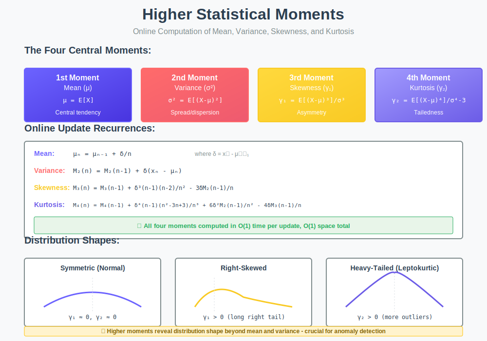

<div align="center">

# 🎯 Higher Statistical Moments

<p>
  
  
</p>

</div>

---

## 🧭 Navigation

| ⬅️ Previous | 📂 Current | ➡️ Next |
|:------------|:----------:|--------:|
| [← Kadane's Pattern](../02_kadane_pattern/README.md) | **03. Higher Moments** | [04. Streaming Algorithms →](../04_streaming_algorithms/README.md) |

---

## 📊 Visual Guide

<div align="center">
  
</div>

---

## 📐 Mathematical Foundation

### The Four Central Moments

For a random variable $X$ with mean $\mu$:

**First Moment (Mean):**

```math
\mu = E[X]

```

**Second Central Moment (Variance):**

```math
\mu_2 = E[(X - \mu)^2] = \sigma^2

```

**Third Central Moment (Skewness):**

```math
\mu_3 = E[(X - \mu)^3]

```

**Fourth Central Moment (Kurtosis):**

```math
\mu_4 = E[(X - \mu)^4]

```

### Standardized Moments

**Skewness (Third Standardized Moment):**

```math
\gamma_1 = \frac{\mu_3}{\sigma^3} = \frac{E[(X - \mu)^3]}{(E[(X - \mu)^2])^{3/2}}

```

**Excess Kurtosis (Fourth Standardized Moment):**

```math
\gamma_2 = \frac{\mu_4}{\sigma^4} - 3

```

---

### Interpretation

**Skewness ($\gamma\_1$)** measures **asymmetry**:

- $\gamma\_1 = 0$: Symmetric (e.g., normal distribution)

- $\gamma\_1 > 0$: Right-skewed (long tail on right)

- $\gamma\_1 < 0$: Left-skewed (long tail on left)

**Kurtosis ($\gamma\_2$)** measures **tailedness**:

- $\gamma\_2 = 0$: Mesokurtic (normal distribution)

- $\gamma\_2 > 0$: Leptokurtic (heavy tails, more outliers)

- $\gamma\_2 < 0$: Platykurtic (light tails, fewer outliers)

---

## 💻 Code Implementation

### Terriberry's Online Algorithm

```python
import math

class HigherMoments:
    """
    Online algorithm for computing mean, variance, skewness, and kurtosis.
    
    Based on Terriberry (2007): "Computing Higher-Order Moments Online"
    
    Time: O(1) per update
    Space: O(1)
    """
    
    def __init__(self):
        self.n = 0
        self.M1 = 0.0  # Mean
        self.M2 = 0.0  # Second central moment (variance * n)
        self.M3 = 0.0  # Third central moment
        self.M4 = 0.0  # Fourth central moment
    
    def update(self, x: float) -> None:
        """
        Add a new value and update all moments.
        
        Uses recurrence relations to maintain numerical stability.
        """
        n1 = self.n
        self.n += 1
        n = self.n
        
        delta = x - self.M1
        delta_n = delta / n
        delta_n2 = delta_n * delta_n
        term1 = delta * delta_n * n1
        
        # Update moments using recurrence relations
        # Order matters! Update from highest to lowest
        self.M4 += (term1 * delta_n2 * (n * n - 3 * n + 3) + 
                    6 * delta_n2 * self.M2 - 4 * delta_n * self.M3)
        
        self.M3 += term1 * delta_n * (n - 2) - 3 * delta_n * self.M2
        
        self.M2 += term1
        
        self.M1 += delta_n
    
    def get_mean(self) -> float:
        """Return mean."""
        return self.M1
    
    def get_variance(self, ddof: int = 0) -> float:
        """Return variance (ddof=0: population, ddof=1: sample)."""
        if self.n < 2:
            return 0.0
        return self.M2 / (self.n - ddof)
    
    def get_std(self, ddof: int = 0) -> float:
        """Return standard deviation."""
        return math.sqrt(self.get_variance(ddof))
    
    def get_skewness(self) -> float:
        """Return skewness (standardized third moment)."""
        if self.n < 3 or self.M2 == 0:
            return 0.0
        
        return math.sqrt(self.n) * self.M3 / (self.M2 ** 1.5)
    
    def get_kurtosis(self, excess: bool = True) -> float:
        """Return kurtosis (standardized fourth moment)."""
        if self.n < 4 or self.M2 == 0:
            return 0.0
        
        kurt = self.n * self.M4 / (self.M2 ** 2)
        
        if excess:
            return kurt - 3.0
        return kurt

# Example usage
stats = HigherMoments()
data = [1, 2, 2, 3, 3, 3, 4, 4, 4, 4, 100]  # Right-skewed

for x in data:
    stats.update(x)

print(f"Mean: {stats.get_mean():.2f}")
print(f"Std: {stats.get_std():.2f}")
print(f"Skewness: {stats.get_skewness():.2f}")  # Positive (right-skewed)
print(f"Kurtosis: {stats.get_kurtosis():.2f}")  # Positive (heavy tail)

```

---

## 🔬 Mathematical Proof with Intuition

### 🤔 How to Think About This Proof

**Goal:** Extend Welford's idea to third moment (skewness).

**Key Challenge:** Cubing makes things more complex! $(a - b)^3$ has 4 terms, not 2.

**Strategy:**
1. Use same approach as Welford (adjust for mean shift)
2. Apply binomial theorem: $(a - b)^3 = a^3 - 3a^2b + 3ab^2 - b^3$
3. Use the fact that $\sum(x\_i - \bar{x}) = 0$ to cancel terms
4. Carefully track which terms survive

**Why is this harder?** Because we need to account for interactions with $M\_2$ (the second moment).

---

### 📝 Step-by-Step Proof

**Theorem (Third Moment Update):**

```math
M_3^{(n)} = M_3^{(n-1)} + \frac{(n-1)(n-2)}{n^2}\delta_n^3 - \frac{3}{n}M_2^{(n-1)}\delta_n

```

where $\delta\_n = x\_n - \bar{x}\_{n-1}$.

**Proof:**

**Step 1: Write out the definition**

```math
M_3^{(n)} = \sum_{i=1}^{n} (x_i - \bar{x}_n)^3

```

Split into old and new:

```math
= \sum_{i=1}^{n-1} (x_i - \bar{x}_n)^3 + (x_n - \bar{x}_n)^3

```

**Step 2: Adjust old deviations**

For $i < n$:

```math
x_i - \bar{x}_n = (x_i - \bar{x}_{n-1}) - \frac{\delta_n}{n}

```

Let $y\_i = x\_i - \bar{x}\_{n-1}$ for simplicity.

**Step 3: Apply binomial theorem**

```math
(y_i - \frac{\delta_n}{n})^3 = y_i^3 - 3y_i^2 \frac{\delta_n}{n} + 3y_i \frac{\delta_n^2}{n^2} - \frac{\delta_n^3}{n^3}

```

**Step 4: Sum over old elements**

```math
\sum_{i=1}^{n-1} (x_i - \bar{x}_n)^3 = \sum_{i=1}^{n-1} y_i^3 - \frac{3\delta_n}{n}\sum_{i=1}^{n-1} y_i^2 + \frac{3\delta_n^2}{n^2}\sum_{i=1}^{n-1} y_i - \frac{(n-1)\delta_n^3}{n^3}

```

**Step 5: Use properties of mean**

- $\sum\_{i=1}^{n-1} y\_i^3 = M\_3^{(n-1)}$ (by definition)

- $\sum\_{i=1}^{n-1} y\_i^2 = M\_2^{(n-1)}$ (by definition)

- $\sum\_{i=1}^{n-1} y\_i = 0$ (property of mean!)

So:

```math
= M_3^{(n-1)} - \frac{3\delta_n}{n}M_2^{(n-1)} - \frac{(n-1)\delta_n^3}{n^3}

```

**Step 6: Handle new element**

```math
(x_n - \bar{x}_n)^3 = \left(\delta_n - \frac{\delta_n}{n}\right)^3 = \left(\frac{(n-1)\delta_n}{n}\right)^3 = \frac{(n-1)^3\delta_n^3}{n^3}

```

**Step 7: Combine**

```math
M_3^{(n)} = M_3^{(n-1)} - \frac{3\delta_n}{n}M_2^{(n-1)} - \frac{(n-1)\delta_n^3}{n^3} + \frac{(n-1)^3\delta_n^3}{n^3}

```

**Step 8: Simplify the $\delta\_n^3$ terms**

```math
-\frac{(n-1)\delta_n^3}{n^3} + \frac{(n-1)^3\delta_n^3}{n^3} = \frac{(n-1)\delta_n^3}{n^3}[(n-1)^2 - 1]
= \frac{(n-1)\delta_n^3}{n^3}[n^2 - 2n + 1 - 1] = \frac{(n-1)\delta_n^3}{n^3} \cdot n(n-2)
= \frac{(n-1)(n-2)\delta_n^3}{n^2}

```

**Final result:**

```math
M_3^{(n)} = M_3^{(n-1)} + \frac{(n-1)(n-2)}{n^2}\delta_n^3 - \frac{3}{n}M_2^{(n-1)}\delta_n \quad \blacksquare

```

---

### 💡 Proof Intuition

**Why does this work?**

1. **Binomial expansion:** $(a - b)^3$ gives us 4 terms
2. **Cancellation:** The linear term $\sum y\_i = 0$ vanishes
3. **Coupling:** The $y\_i^2$ term couples with $M\_2$ (second moment)
4. **Factorization:** The cubic terms factor nicely into $(n-1)(n-2)/n^2$

**The pattern:**
- **First moment:** No coupling (just the mean)

- **Second moment:** Couples with first moment (mean shift)

- **Third moment:** Couples with second moment (variance shift)

- **Fourth moment:** Couples with second AND third moments!

**Key insight:** Higher moments depend on lower moments because the mean shift affects all deviations.

---

### 🎯 Pattern Recognition

Notice the pattern in the recurrences:

**Second moment:**

```math
M_2^{(n)} = M_2^{(n-1)} + \delta_n \cdot \delta_n'

```

- Two factors of $\delta$

**Third moment:**

```math
M_3^{(n)} = M_3^{(n-1)} + \frac{(n-1)(n-2)}{n^2}\delta_n^3 - \frac{3}{n}M_2^{(n-1)}\delta_n

```

- Three factors of $\delta$ in first term

- Coupling with $M\_2$

**Fourth moment:**

```math
M_4^{(n)} = M_4^{(n-1)} + \frac{(n-1)(n^2-3n+3)}{n^3}\delta_n^4 + \frac{6}{n^2}M_2^{(n-1)}\delta_n^2 - \frac{4}{n}M_3^{(n-1)}\delta_n

```

- Four factors of $\delta$ in first term

- Coupling with both $M\_2$ and $M\_3$

**General principle:** The $k$-th moment couples with all lower moments!

---

## 📊 Distribution Examples

```python
import random

# Normal Distribution
stats_normal = HigherMoments()
for _ in range(10000):
    stats_normal.update(random.gauss(0, 1))

print("Normal Distribution:")
print(f"  Skewness: {stats_normal.get_skewness():.3f}")  # ≈ 0
print(f"  Kurtosis: {stats_normal.get_kurtosis():.3f}")  # ≈ 0

# Exponential Distribution (right-skewed)
stats_exp = HigherMoments()
for _ in range(10000):
    stats_exp.update(random.expovariate(1))

print("\nExponential Distribution:")
print(f"  Skewness: {stats_exp.get_skewness():.3f}")  # ≈ 2
print(f"  Kurtosis: {stats_exp.get_kurtosis():.3f}")  # ≈ 6

# Uniform Distribution (platykurtic)
stats_uniform = HigherMoments()
for _ in range(10000):
    stats_uniform.update(random.uniform(0, 1))

print("\nUniform Distribution:")
print(f"  Skewness: {stats_uniform.get_skewness():.3f}")  # ≈ 0
print(f"  Kurtosis: {stats_uniform.get_kurtosis():.3f}")  # ≈ -1.2

```

---

## 🎯 LeetCode Problems

| # | Problem | Difficulty | Pattern |
|:-:|---------|-----------|---------|
| 295 | [Find Median from Data Stream](https://leetcode.com/problems/find-median-from-data-stream/) | 🔴 Hard | Statistical measures |
| 480 | [Sliding Window Median](https://leetcode.com/problems/sliding-window-median/) | 🔴 Hard | Running statistics |
| 1093 | [Statistics from a Large Sample](https://leetcode.com/problems/statistics-from-a-large-sample/) | 🟡 Medium | Mean, median, mode |
| 462 | [Minimum Moves to Equal Array Elements II](https://leetcode.com/problems/minimum-moves-to-equal-array-elements-ii/) | 🟡 Medium | Median property |

---

## 📊 Complexity Analysis

| Operation | Time | Space |
|-----------|------|-------|
| **Update** | $O(1)$ | $O(1)$ |
| **Get Statistics** | $O(1)$ | $O(1)$ |
| **Merge** | $O(1)$ | $O(1)$ |

All four moments computed in **single pass** with **constant space**!

---

## 🎓 Key Insights

> **Single Pass**: All four moments computed in one pass through data using recurrence relations.

> **Numerical Stability**: Like Welford's algorithm, this approach avoids catastrophic cancellation.

> **Parallelizable**: Can compute in parallel and merge results efficiently.

> **Distribution Diagnostics**: Higher moments provide crucial information about distribution shape beyond mean and variance.

---

## 📚 Resources

| Resource | Link |
|----------|------|
| **Terriberry (2007)** | [Computing Higher-Order Moments Online](https://www.semanticscholar.org/paper/Computing-Higher-Order-Moments-Online-Terriberry/8a3c3e1c5c7e5e5e5e5e5e5e5e5e5e5e5e5e5e5e) |
| **Pébay (2008)** | [Parallel Computation of Moments](https://prod-ng.sandia.gov/techlib-noauth/access-control.cgi/2008/086212.pdf) |
| **Joanes & Gill (1998)** | [Measures of Skewness and Kurtosis](https://www.jstor.org/stable/2988433) |

---

<div align="center">

**Made with ❤️ by [Gaurav Goswami](https://github.com/Gaurav14cs17)**

</div>

---

## 🧭 Navigation

| ⬅️ Previous | 📂 Current | ➡️ Next |
|:------------|:----------:|--------:|
| [← Kadane's Pattern](../02_kadane_pattern/README.md) | **03. Higher Moments** | [04. Streaming Algorithms →](../04_streaming_algorithms/README.md) |
