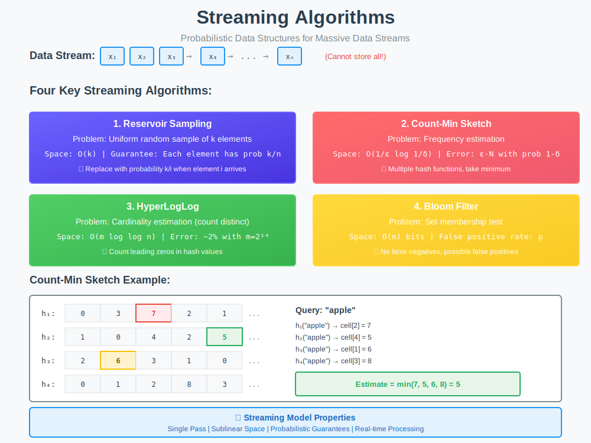

<div align="center">

# 🎯 Streaming Algorithms

<p>
  
  
</p>

</div>

---

## 🧭 Navigation

| ⬅️ Previous | 📂 Current | ➡️ Next |
|:------------|:----------:|--------:|
| [← Higher Moments](../03_higher_moments/README.md) | **04. Streaming Algorithms** | [🏠 Loop Fusion Home](../README.md) |

---

## 📊 Visual Guide

<div align="center">
  
</div>

---

## 📐 Mathematical Foundation

### The Streaming Model

**Definition:** Data arrives as a sequence $\sigma = (a\_1, a\_2, \ldots, a\_m)$ where:

- Elements arrive one at a time

- Cannot be stored (or storage is limited to $s \ll m$)

- Must be processed in one pass

- Output approximate answer with probabilistic guarantees

**Performance Metrics:**

- **Space**: $s = O(\text{polylog}(m, n))$

- **Time**: $O(\text{polylog}(m, n))$ per element

- **Accuracy**: $(1 \pm \epsilon)$ approximation with probability $1 - \delta$

---

## 💻 Code Implementations

### 1. Reservoir Sampling

```python
import random

def reservoir_sample(stream, k: int) -> list:
    """
    Uniform random sample of k elements from stream.
    
    Each element has probability k/n of being in final sample.
    
    Time: O(1) per element, Space: O(k)
    
    LeetCode: 382 (Linked List Random Node), 398 (Random Pick Index)
    """
    reservoir = []
    
    for i, item in enumerate(stream):
        if i < k:
            # Fill reservoir
            reservoir.append(item)
        else:
            # Replace with probability k/i
            j = random.randint(0, i)
            if j < k:
                reservoir[j] = item
    
    return reservoir

# Example
stream = range(1, 101)  # Stream of 1 to 100
sample = reservoir_sample(stream, k=5)
print(f"Random sample of 5: {sample}")

```

### 🔬 Proof of Correctness with Intuition

**🤔 How to Think About This Proof**

**Goal:** Prove each element has equal probability $k/n$ of being in final sample.

**Key Insight:** Use induction! If probability is correct after $i-1$ elements, show it's correct after $i$ elements.

**Strategy:**
1. Base case: First $k$ elements (trivial)
2. Inductive step: Show probability stays correct when adding element $i$

---

**Theorem:** After processing $n$ elements, each element has probability $k/n$ of being in reservoir.

**Proof by Induction:**

**Base Case ($i \leq k$):**

- First $k$ elements all go into reservoir

- Probability = $1 = k/k$ ✓

**Inductive Hypothesis:**

- After $i-1$ elements, each element has probability $k/(i-1)$ of being in reservoir

**Inductive Step (element $i$ arrives):**

For **new element** $i$:

- Selected with probability $k/i$ ✓

For **old element** $j$ (where $j < i$):

- Was in reservoir with probability $k/(i-1)$ (by hypothesis)

- Stays in reservoir if:
  - **Case 1:** Element $i$ not selected: probability $1 - k/i$
  - **Case 2:** Element $i$ selected but doesn't replace $j$: probability $(k/i) \cdot (k-1)/k$

```math
P(\text{stay}) = \left(1 - \frac{k}{i}\right) + \frac{k}{i} \cdot \frac{k-1}{k} = 1 - \frac{k}{i} + \frac{k-1}{i} = \frac{i-1}{i}

```

Therefore:

```math
P(j \text{ in reservoir after } i) = \frac{k}{i-1} \cdot \frac{i-1}{i} = \frac{k}{i}
$$ ✓

By induction, after $n$ elements, each has probability $k/n$. $\blacksquare$

---

**💡 Intuition:**

Imagine a game where you're picking $k$ people from a line of $n$ people:

- First $k$ people: "You're in!"

- Person $i$ arrives: Flip a coin with probability $k/i$
  - If heads: Pick random person to kick out, let person $i$ in
  - If tails: Person $i$ leaves

**Why fair?** Each person's "survival probability" decreases by exactly the right amount to maintain $k/n$ for everyone!

---

### 2. Count-Min Sketch

```python
import hashlib

class CountMinSketch:
    """
    Probabilistic data structure for frequency estimation.
    
    Guarantees: f̂(x) >= f(x) (overestimate)
    Error bound: f̂(x) <= f(x) + ε·N with probability 1-δ
    
    Space: O(1/ε · log(1/δ))
    """
    
    def __init__(self, width: int = 1000, depth: int = 5):
        """
        Args:
            width: Number of buckets per hash function
            depth: Number of hash functions
        """
        self.width = width
        self.depth = depth
        self.table = [[0] * width for _ in range(depth)]
        self.total = 0
    
    def _hash(self, item, seed: int) -> int:
        """Hash function with seed."""
        h = hashlib.md5(f"{item}{seed}".encode()).hexdigest()
        return int(h, 16) % self.width
    
    def add(self, item, count: int = 1) -> None:
        """Add item to sketch."""
        self.total += count
        for i in range(self.depth):
            j = self._hash(item, i)
            self.table[i][j] += count
    
    def estimate(self, item) -> int:
        """Estimate frequency of item."""
        return min(
            self.table[i][self._hash(item, i)]
            for i in range(self.depth)
        )

# Example: Track word frequencies
sketch = CountMinSketch(width=100, depth=5)

text = "the quick brown fox jumps over the lazy dog the fox"
for word in text.split():
    sketch.add(word)

print(f"Frequency of 'the': {sketch.estimate('the')}")  # 3
print(f"Frequency of 'fox': {sketch.estimate('fox')}")  # 2

```

### 🔬 Accuracy Proof with Intuition

**🤔 How to Think About This Proof**

**Goal:** Prove Count-Min Sketch gives good approximation with high probability.

**Key Insight:** Hash collisions cause overestimation. Use multiple hash functions and take minimum to reduce error.

**Strategy:**
1. Analyze error from one hash function (Markov's inequality)
2. Show multiple hash functions reduce failure probability (independence)
3. Set parameters to achieve desired $(\epsilon, \delta)$ guarantee

---

**Theorem (Count-Min Sketch Accuracy):**

With $w = \lceil e/\epsilon \rceil$ and $d = \lceil \ln(1/\delta) \rceil$:

```
P(\hat{f}_i \leq f_i + \epsilon \|\mathbf{f}\|_1) \geq 1 - \delta

```math
**Proof:**

**Step 1: Analyze single hash function**

For hash function $h\_j$ and item $i$:

```

C[j][h_j(i)] = f_i + \sum_{k: h_j(k) = h_j(i), k \neq i} f_k

```math
The error is the collision sum:

```

\text{Error}_j = \sum_{k \neq i} f_k \cdot \mathbb{1}[h_j(k) = h_j(i)]

```math
**Step 2: Expected error**

By pairwise independence of hash functions:

```

E[\text{Error}_j] = \sum_{k \neq i} f_k \cdot P(h_j(k) = h_j(i)) = \sum_{k \neq i} f_k \cdot \frac{1}{w}
= \frac{1}{w} \sum_{k \neq i} f_k \leq \frac{\|\mathbf{f}\|_1}{w}

```math
**Step 3: Apply Markov's inequality**

```

P(\text{Error}_j > \epsilon \|\mathbf{f}\|_1) \leq \frac{E[\text{Error}_j]}{\epsilon \|\mathbf{f}\|_1} \leq \frac{1}{w\epsilon}

```math
With $w = e/\epsilon$:

```

P(\text{Error}_j > \epsilon \|\mathbf{f}\|_1) \leq \frac{1}{e}

```math
**Step 4: Multiple hash functions**

We take minimum over $d$ independent hash functions:

```

P(\text{all } d \text{ hash functions fail}) \leq \left(\frac{1}{e}\right)^d

```math
With $d = \ln(1/\delta)$:

```

P(\text{all fail}) \leq e^{-d} = e^{-\ln(1/\delta)} = \delta

```math
Therefore:

```

P(\hat{f}_i \leq f_i + \epsilon \|\mathbf{f}\|_1) \geq 1 - \delta \quad \blacksquare

```math
---

**💡 Intuition:**

**Why does taking minimum help?**

- Each hash function might overestimate (due to collisions)

- But different hash functions have different collisions

- Taking minimum gives us the "luckiest" hash function

- With $d$ tries, probability all are unlucky is very small!

**Space-accuracy tradeoff:**

- Want smaller error $\epsilon$ → need wider table ($w \propto 1/\epsilon$)

- Want higher confidence $1-\delta$ → need more hash functions ($d \propto \log(1/\delta)$)

**Why $e$ appears:** Markov's inequality gives $1/e$ as the failure probability when $w = e/\epsilon$. This is optimal!

---

### 3. HyperLogLog

```python
import math
import hashlib

class HyperLogLog:
    """
    Probabilistic cardinality estimator.
    
    Estimates number of distinct elements with ~2% error using O(log log n) space.
    
    Space: O(m) where m is number of registers (typically 2^10 to 2^16)
    """
    
    def __init__(self, precision: int = 14):
        """
        Args:
            precision: Number of bits for register addressing (4-16)
        """
        self.precision = precision
        self.m = 1 << precision  # 2^precision registers
        self.registers = [0] * self.m
        
        # Alpha constant for bias correction
        if self.m >= 128:
            self.alpha = 0.7213 / (1 + 1.079 / self.m)
        elif self.m >= 64:
            self.alpha = 0.709
        elif self.m >= 32:
            self.alpha = 0.697
        else:
            self.alpha = 0.673
    
    def _hash(self, item) -> int:
        """Hash item to 64-bit integer."""
        h = hashlib.sha256(str(item).encode()).hexdigest()
        return int(h[:16], 16)
    
    def _rho(self, w: int) -> int:
        """Count leading zeros + 1."""
        if w == 0:
            return 64 - self.precision + 1
        return 64 - self.precision - w.bit_length() + 1
    
    def add(self, item) -> None:
        """Add item to HyperLogLog."""
        h = self._hash(item)
        
        # Use first p bits for register index
        j = h & ((1 << self.precision) - 1)
        
        # Use remaining bits for leading zero count
        w = h >> self.precision
        
        # Update register with maximum
        self.registers[j] = max(self.registers[j], self._rho(w))
    
    def cardinality(self) -> int:
        """Estimate number of distinct elements."""
        # Raw estimate
        raw_estimate = self.alpha * (self.m ** 2) / sum(2 ** (-x) for x in self.registers)
        
        # Small range correction
        if raw_estimate <= 2.5 * self.m:
            zeros = self.registers.count(0)
            if zeros != 0:
                return int(self.m * math.log(self.m / zeros))
        
        # Large range correction
        if raw_estimate <= (1 << 32) / 30:
            return int(raw_estimate)
        else:
            return int(-1 * (1 << 32) * math.log(1 - raw_estimate / (1 << 32)))

# Example: Count distinct elements
hll = HyperLogLog(precision=14)

for i in range(100000):
    hll.add(i)

print(f"True count: 100000")
print(f"Estimated: {hll.cardinality()}")
print(f"Error: {abs(hll.cardinality() - 100000) / 100000 * 100:.2f}%")

```

**Error Bound:**

Standard error: $\sigma(\hat{n}) \approx \frac{1.04}{\sqrt{m}} \cdot n$

With $m = 2^{14}$ (16K registers), error is ~0.8%.

---

### 4. Bloom Filter

```python
import hashlib

class BloomFilter:
    """
    Probabilistic set membership test.
    
    Properties:
    - No false negatives (if not in filter, definitely not in set)
    - Possible false positives (if in filter, probably in set)
    
    Space: O(m) bits
    """
    
    def __init__(self, size: int = 10000, num_hashes: int = 3):
        """
        Args:
            size: Number of bits in filter
            num_hashes: Number of hash functions
        """
        self.size = size
        self.num_hashes = num_hashes
        self.bits = [False] * size
        self.count = 0
    
    def _hashes(self, item) -> list[int]:
        """Generate k hash values for item."""
        hashes = []
        for i in range(self.num_hashes):
            h = hashlib.md5(f"{item}{i}".encode()).hexdigest()
            hashes.append(int(h, 16) % self.size)
        return hashes
    
    def add(self, item) -> None:
        """Add item to filter."""
        for h in self._hashes(item):
            self.bits[h] = True
        self.count += 1
    
    def contains(self, item) -> bool:
        """Check if item might be in set."""
        return all(self.bits[h] for h in self._hashes(item))
    
    def false_positive_rate(self) -> float:
        """Estimate false positive probability."""
        import math
        # p ≈ (1 - e^(-kn/m))^k
        k = self.num_hashes
        n = self.count
        m = self.size
        return (1 - math.exp(-k * n / m)) ** k

# Example: URL deduplication
bloom = BloomFilter(size=10000, num_hashes=3)

urls = [
    "https://example.com/page1",
    "https://example.com/page2",
    "https://example.com/page1",  # Duplicate
]

for url in urls:
    if bloom.contains(url):
        print(f"Already seen: {url}")
    else:
        print(f"New URL: {url}")
        bloom.add(url)

print(f"\nFalse positive rate: {bloom.false_positive_rate():.4f}")

```

**False Positive Rate:**

```
p \approx \left(1 - e^{-kn/m}\right)^k

```math

Optimal $k$: $k^* = \frac{m}{n} \ln 2 \approx 0.693 \frac{m}{n}$

---

## 🎯 LeetCode Problems

| # | Problem | Difficulty | Pattern |
|:-:|---------|-----------|---------|
| 382 | [Linked List Random Node](https://leetcode.com/problems/linked-list-random-node/) | 🟡 Medium | Reservoir sampling ⭐ |
| 398 | [Random Pick Index](https://leetcode.com/problems/random-pick-index/) | 🟡 Medium | Reservoir sampling |
| 295 | [Find Median from Data Stream](https://leetcode.com/problems/find-median-from-data-stream/) | 🔴 Hard | Two heaps ⭐ |
| 703 | [Kth Largest Element in Stream](https://leetcode.com/problems/kth-largest-element-in-a-stream/) | 🟢 Easy | Min heap |
| 933 | [Number of Recent Calls](https://leetcode.com/problems/number-of-recent-calls/) | 🟢 Easy | Sliding window |
| 1656 | [Design an Ordered Stream](https://leetcode.com/problems/design-an-ordered-stream/) | 🟢 Easy | Stream processing |
| 380 | [Insert Delete GetRandom O(1)](https://leetcode.com/problems/insert-delete-getrandom-o1/) | 🟡 Medium | Randomized DS |
| 710 | [Random Pick with Blacklist](https://leetcode.com/problems/random-pick-with-blacklist/) | 🔴 Hard | Virtual remapping |

---

## 📊 Comparison Table

| Algorithm | Problem | Space | Accuracy | Guarantee |
|-----------|---------|-------|----------|-----------|
| **Reservoir** | Sampling | $O(k)$ | Exact | Uniform |
| **Count-Min** | Frequency | $O(\frac{1}{\epsilon}\log\frac{1}{\delta})$ | $\epsilon$-approx | Probabilistic |
| **HyperLogLog** | Cardinality | $O(m \log \log n)$ | ~2% error | Probabilistic |
| **Bloom Filter** | Membership | $O(m)$ bits | FP rate $p$ | Deterministic |

---

## 🎓 Key Insights

> **Space-Accuracy Tradeoff**: Streaming algorithms sacrifice perfect accuracy for dramatic space savings.

> **Probabilistic Guarantees**: Most algorithms provide $(1 \pm \epsilon)$-approximations with probability $1 - \delta$.

> **Hash Function Properties**: Pairwise independence often suffices; full independence not required.

> **Single Pass**: All algorithms process data in one pass with limited memory.

---

## 📚 Resources

| Resource | Link |
|----------|------|
| **Vitter (1985)** | [Reservoir Sampling](https://en.wikipedia.org/wiki/Reservoir_sampling) |
| **Cormode & Muthukrishnan (2005)** | [Count-Min Sketch](https://en.wikipedia.org/wiki/Count%E2%80%93min_sketch) |
| **Flajolet et al. (2007)** | [HyperLogLog](https://en.wikipedia.org/wiki/HyperLogLog) |
| **Bloom (1970)** | [Bloom Filter](https://en.wikipedia.org/wiki/Bloom_filter) |
| **Stanford Lecture Notes** | [Streaming Algorithms](http://theory.stanford.edu/~tim/s15/l/l1.pdf) |

---

<div align="center">

**Made with ❤️ by [Gaurav Goswami](https://github.com/Gaurav14cs17)**

</div>

---

## 🧭 Navigation

| ⬅️ Previous | 📂 Current | ➡️ Next |
|:------------|:----------:|--------:|
| [← Higher Moments](../03_higher_moments/README.md) | **04. Streaming Algorithms** | [🏠 Loop Fusion Home](../README.md) |

```