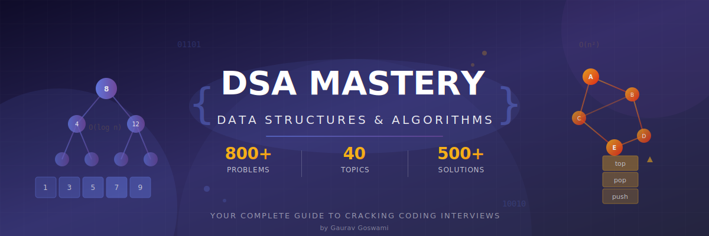
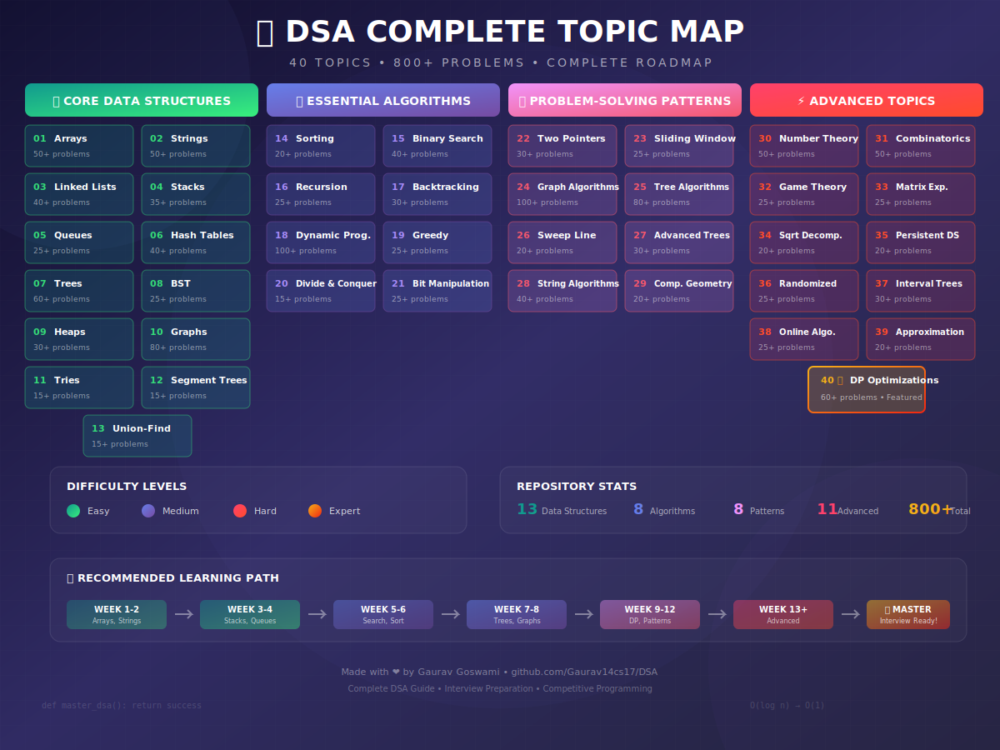
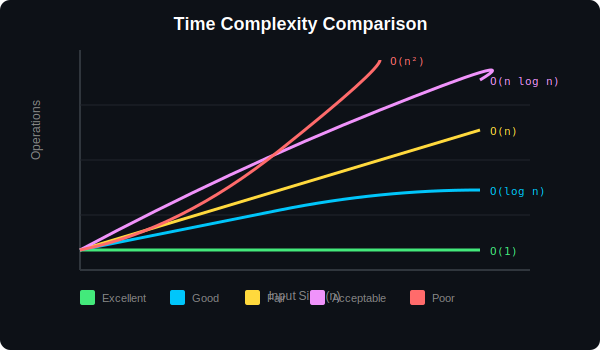

<div align="center">

<!-- Hero Banner -->


<br/>

<!-- Typing Animation -->
<a href="https://git.io/typing-svg"></a>

<br/>

<!-- Badges -->
<p>
  <a href="https://github.com/Gaurav14cs17/DSA/stargazers"></a>
  <a href="https://github.com/Gaurav14cs17/DSA/network/members"></a>
  <a href="https://github.com/Gaurav14cs17/DSA/issues"></a>
  <a href="https://github.com/Gaurav14cs17/DSA/blob/main/LICENSE"></a>
</p>

<p>
  <a href="https://Gaurav14cs17.github.io/DSA/"></a>
</p>

</div>

---

## ✨ What Makes This Special?

<table>
<tr>
<td width="50%">

### 🎯 **Comprehensive Coverage**

- **41 carefully curated topics**

- From basic arrays to advanced loop fusion

- Interview-focused problem selection

</td>
<td width="50%">

### 📐 **Mathematical Rigor**

- Formal proofs and derivations

- Complexity analysis for every algorithm

- Visual step-by-step walkthroughs

</td>
</tr>
<tr>
<td width="50%">

### 💻 **Production-Ready Code**

- Clean, well-documented Python implementations

- Multiple approaches for each problem

- Optimized solutions with explanations

</td>
<td width="50%">

### 🗺️ **Structured Learning Path**

- Progressive difficulty levels

- Clear prerequisites and dependencies

- Practice roadmaps for each topic

</td>
</tr>
</table>

---

## 🗂️ Complete Topic Index

### 📦 Core Data Structures

<div align="center">

| # | Topic | Level | Problems | Description |
|:-:|:------|:-----:|:--------:|:------------|
| 01 | [**Arrays**](./01_arrays/) | 🟢 Easy | 50+ | Two pointers, prefix sum, matrix operations |
| 02 | [**Strings**](./02_strings/) | 🟢 Easy | 50+ | Pattern matching, palindromes, anagrams |
| 03 | [**Linked Lists**](./03_linked_lists/) | 🟢 Easy | 40+ | Reversal, merge, cycle detection |
| 04 | [**Stacks**](./04_stacks/) | 🟡 Medium | 35+ | Monotonic stack, expression evaluation |
| 05 | [**Queues**](./05_queues/) | 🟡 Medium | 25+ | BFS, deque, priority queues |
| 06 | [**Hash Tables**](./06_hash_tables/) | 🟢 Easy | 40+ | Frequency counting, two sum pattern |
| 07 | [**Trees**](./07_trees/) | 🟡 Medium | 60+ | Traversal, construction, LCA |
| 08 | [**Binary Search Trees**](./08_binary_search_trees/) | 🟡 Medium | 25+ | Validation, operations, balancing |
| 09 | [**Heaps**](./09_heaps/) | 🟡 Medium | 30+ | Top-K, merge K streams, two heaps |
| 10 | [**Graphs**](./10_graphs/) | 🔴 Hard | 80+ | BFS, DFS, shortest path, MST |
| 11 | [**Tries**](./11_tries/) | 🟡 Medium | 15+ | Autocomplete, word search |
| 12 | [**Segment Trees**](./12_segment_trees/) | 🔴 Hard | 15+ | Range queries, lazy propagation |
| 13 | [**Union-Find**](./13_union_find/) | 🟡 Medium | 15+ | Connected components, cycle detection |

</div>

### 🧮 Essential Algorithms

<div align="center">

| # | Topic | Level | Problems | Description |
|:-:|:------|:-----:|:--------:|:------------|
| 14 | [**Sorting**](./14_sorting/) | 🟢 Easy | 20+ | Comparison sorts, counting sort, custom |
| 15 | [**Binary Search**](./15_searching/) | 🟡 Medium | 40+ | Sorted array, search on answer, 2D |
| 16 | [**Recursion**](./16_recursion/) | 🟡 Medium | 25+ | Backtracking, memoization, D&C |
| 17 | [**Backtracking**](./17_backtracking/) | 🟡 Medium | 30+ | Permutations, subsets, N-Queens |
| 18 | [**Dynamic Programming**](./18_dynamic_programming/) | 🔴 Hard | 100+ | 1D, 2D, knapsack, tree DP, bitmask |
| 19 | [**Greedy**](./19_greedy_algorithms/) | 🟡 Medium | 25+ | Interval scheduling, activity selection |
| 20 | [**Divide & Conquer**](./20_divide_and_conquer/) | 🟡 Medium | 15+ | Merge sort pattern, quick select |
| 21 | [**Bit Manipulation**](./21_bit_manipulation/) | 🟡 Medium | 25+ | XOR tricks, bit counting, subsets |

</div>

### 🎯 Problem-Solving Patterns

<div align="center">

| # | Topic | Level | Problems | Description |
|:-:|:------|:-----:|:--------:|:------------|
| 22 | [**Two Pointers**](./22_two_pointers/) | 🟢 Easy | 30+ | Opposite direction, same direction |
| 23 | [**Sliding Window**](./23_sliding_window/) | 🟡 Medium | 25+ | Fixed size, variable size |
| 24 | [**Graph Algorithms**](./24_graph_algorithms/) | 🔴 Hard | 100+ | Advanced BFS/DFS, network flow |
| 25 | [**Tree Algorithms**](./25_tree_algorithms/) | 🔴 Hard | 80+ | Binary lifting, HLD, centroid |
| 26 | [**Sweep Line**](./26_sweep_line/) | 🟡 Medium | 20+ | Event processing, interval problems |
| 27 | [**Advanced Trees**](./27_advanced_trees/) | 🔴 Hard | 30+ | AVL, Red-Black, B-Trees |
| 28 | [**String Algorithms**](./28_string_algorithms/) | 🔴 Hard | 40+ | KMP, Z-algorithm, suffix array |
| 29 | [**Computational Geometry**](./29_computational_geometry/) | 🔴 Hard | 20+ | Convex hull, line intersection |

</div>

### ⚡ Advanced Topics

<div align="center">

| # | Topic | Level | Problems | Description |
|:-:|:------|:-----:|:--------:|:------------|
| 30 | [**Number Theory**](./30_number_theory/) | 🔴 Hard | 50+ | GCD, prime sieve, modular arithmetic |
| 31 | [**Combinatorics**](./31_combinatorics/) | 🔴 Hard | 50+ | Counting, generating functions |
| 32 | [**Game Theory**](./32_game_theory/) | 🔴 Hard | 25+ | Nim, Sprague-Grundy, minimax |
| 33 | [**Matrix Exponentiation**](./33_matrix_exponentiation/) | 🔴 Hard | 25+ | Fast Fibonacci, linear recurrence |
| 34 | [**Sqrt Decomposition**](./34_sqrt_decomposition/) | 🔴 Hard | 20+ | Mo's algorithm, block decomposition |
| 35 | [**Persistent DS**](./35_persistent_ds/) | 🔴 Hard | 20+ | Persistent segment tree, versioning |
| 36 | [**Randomized**](./36_randomized_algorithms/) | 🟡 Medium | 25+ | Reservoir sampling, skip lists |
| 37 | [**Interval Trees**](./37_interval_trees/) | 🟡 Medium | 30+ | Interval scheduling, range updates |
| 38 | [**Online Algorithms**](./38_online_algorithms/) | 🔴 Hard | 25+ | LRU cache, streaming algorithms |
| 39 | [**Approximation**](./39_approximation_algorithms/) | 🔴 Hard | 20+ | Set cover, TSP approximation |
| 40 | [**DP Optimizations**](./40_dp_optimizations/) | 🔴 Hard | 60+ | Convex hull trick, divide & conquer |
| 41 | [**Loop Fusion & Online**](./41_loop_fusion_online/) | 🔴 Hard | 30+ | Welford, Kadane, recurrence relations |

</div>

---

## 🗺️ Complete Topic Overview

<div align="center">



</div>

---

## 🚀 Learning Roadmap

<div align="center">

```
                              🎯 DSA MASTERY PATH 🎯

    +-----------------------------------------------------------------+
    |                                                                 |
    |   WEEK 1-2          WEEK 3-4          WEEK 5-6         WEEK 7+  |
    |   ---------         ---------         ---------        -------- |
    |                                                                 |
    |   📦 Arrays         🧮 Sorting        🌲 Trees         🔴 DP     |
    |   📝 Strings        🔍 Binary         📊 Graphs        ⚡ Adv.   |
    |   🔗 Lists            Search          🏔️ Heaps        📐 Math   |
    |   #️⃣ Hash Maps     ↩️ Recursion      🔀 Union-Find            |
    |                                                                 |
    |   ------------------------------------------------------------ |
    |   🟢 FOUNDATION     🟡 INTERMEDIATE   🔴 ADVANCED      ⭐ EXPERT |
    |                                                                 |
    +-----------------------------------------------------------------+

```

</div>

### 📈 Suggested Weekly Plan

| Week | Focus Area | Topics | Goal |
|:----:|:-----------|:-------|:-----|
| **1-2** | Foundations | Arrays, Strings, Hash Maps | Build strong basics |
| **3-4** | Core DS | Linked Lists, Stacks, Queues | Master linear structures |
| **5-6** | Search & Sort | Binary Search, Sorting | Understand divide & conquer |
| **7-8** | Recursion | Recursion, Backtracking | Think recursively |
| **9-10** | Trees | Binary Trees, BST, Heaps | Tree traversal mastery |
| **11-12** | Graphs | BFS, DFS, Shortest Path | Graph algorithms |
| **13-16** | DP | 1D, 2D, Advanced DP | Dynamic programming |
| **17+** | Advanced | Segment Trees, Number Theory | Competition level |

---

## 📐 Complexity Cheat Sheet

<div align="center">



| Algorithm | Time | Space | When to Use |
|:----------|:----:|:-----:|:------------|
| **Binary Search** | `O(log n)` | `O(1)` | Sorted data, monotonic function |
| **Two Pointers** | `O(n)` | `O(1)` | Sorted arrays, palindromes |
| **Sliding Window** | `O(n)` | `O(k)` | Subarray/substring problems |
| **BFS** | `O(V+E)` | `O(V)` | Shortest path (unweighted) |
| **DFS** | `O(V+E)` | `O(V)` | Path finding, cycle detection |
| **Dijkstra** | `O((V+E)log V)` | `O(V)` | Shortest path (weighted) |
| **Merge Sort** | `O(n log n)` | `O(n)` | Stable sort needed |
| **Quick Sort** | `O(n log n)` | `O(log n)` | General purpose sorting |
| **DP (1D)** | `O(n)` | `O(n)` | Optimal substructure |
| **DP (2D)** | `O(n²)` | `O(n²)` | Two-sequence problems |

</div>

---

## 🏆 Top Interview Problems

<div align="center">

### Must-Solve Before Your Interview

| # | Problem | Topic | Company |
|:-:|:--------|:------|:--------|
| 1 | Two Sum | Hash Map | Google, Amazon, Meta |
| 2 | Valid Parentheses | Stack | All Companies |
| 3 | Merge Intervals | Sorting | Amazon, Microsoft |
| 4 | LRU Cache | Design | Meta, Amazon |
| 5 | Binary Tree Level Order | BFS | Google, Microsoft |
| 6 | Course Schedule | Topological Sort | Amazon, Google |
| 7 | Coin Change | DP | All Companies |
| 8 | Word Search | Backtracking | Meta, Amazon |
| 9 | Longest Substring | Sliding Window | All Companies |
| 10 | Clone Graph | DFS | Meta, Google |

</div>

---

## 🤝 Contributing

Contributions are welcome! Here's how you can help:

1. 🐛 **Report bugs** - Open an issue

2. 💡 **Suggest features** - Share your ideas

3. 📝 **Improve docs** - Fix typos, add examples

4. 🔧 **Submit PRs** - Add problems, optimize solutions

---

## 📬 Connect

<div align="center">

<a href="https://github.com/Gaurav14cs17">
  
</a>

<br/><br/>

**If this repository helped you, please consider giving it a ⭐**

*Your support motivates continued development!*

</div>

---

<div align="center">

---


**⭐ Star this repo if it helped you! ⭐**

**Made with ❤️ by [Gaurav Goswami](https://github.com/Gaurav14cs17)**

*Comprehensive DSA Guide • 830+ Problems • 41 Topics*

</div>

